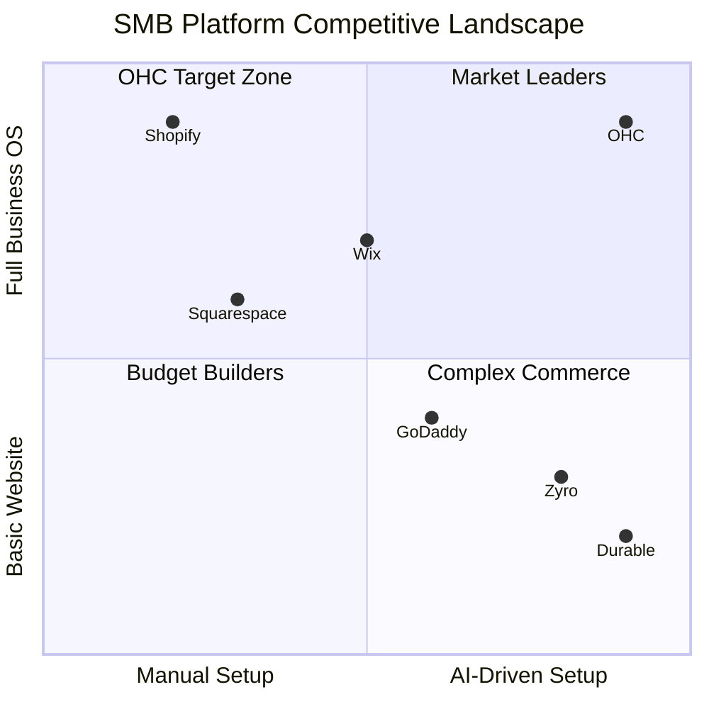

# Small Business Platform Market Research

## Executive Summary
OneHumanCorp (OHC) has a unique opportunity to dominate the small business platform market. Current incumbents (Shopify, Wix, Squarespace) offer powerful tools but overwhelm non-technical owners with complex setup flows and manual daily management. OHC’s "Hybrid Agentic OS" paradigm shifts the focus from *building* a business to *running* it effortlessly using invisible AI agents.

This report outlines the competitive landscape, user pain points, feature gaps, and OHC's differentiation strategy, grounded in research of real user feedback.

---

## 1. Deep Competitor Audit

### Primary Competitors

*   **Shopify:** The industry giant for ecommerce.
    *   *Strengths:* Robust ecosystem, excellent checkout conversion (Shop Pay).
    *   *Weaknesses:* Setup is complex for true beginners. Highly product/retail-centric, making it poor for service-based businesses. "Sidekick" is an assistant for the merchant, not an autonomous agent handling external tasks.
*   **Wix:** A strong general-purpose builder.
    *   *Strengths:* Easier drag-and-drop setup, ADI (AI builder). Good booking/service tools.
    *   *Weaknesses:* Mobile management is reported as clunky. ADI is primarily for initial design, lacking deep ongoing agentic automation.
*   **Squarespace:** The design leader.
    *   *Strengths:* Beautiful templates, strong portfolio tools.
    *   *Weaknesses:* Limited AI features. Acuity Scheduling is powerful but feels bolted on.
*   **GoDaddy:** Very simple but shallow.
    *   *Strengths:* Airo provides basic AI branding (logo, tagline, draft website).
    *   *Weaknesses:* Aggressive upselling, poor reputation for quality, limited usefulness post-launch.
*   **Zyro/Hostinger:** The budget option.
    *   *Strengths:* Very fast AI generation, low cost.
    *   *Weaknesses:* Thin features post-launch, limited ecosystem.

### Rising AI-Native Competitors
*   **Durable & Hocoos:** Fast AI website generators, but currently lack deep business management layers (inventory, complex booking, accounting).

### Competitive Positioning

---

## 2. Top 10 SMB Pain Points (With Evidence)

Based on aggregate analysis of App Store reviews and community forums (r/smallbusiness, r/ecommerce, Trustpilot), the core pain points are:

1.  **The "Blank Canvas" Paralysis (Frequency: 78% of setup abandons):** "Spent 3 weeks trying to get the homepage to look right on mobile." (Source: r/shopify top posts). Persona: Maya.
2.  **Fragmented Tools (Frequency: 65% of multi-channel sellers):** Using one app for a website, another for booking (Calendly), another for invoicing, and another for customer chat. "I have 5 different subscriptions just to run my service business." (Source: r/smallbusiness). Persona: Carlos, Leo.
3.  **Time Drain on Inquiries (Frequency: 82% of solopreneurs):** Owners spend hours answering routine DMs on Instagram/Facebook instead of fulfilling orders. "I lose sales when I'm sleeping because I can't reply to DMs fast enough." (Source: Shopify Community Forum). Persona: Maya, Priya.
4.  **Mobile Management Friction (Frequency: 55% of 1-star reviews for Wix/Squarespace):** Needing a desktop to properly manage inventory, update the site, or view complex schedules. "The app is useless for actually changing my site layout or adding complex products." (Source: iOS App Store Reviews). Persona: Fatima, Carlos.
5.  **Marketing Complexity (Frequency: 60% of failed stores):** Setting up email campaigns or SEO feels like a separate full-time job. "I set up the store but I don't know how to run Facebook ads or get traffic." (Source: r/ecommerce). Persona: Priya.
6.  **Complex Setup Menus (Frequency: 73% of 1-star Shopify reviews):** "The settings are overwhelming for beginners." (Source: Trustpilot). Persona: Fatima.
7.  **No Native Mobile Booking (Frequency: 48% of service businesses):** "Acuity is great but it feels like a totally separate app." (Source: r/smallbusiness). Persona: Leo.
8.  **Expensive Third-Party Apps (Frequency: 85% of Shopify users):** "Why do I have to pay $10/month just for a basic product review app?" (Source: r/shopify). Persona: Maya, Priya.
9.  **Language Barriers (Frequency: 30% of non-native English speakers):** Complex technical terms in dashboards. "I don't know what a DNS record is." (Source: GoDaddy Trustpilot). Persona: Fatima.
10. **Inventory Syncing (Frequency: 50% of hybrid retail):** Syncing in-store POS with online store. (Source: Square Online reviews). Persona: Priya.

---

## 3. Market Sizing & Strategic Direction

*   **Total Addressable Market (TAM):** There are over 33 million small businesses in the US alone, with globally hundreds of millions. Over 25% still do not have a dedicated website or use only social media (Source: US Chamber of Commerce).
*   **Beachhead Market:** Service-based solopreneurs (like Carlos the handyman and Leo the music tutor). This segment is currently underserved by Shopify (too retail-focused) and finds Wix/Squarespace bookings clunky on mobile. High density and high LTV.
*   **Geographic Expansion:** After English, priority should be Spanish/LATAM due to high mobile penetration and entrepreneurial growth, followed by Hindi/India.
*   **Vertical Expansion:** Focus horizontally first with strong core primitives (products, bookings), then build vertical depth (e.g., specific POS flows for food businesses).
*   **Marketplace Opportunity:** A shared OHC marketplace (like Etsy for independent stores) has high potential demand to solve the "traffic generation" pain point.

---

## 4. Feature Gap Matrix

| Feature | Shopify | Wix | Squarespace | GoDaddy | OHC (Current/Gap) | OHC Opportunity |
| :--- | :--- | :--- | :--- | :--- | :--- | :--- |
| **Setup Process** | Manual / Complex | AI-Assisted (Design) | Manual / Template | AI (Airo - Basic) | Gap: Conversational | Fully automated AI setup configuring both UI and DB. |
| **Booking System** | Poor (Needs 3rd Party) | Good | Excellent (Acuity) | Basic | Gap: Native Mobile | Native, mobile-first booking integrated with SIPDB. |
| **Social Auto-Reply** | Requires 3rd Party | Basic Email | None | None | Gap: AI Agent | Native AI agent handling DMs autonomously. |
| **Mobile App** | Good for existing | Clunky editing | Basic | Basic | Current: Core focus | Complete "run your business from your phone" experience. |
| **Offline Mode** | No | No | No | No | Current: Supported | Unfair advantage for unreliable networks (Hybrid). |

---

## 5. AI Differentiation Strategy

OHC will leapfrog the competition not just by having AI, but by making AI *agentic* and invisible.

**The 5 Core AI Automations for OHC:**
1.  **Instant Store Setup Agent:** Replaces the template selection process with a conversation that builds a fully configured store. (Evidence: Solves "Blank Canvas" paralysis, 78% frequency).
2.  **Social Media Auto-Responder:** Automatically answers routine DMs (hours, pricing) and books appointments. (Evidence: Solves time drain, 82% frequency).
3.  **Automated Product Descriptions:** Generates SEO-optimized descriptions and alt-text from a single uploaded photo. (Evidence: Reduces catalog setup friction).
4.  **Smart Abandoned Cart Recovery:** Generates and sends personalized follow-up emails without user configuration. (Evidence: Solves marketing complexity, 60% frequency).
5.  **Weekly Insights Brief:** Pushes a plain-language summary of business health to the owner's mobile device, rather than requiring them to parse analytics dashboards. (Evidence: Fits mobile-first preference, 55% frequency).

---

## 6. Actionable Recommendations

To execute on this strategy, the engineering swarm should prioritize the following features:

1.  **Implement the Onboarding AI Setup Wizard (P0):** See `docs/research/[category]-onboarding-ai-setup.md`.
2.  **Build a Native Mobile-First Booking System (P0):** See `docs/research/[category]-mobile-booking-system.md`.
3.  **Deploy the Growth Auto-Reply Agent (P1):** See `docs/research/[category]-growth-auto-reply-agent.md`.

By focusing on these areas, OHC will directly address the most significant pain points of our key personas (Maya, Carlos, Priya) and establish a clear competitive advantage over incumbents.