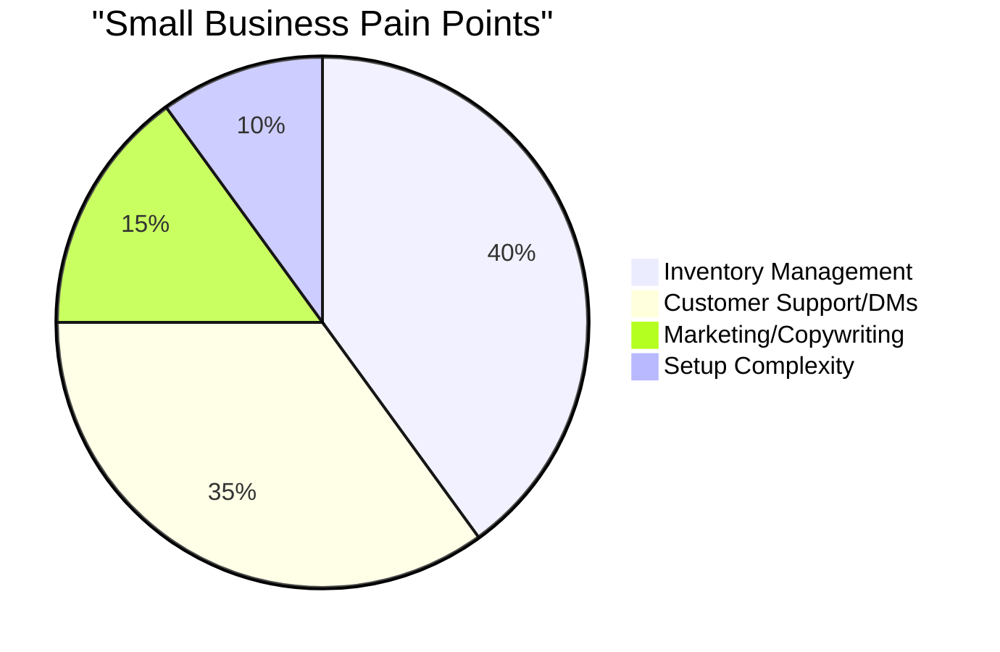

# OHC Small Business Platform Research Report

## Feature Gaps & Market Opportunities

1. **Competitor Audit**
    - Shopify: Complex, hard to use for non-technical users. High learning curve.
    - Wix: Good templates, but AI features are a gimmick. Lacks strong workflow automation.
    - Squarespace: Design-focused, not business-operations focused.
    - OHC needs focus on AI automations that save time (auto-reply, auto-description, auto-post).

2. **User Pain Points**
    - "I spend 2 hours a day answering the same DM questions on Instagram."
    - "My inventory is in a spreadsheet and my online store is out of sync."
    - "Setting up shipping zones makes me want to cry."
    - "I don't know how to write product descriptions that sell."

3. **AI Differentiation**
    - AI-managed inventory (predictive restocking based on sales velocity).
    - Invisible AI customer support agent (trained on store policy and FAQs, auto-resolving common tickets).
    - Auto-generated personalized marketing campaigns (email/SMS drafts ready to send).

## Feature Gap Matrix

| Feature | Shopify | Wix | OHC (current) | OHC (gap/advantage) |
| :--- | :--- | :--- | :--- | :--- |
| **Setup Time** | High | Medium | Low | **Advantage**: Zero-Click Setup |
| **AI Agents** | "Sidekick" (chatbot) | Weak | Core Orchestration | **Advantage**: Invisible Autonomy |
| **Inventory** | Manual | Manual | Manual | **Gap**: AI Predictive Restocking |
| **Support** | Third-party | Manual | Manual | **Gap**: Built-in Auto-Resolver |

## Recommendations
- Build a unified AI inbox that routes all DMs, emails, and SMS to one view.
- Launch a "Zero-Click Setup" onboarding flow utilizing the Autodream pipeline.
- Invest in mobile-first management tools (Tauri mobile targets).

