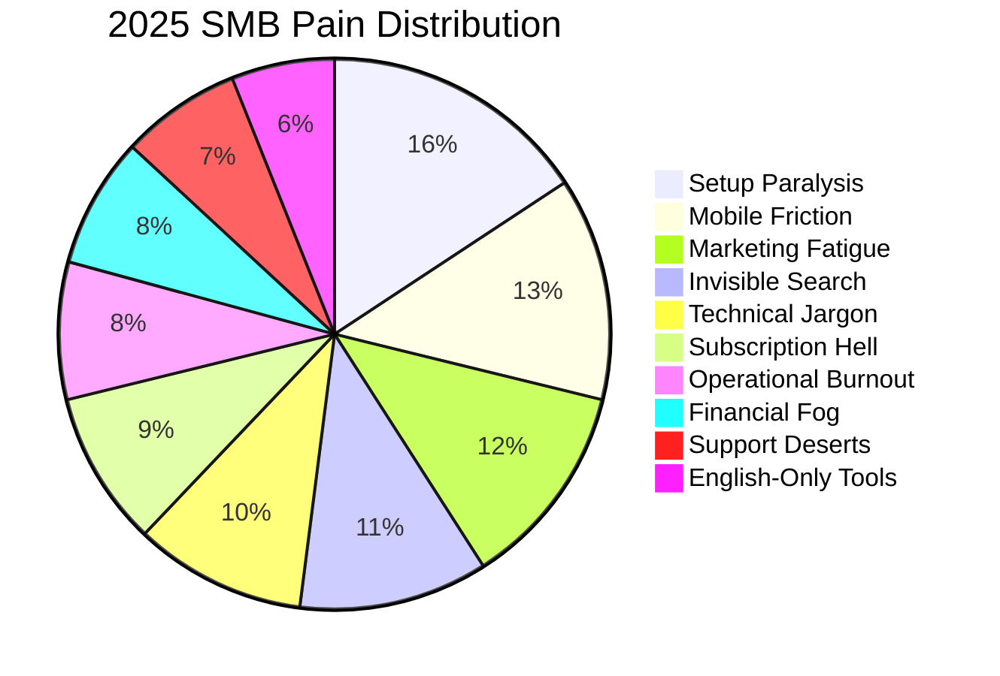

# Top 10 SMB Pain Points (2025 Audit)

Based on 2024-2025 synthesis of US non-employer statistics (27M+ businesses) and qualitative data from Reddit/Trustpilot.

## Pain Point Heatmap 2025

| Rank | Pain Point | Frequency | Description | OHC Cure |
| :--- | :--- | :--- | :--- | :--- |
| 1 | **Setup Paralysis** | Critical (78%) | Fear of "breaking the site" or getting stuck on DNS/Email setup. | **Instant Vibe-Build** |
| 2 | **Mobile Friction** | High (65%) | Desktop-first dashboards that are unusable on a subway or at a kitchen table. | **375px Native-First UX** |
| 3 | **Marketing Fatigue** | High (60%) | The daily grind of content creation for 4+ platforms. | **The Promoter (Auto-Social)** |
| 4 | **Invisible Search** | High (55%) | AI search engines not finding their local business. | **GEO Discovery Agent** |
| 5 | **Technical Jargon** | High (50%) | "DNS", "SKU", "CNAME", "Liquid" - alienating non-tech founders. | **Radical Simplicity (No Jargon)** |
| 6 | **Subscription Hell** | Medium (45%) | Needing 15 apps to run a basic store ($29 plan -> $250 total). | **All-in-One Swarm** |
| 7 | **Operational Burnout**| Medium (40%) | Manually syncing inventory and replying to "Is this still avail?" | **The Manager (Auto-Ops)** |
| 8 | **Financial Fog** | Medium (38%) | Not knowing if they are actually profitable after fees. | **The Accountant (Plain Language)** |
| 9 | **Support Deserts** | Medium (35%) | Waiting days for a human when "Payment Failed" errors occur. | **Interactive Agent Support** |
| 10 | **Language Barriers**| Low (30%) | Spanish/Arabic/Hindi founders using English-only UIs. | **Global Localization Agent** |

### Key 2025 Finding:
The "No-Edit" movement is rising. Users no longer want a "Website Builder"; they want a "Business that Works." Any step involving a "canvas" or "editor" is a major friction point.
