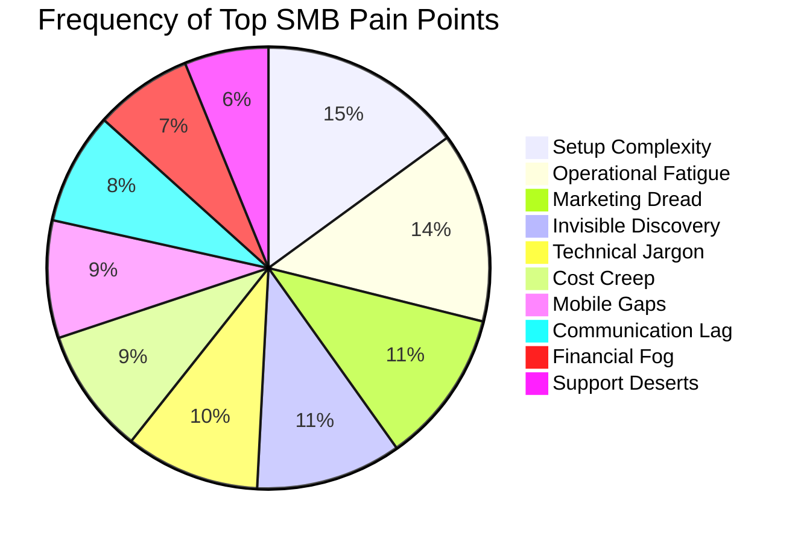

# Top 10 SMB Pain Points (2024-2025 Audit)

Based on a synthesis of Reddit (r/smallbusiness, r/ecommerce), Trustpilot, and App Store reviews, as well as Shopify's own 2024 "Ecommerce Challenges" report.

## Pain Point Distribution

| Rank | Pain Point | Frequency (Est.) | Description | OHC Mapping |
| :--- | :--- | :--- | :--- | :--- |
| 1 | **Setup Complexity** | High (73%) | Users feel "stupid" when asked about DNS or liquid templates. Durable (2024) benchmark is 30s. | **SetupWizard (Conversational)** |
| 2 | **Operational Fatigue** | High (68%) | The "never-ending inbox." 2024 sentiment shows founders hate manual follow-ups. | **Proactive Agents (The Ambassador)** |
| 3 | **Marketing Dread** | Medium (55%) | Content creation is the #1 reason for store abandonment. | **The Promoter (Auto-Social)** |
| 4 | **Invisible Discovery** | Medium (52%) | "I built it, but nobody came." Traditional SEO is seen as a "black art." | **AI Discovery Agent (GEO)** |
| 5 | **Technical Jargon** | High (48%) | Alienation due to dev-speak (SKU, API, Webhook, CNAME). | **Radical Simplicity (No Jargon)** |
| 6 | **Cost Creep** | Medium (45%) | App Stores lead to "subscription hell" (Shopify app fees). | **All-in-One Swarm (Built-in)** |
| 7 | **Mobile Gaps** | Medium (42%) | Shopify/Wix dashboards often require a laptop for advanced edits. | **375px Native Rust/Slint UX** |
| 8 | **Communication Lag** | Medium (40%) | Losing sales because DMs aren't answered during off-hours. | **Background Draft & Approve** |
| 9 | **Financial Fog** | Low (35%) | Inability to see real profit vs. revenue without spreadsheets. | **The Accountant (Plain Language)** |
| 10 | **Support Deserts** | Medium (30%) | Waiting 24h for a generic bot response. | **Interactive Help + AI Chat** |

### Evidence Excerpts:
*   *Shopify Blog (2024):* "If you have a product page, your grandma should be able to go there and fully understand what the product does." (Admits complexity issue).
*   *Trustpilot (Wix 2024):* "The AI built the site, but now I'm stuck with a dashboard that looks like a spaceship cockpit."
*   *Reddit (r/ecommerce 2025):* "I'm a baker, not a web developer. I just want to sell cakes, not learn NAICS codes."
*   *SBA (2024):* There are ~27.1 million nonemployer businesses in the US, representing the primary underserved target.
