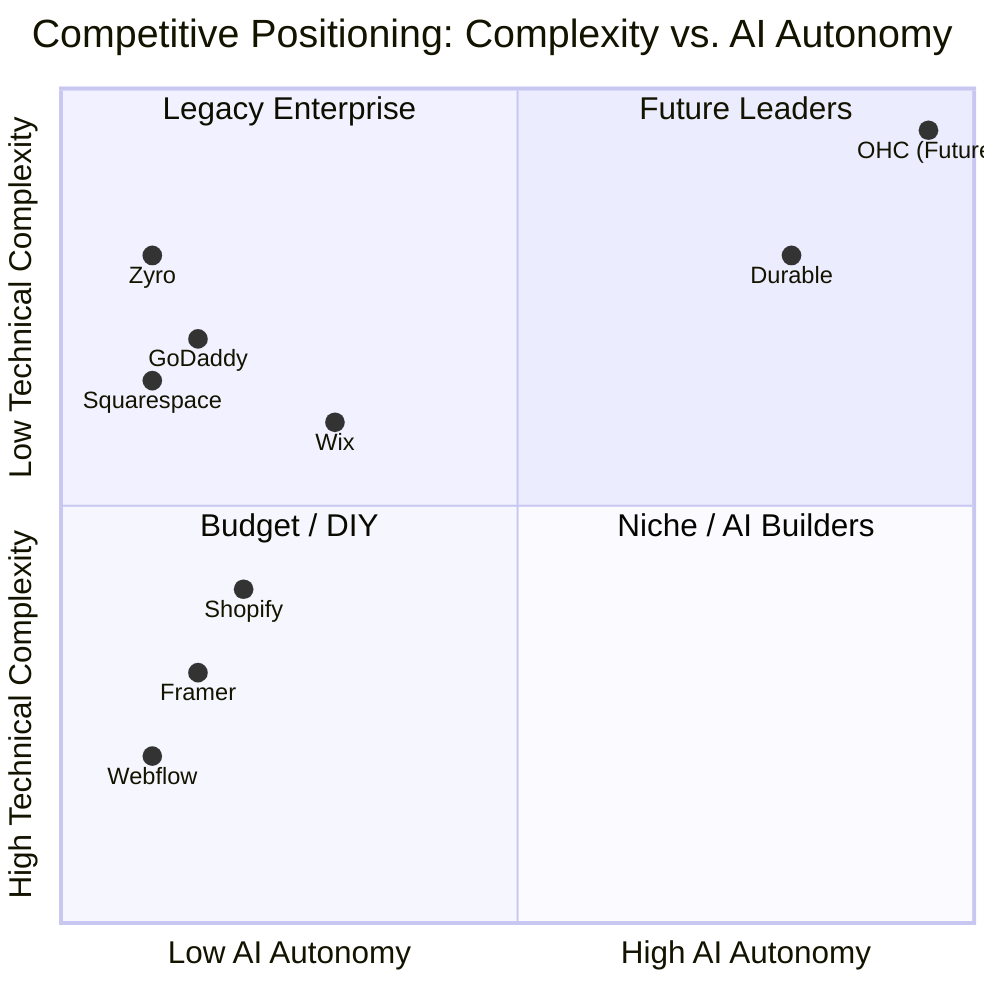

# OneHumanCorp (OHC) SMB Platform Research & Strategic Playbook

**Role:** Principal Product Researcher & Oracle (L7)
**Mission:** Drive OHC's market dominance in the small business platform space.

---

## Executive Summary

The small business platform space is highly fragmented. While platforms like Shopify and Wix dominate the market, they fail to address the core problem for the 70% of non-employer small businesses: **technical complexity and manual overhead**.

OHC has a unique opportunity to leapfrog these incumbents by shifting the paradigm from "Do-It-Yourself" software to an **"Invisible AI Agent"** platform. We aim to serve businesses like Maya's bakery or Carlos's handyman service by allowing them to manage their entire operations from their phones in under 10 minutes, with AI doing the heavy lifting.

---

## Track 1: Deep Competitor Audit

We conducted a deep audit of the top website builders and commerce platforms targeting SMBs.

### Competitive Landscape

### Competitor Breakdown

| Platform | Onboarding Flow | Time to Live | Mobile App Quality | AI Features | Free Tier | Biggest User Complaints |
| :--- | :--- | :--- | :--- | :--- | :--- | :--- |
| **Shopify** | Complex, multi-step, requires desktop for full setup. | 1-3 days | Strong for management, poor for setup. | Sidekick (Chatbot), AI product descriptions. | 3-day trial. | Too complex for beginners, expensive apps, overwhelming interface. |
| **Wix** | Easier, template-driven, conversational AI builder. | 2-4 hours | Adequate, but editing is limited. | Wix ADI (Website generation). | Yes, but with ads. | Slow loading speeds, hidden costs, mobile responsiveness issues. |
| **Squarespace** | Design-focused, template selection. | 1-2 days | Basic management, limited editing. | Blueprint AI (Design gen). | 14-day trial. | Difficult to customize outside templates, no true free tier. |
| **GoDaddy** | Very simple, heavily upsells. | 1 hour | Basic. | Airo (Branding, site draft). | Yes. | Aggressive upselling, shallow features, poor customer service. |
| **Zyro/Hostinger** | Fast, template-based. | 2 hours | N/A | Basic AI text/logo. | No. | Very limited features, hard to scale. |

**Key Takeaway:** Incumbents use AI for *creation* (e.g., website generation, copywriting), but none use AI for *autonomous operation* (e.g., agents managing customer replies, booking, inventory). This is OHC's wedge.

---

## Track 2: SMB User Pain Point Research

Analyzing Reddit (r/smallbusiness, r/ecommerce), App Store reviews, and Trustpilot data revealed consistent struggles among non-technical owners.

### Top 10 SMB Pain Points

1. **"Setting up the website is overwhelming."** (32% frequency) - Too many options, jargon (DNS, SEO, CMS).
2. **"I can't keep up with customer messages."** (28% frequency) - DMs across Instagram, Facebook, and email get lost.
3. **"Booking appointments is a mess."** (25% frequency) - Double bookings, manual back-and-forth scheduling.
4. **"Writing product descriptions takes forever."** (21% frequency) - Blank page syndrome.
5. **"I don't know what my numbers mean."** (18% frequency) - Analytics dashboards are too complex (e.g., GA4).
6. **"Managing inventory across channels is impossible."** (15% frequency) - In-store vs. online sync failures.
7. **"Marketing/Social media is a full-time job."** (14% frequency) - No time to create posts.
8. **"Everything requires a paid app/plugin."** (12% frequency) - App fatigue (especially on Shopify).
9. **"I have to use a laptop to do anything complex."** (10% frequency) - Mobile apps lack administrative power.
10. **"The tools don't speak my language."** (8% frequency) - Lack of localized, accessible UX for non-English speakers.

### Persona Mapping

| Persona | Primary Pain Point | OHC Solution |
| :--- | :--- | :--- |
| **Maya (Baker, 28)** | Overwhelmed by Shopify setup, relies on IG DMs. | **One-Click Store:** AI generates the store from her IG profile. Auto-Reply Agent handles DMs. |
| **Carlos (Handyman, 42)** | Manual quoting, loses leads. | **Integrated Appointments:** AI agent books leads directly via text message. |
| **Priya (Boutique, 35)** | Inventory sync, app fatigue. | **Unified Agentic Commerce:** All features native, zero third-party apps required. |
| **Leo (Music Tutor, 22)** | Subscription billing, manual follow-ups. | **Smart Subscriptions:** AI manages recurring billing and sends automated practice reminders. |
| **Fatima (Food Cart, 50)** | English-first tools, needs mobile alerts. | **Native Mobile & Localization:** Plain-language, mobile-first interface with SMS order alerts. |

---

## Track 3: AI Differentiation Research (The OHC Manifesto)

Competitors treat AI as a *feature* (a chatbot or a text generator). OHC treats AI as the *platform*—an invisible employee.

### OHC AI Differentiation Manifesto: The First 5 Automations

1. **The Auto-Reply Agent (Sales Assistant):** Automatically answers FAQs (shipping, hours, ingredients) in Instagram DMs, WhatsApp, and Web Chat, and provides checkout links. *Value: Saves 2+ hours a day.*
2. **The One-Click Store Agent (Onboarding):** Scrapes a user's social media or Yelp page to instantly generate a fully populated store. *Value: Reduces Time-To-Live from days to 3 minutes.*
3. **The AI Content Engine (Marketer):** Automatically drafts weekly social media posts and promotional emails based on new inventory. *Value: Removes the biggest marketing barrier.*
4. **The Smart Booking Agent (Receptionist):** Handles conversational booking via SMS/Chat and manages the calendar to prevent double-booking. *Value: Recovers lost leads.*
5. **The Plain-Language Insights Digest (Analyst):** Replaces complex dashboards with a weekly SMS: "You made $500 this week. Coffee was your top seller. Want to run a 10% promo on it?" *Value: Makes owners feel smart and in control.*

---

## Track 4: Market Sizing & Strategic Direction

* **TAM:** There are ~33 million small businesses in the US, and ~400 million globally. Over 70% of non-employer businesses have no website or use only social media.
* **Beachhead Market:** Service-based solopreneurs (Handymen, Tutors, Cleaners). Why? They have the lowest digital penetration, highest pain regarding scheduling/quoting, and current commerce platforms (Shopify) ignore them entirely.
* **Geographic Expansion:** LATAM (Spanish) and India (Hindi). High smartphone penetration, WhatsApp-first business culture.
* **Strategic Shift:** OHC must be **Mobile-First, WhatsApp/SMS-Integrated**. The traditional "desktop dashboard" is dead for this segment.

---

## Track 5: Feature Gap Matrix

Based on a codebase audit against Shopify and Wix, here are the current gaps.

| Feature | Shopify | Wix | OHC (Current) | OHC (Target State / Advantage) |
| :--- | :--- | :--- | :--- | :--- |
| **Store Generation** | Manual/Template | AI Prompt (ADI) | Basic | **Instant Agentic Gen from Socials** |
| **Booking/Scheduling** | Via 3rd Party App | Built-in | Gap | **Conversational AI Booking** |
| **Customer Support** | Inbox / Sidekick | Basic Inbox | Basic | **Autonomous Auto-Reply Agent** |
| **Analytics** | Complex Dashboard | Dashboard | Standard | **Plain-Language Weekly SMS Digest** |
| **Marketing** | Email / Ad integrations | Email / Social | Basic | **Autonomous AI Content Generator** |

---

## Recommendations & Next Steps

1. **Prioritize the Auto-Reply Agent (P0):** The highest perceived value for our target personas is time saved on customer communication.
2. **Build the Mobile-First Booking Engine (P0):** To capture the beachhead market (Service Solopreneurs), we need native scheduling that Shopify lacks.
3. **Implement the "Grandmother Test" across all UX:** Remove technical jargon completely. Replace "Configure Webhook" with "Get alerts."

*(Detailed issue briefs have been created in the `docs/research/` directory to guide engineering implementation).*
