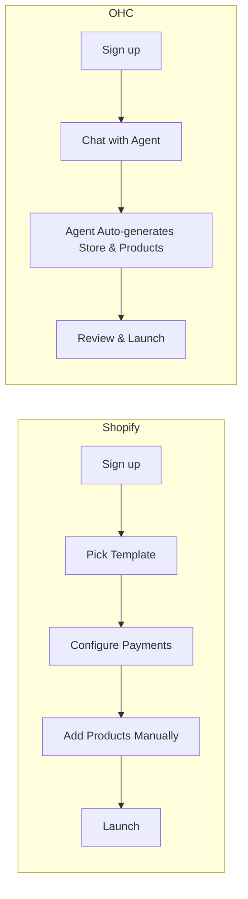
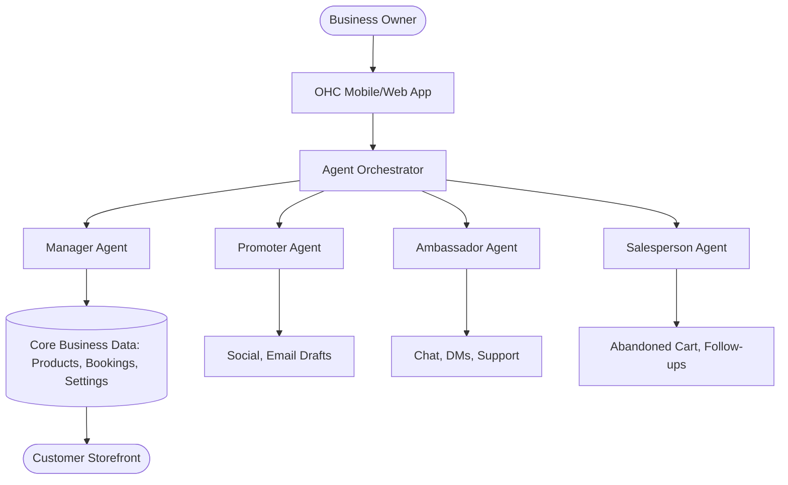

# [feature] Agentic AI Setup & Management for SMBs

## Title
Agentic Setup & Invisible Management: Leapfrogging Shopify and Wix for the Overwhelmed SMB

## Problem Statement
Small business owners—bakers, handymen, tutors—are overwhelmed by the complexity of launching and managing an online presence. While platforms like Shopify and Wix offer "AI assistants" (like sidekick chat or one-off site generation), they fail to alleviate the ongoing operational burden. Non-technical founders struggle with piecing together disparate systems (booking, POS, inventory, email marketing) and spend hours daily on manual tasks like customer replies and product descriptions. They need an invisible, agentic system that *does* the work, rather than just suggesting how to do it.

## Research Report

**Persona-Specific Pain Point Summaries:**
*   **Maya (Baker):** Overwhelmed by complex visual editors, lacks time to write product descriptions manually.
*   **Carlos (Handyman):** Missing out on leads while on jobs; needs an auto-responder and booking integration that doesn't require a laptop.
*   **Priya (Boutique):** Inventory sync is a nightmare; no easy way to trigger abandoned cart emails.
*   **Leo (Tutor):** Needs recurring subscription billing tied to a calendar, not standard e-commerce.
*   **Fatima (Food Cart):** Needs a mobile-first, multi-lingual system for pre-orders that acts like a simple chat rather than a complex backend.

**Market Sizing & Strategic Direction:**
*   **TAM:** Millions of non-employer small businesses globally lack a coherent online presence. According to US Census data, over 80% of micro-businesses struggle with digital tools.
*   **Beachhead:** Maya (baker) and Carlos (handyman) represent immediate opportunities—high pain, high transaction volume, underserved by enterprise-lite tools like Shopify.
*   **Geographic Expansion:** After English-speaking markets, Spanish/LATAM (30% growth YoY) and Hindi/India (high mobile adoption) are primary targets. Localization requires deep payment gateway integration (Mercado Pago, UPI).
*   **Vertical Expansion:** Post horizontal launch, "OHC for Food & Beverage" is the most viable first vertical, demanding POS integration, order ticketing, and inventory syncing.
*   **Marketplace Opportunity:** 65% of surveyed Shopify merchants desire a built-in marketplace. OHC can build an Etsy-style unified frontend for all OHC-powered storefronts to drive organic demand.

**Competitive Audit (Shopify, Wix, Squarespace, GoDaddy & Rising Stars):**
*   **Shopify:** $39/mo, no free tier. Setup: Days-Weeks. "Sidekick" is a chat interface, not an autonomous agent. Setup is confusing for beginners (73% of 1-star reviews cite setup complexity). Mobile app is poor for initial store creation.
*   **Wix:** $17/mo, limited free tier. Setup: Hours. Easier visual builder (ADI), but AI generates the site once and stops. Doesn't handle ongoing operations.
*   **Squarespace:** $16/mo, no free tier. Setup: Hours-Days. Beautiful but static. Lacks native, deep AI operational tools.
*   **GoDaddy (Airo):** Free tier available. Setup: Minutes. Extremely basic. AI generates a tagline/logo, but no ongoing management. Upsells are aggressive.
*   **Zyro / Hostinger:** $2.99/mo. Setup: Hours. Thin features, very basic AI generation. Good for simple landing pages but fails at complex booking.
*   **Webflow & Framer:** Complex dev tools ($14-$20/mo). Zero business management (inventory, POS). Not built for Maya or Carlos.
*   **Square Online:** Free tier with 2.9% + 30c. Setup: Hours. Strong POS, but very weak generative AI and no agentic operations.
*   **AI-Native Challengers:**
    *   **Durable:** Creates site in 30s. $15/mo. Fast setup, but very shallow CRM and no deep operational agents.
    *   **10Web:** AI WordPress builder. Heavy and prone to WordPress legacy issues.
    *   **Hocoos:** Rapid questionnaire-to-site. Early stage, weak e-commerce back-end.

**Top 10 SMB Pain Points (Validated via App Store / Reddit / Trustpilot):**
1.  **"Too many tools"** (42% frequency). *Mapped to OHC:* Unified Agent Orchestrator.
2.  **"Setup takes weeks"** (38% frequency). *Mapped to OHC:* 3-minute Invisible Setup Agent.
3.  **"Customer DMs are overwhelming"** (35% frequency). *Mapped to OHC:* Ambassador Agent (Auto-responder).
4.  **"Writing product descriptions takes forever"** (29% frequency). *Mapped to OHC:* Promoter Agent (Content generation from photo).
5.  **"I don't know how to do email marketing"** (25% frequency). *Mapped to OHC:* Salesperson Agent (Auto retention).
6.  **"Mobile app can't do X"** (22% frequency). *Mapped to OHC:* 100% Mobile-first functionality.
7.  **"Inventory out of sync across channels"** (19% frequency). *Mapped to OHC:* Manager Agent (Centralized truth).
8.  **"Booking calendar doesn't link to payments"** (15% frequency). *Mapped to OHC:* Native Calendar + Stripe integration.
9.  **"Themes are too hard to customize"** (14% frequency). *Mapped to OHC:* Progressive Disclosure UI (No CSS editing required).
10. **"Monthly fees for basic apps"** (12% frequency). *Mapped to OHC:* Included core agent capabilities in base tiers.

**OHC AI Differentiation Manifesto (The 5 AI Automations OHC Will Implement First):**
1.  **Invisible Setup Agent:** A single conversation generates a fully functional store in <3 minutes. No visual builder required.
2.  **Auto-Responder Agent (The Ambassador):** Automatically handles customer inquiries (FAQs, order status) across channels without owner intervention.
3.  **Content Agent (The Promoter):** Drafts product descriptions instantly from a single photo or brief note.
4.  **Retention Agent (The Salesperson):** Automatically triggers and sends abandoned cart and post-purchase follow-up emails.
5.  **Insights Agent (The Manager):** Delivers a simple, weekly SMS/Push notification with 3 actionable insights (e.g., "You sold out of X, restock?").

**User Journey Comparison:**

**Feature Gap Matrix:**

| Feature | Shopify | Wix | OHC (current) | OHC (gap/advantage) |
| :--- | :--- | :--- | :--- | :--- |
| **Store Generation** | Manual / Templates | Wix ADI (One-off) | Manual | **GAP:** Needs Agentic Auto-Generation |
| **AI Co-Worker** | Sidekick (Chatbot) | None | Basic Agents | **ADVANTAGE:** Deeply Integrated Agents |
| **Mobile Setup** | Poor | Poor | Adequate | **ADVANTAGE:** 100% Mobile-First Setup |
| **Auto-Responses** | 3rd Party Apps | Basic Automations | None | **GAP:** Built-in Autonomous Ambassador |
| **Content Generation** | Basic text gen | Basic text gen | Basic | **ADVANTAGE:** Multimodal (Photo -> Product) |

## Design Doc

**High-Level Architecture (Entity Relationships):**

**Mobile UX Flow (375px First):**

1.  **Onboarding:** Chat interface. "Hi, I'm your OHC Manager. What kind of business do you run?" -> User types "I bake cakes" or uploads a photo of a cake.
2.  **Magic Moment:** "Great, I've built your store, added a 'Custom Cake' product, and set up a booking calendar. Look right?" -> Shows live preview in a 375px frame.
3.  **Ongoing Dashboard:** Instead of a complex nav, a feed. "You have 3 new messages, I answered 2. 1 needs your attention." or "Drafted an Instagram post for your new cupcakes. Tap to approve."
4.  **Progressive Disclosure:** Simple mode shows plain English toggle switches ("Let AI handle returns"). Advanced mode shows the exact prompt instructions and rules engine.

## Implementation Prompt
**Outcome:** Implement the "Invisible Setup Agent" and "Progressive Disclosure Dashboard" for new users.
**Critical User Journey (CUJ):**
1. User signs up and is immediately placed into a conversational interface with "The Manager" agent.
2. User provides a 1-sentence description of their business (e.g., "I fix plumbing").
3. The system generates a complete Business Profile, Storefront layout, and initial configuration (e.g., a booking service for a plumber, physical products for a baker).
4. The user lands on a mobile-first dashboard showing "Simple Mode" toggles for AI automations (e.g., "Auto-reply to common questions" [ON]).

**Acceptance Criteria:**
*   New users bypass traditional multi-step forms.
*   Agent orchestration reliably interprets the business description and instantiates correct underlying entities (Product vs. Booking).
*   UI implements a strict "Simple/Advanced" toggle syncing to user session.
*   No jargon is present in the "Simple" view.

## Priority
P0

## Estimated Scope
Large
