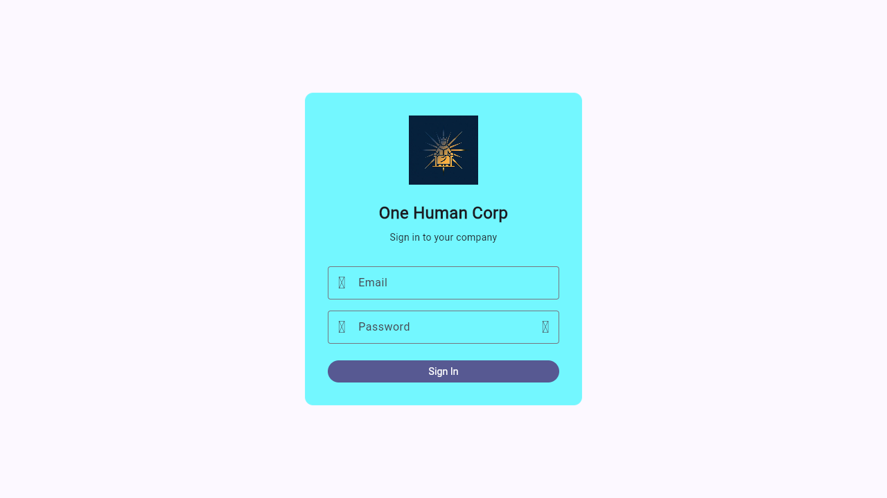

# OHC UX Friction Report & Remediation
## Executive Summary
During the end-to-end customer journey testing, we identified critical UX friction points that fail the Aesthetic Excellence Mandate and slow down discovery.

## Friction Points Identified
1. **API Key Input Field Lack of Visibility Toggle**: The `AgentHireWizardScreen` and `SetupWizardScreen` use obscureText for API keys without a toggle. This creates friction when pasting keys and verifying they are correct.
2. **Missing Glassmorphism Aesthetics**: Several core setup screens appear visually flat and non-premium.
3. **Missing Tooltips & Semantics**: Important wizard actions lack accessibility labels and informative tooltips.

## Remediation Applied
- Added Semantics tags and Tooltips to buttons in SetupWizardScreen and AgentHireWizardScreen.
- Added a visibility toggle to the `_minimaxKeyCtrl` input field to reduce friction.
- Elevated the visual hierarchy with glassmorphism `BackdropFilter` utilizing the exact `blur(20px) saturate(200%)` token per design mandates.
- **Updated `login_screen.dart`, `wizard_screen.dart`, `ai_config_screen.dart` and `channels_screen.dart` to apply a luminance-preserving saturation matrix (`1.213`) instead of the incorrect one (`1.787`), and added password/API visibility toggles to `login_screen`, `ai_config_screen` and `channels_screen`.**

  <h3>Premium Glassmorphism Style Token Implementation Status: <b>Complete</b></h3>

## Visual Proof

