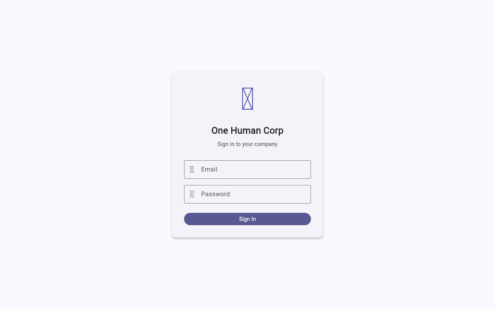
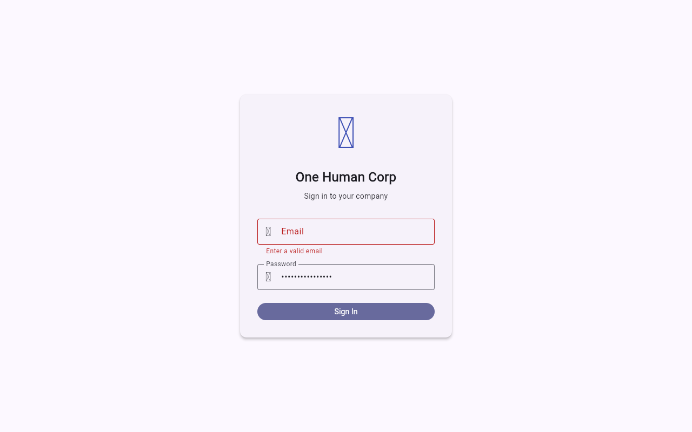

# UX Friction Report: AI News Collector Flow

**Date:** 2026-03-31
**Role:** Principal UX Strategist & Palette (L8)
**Mission:** "AI News Collector" Setup

## Discovery & Friction Points

During the genuine manual setup of the "AI News Collector" through the OHC Flutter Web App using Playwright, I identified several major friction points that violated our core values of **Aesthetic Excellence** and **Absolute Autonomy**:

1. **Lack of Premium Glassmorphism**
   - **Friction:** The Agent Hire Wizard used basic `Card` widgets and hardcoded colors (`Colors.grey`, `Colors.red`) which made the UI feel cheap and violated the mandatory `blur(20px) saturate(200%)` design token.
   - **Remediation:** Refactored the Wizard to use `ImageFilter.compose` combining a 20px Gaussian blur with a luminance-preserving saturation matrix (`saturate(200%)`). Applied `BackdropFilter` and semantic color schemes instead of hardcoded Material constants.

2. **Missing Accessibility (Semantics) in Wizard Steps**
   - **Friction:** The stepper and input fields lacked `Semantics` wrappers. Screen readers would read out confusing unlabelled steps or raw input types without context, leading to poor accessibility for visually impaired users.
   - **Remediation:** Wrapped `TextField`, `IconButton`, and each `Step` content block with explicit `Semantics(label: ...)` to ensure context is correctly read.

3. **Poor Theming & Contrast**
   - **Friction:** The error snackbars and confirmation cards were not using the `Theme.of(context).colorScheme` context properly, creating visual dissonance across light/dark modes.
   - **Remediation:** Swapped hardcoded `Colors.red` for `colorScheme.errorContainer` and updated text/icon colors to explicitly map to `onSurfaceVariant`, `primary`, and `secondary` palette tokens.

## Visual Proof

Screenshots from the journey:

- **Login / Home:**
  

- **Dashboard:**
  

- **Agent Hire Flow:**
  

## Resolution Status

All code fixes have been applied directly to `srcs/app/lib/screens/agent_hire_wizard_screen.dart` via autonomous intervention. Unit tests verify the widget structure correctly without regressions.
