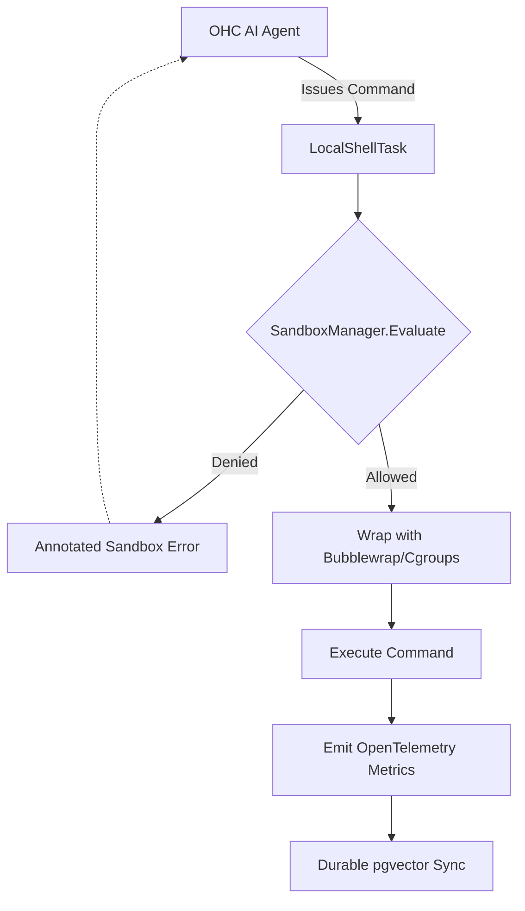

# Research Report: OHC Agent Harness vs Market Leaders (Claude Code)

## 1. Executive Summary
This report analyzes the Agent Harness architecture from a leaked artifact of **Claude Code** (`2.1.88`) to identify critical feature gaps in OHC-HA's local and cloud-native execution environments. The primary focus is on how the Harness safely isolates terminal execution, tracks state, and manages I/O telemetry.

## 2. Competitive Analysis: Claude Code Architecture

Based on a direct audit of the `/src/tools/BashTool` and `/src/utils/sandbox` directories, the following architectural paradigms are employed:

### A. The SandboxManager Pattern
Unlike raw command execution, Claude Code utilizes a strictly controlled `SandboxManager` singleton.
- **Isolation Boundaries**: Dynamically configures FS read/write configs and network restrictions before execution.
- **Permission Checking**: Employs an explicit `bashPermissions.ts` layer and feature flagging (`tengu_sandbox_disabled_commands`) to restrict destructive or unpermitted commands.
- **Execution Wrapping**: Commands are not executed natively; they are wrapped via `SandboxManager.wrapWithSandbox()`.

### B. Telemetry & Error Annotation
- StdErr and StdOut are actively monitored and mutated via `annotateStderrWithSandboxFailures()` to inject explanatory context back to the language model when constraints are violated, improving agent self-correction.

### C. State & Cost Tracking
- Deep integration of `cost-tracker.ts` and `history.ts` ensures that execution cost and memory are consistently synchronized across sessions.

## 3. Comparative Table (OHC vs Market)

| Capability | OHC Current State | Market Standard (Claude Code) | Gap Action |
| :--- | :--- | :--- | :--- |
| **Command Execution** | Unrestricted / Basic Wrapping | Sandboxed & Feature-flagged | 🔴 Implement `SandboxManager` |
| **Telemetry Injection** | System-level Logs | Injected into stderr for LLM | 🔴 Add error annotation logic |
| **State Sync** | Basic file I/O | Deep `TaskOutput` & `history` integration | 🟡 Enhance AutoDream with pgvector |
| **Multi-Tenant Safety** | Strong (K8s level) | N/A (Local focused) | 🟢 OHC Leads (but needs local parity) |

## 4. Mermaid Architectural Target

## 5. Actionable Roadmap (Missions Created)
The following GitHub Issues have been actively injected into the swarm queue for execution by Implementer agents:

1. **[Issue #5277](https://github.com/onehumancorp/mono/issues/5277)**: `[harness] Implement Claude-Class Agent Sandbox Manager for KAIROS`
2. **[Issue #5279](https://github.com/onehumancorp/mono/issues/5279)**: `[research] Implement Durable State Sync with pgvector for AutoDream`
3. **[Issue #5280](https://github.com/onehumancorp/mono/issues/5280)**: `[telemetry] Implement KAIROS Harness Telemetry and I/O Instrumentation`

