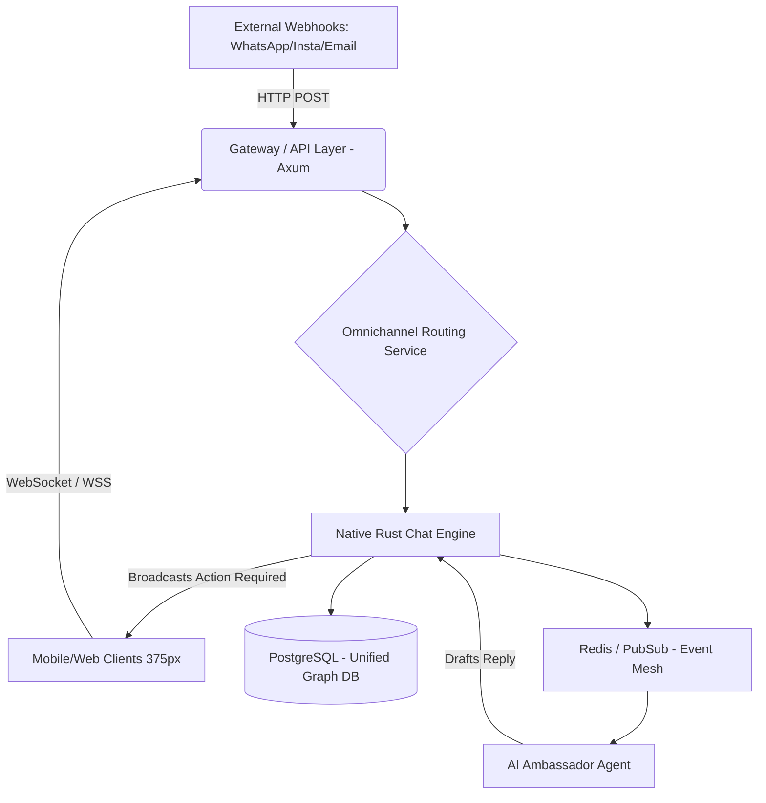

# Architecture Design: Native Rust Omnichannel Chat System (Chatwoot Replacement)

# Problem Statement
OHC requires a high-performance, multi-tenant omnichannel customer support and chat engine. Previously, we relied on Chatwoot, but as an external third-party service, it introduces latency, external dependency risks, and violates our single-platform, hybrid-architecture Zero-Trust principles. We must retire Chatwoot completely and implement a native Rust matching architecture within `onehumancorp/mono` that handles omnichannel data models, controllers, WebSocket real-time messaging, and inbox architecture, heavily tailored for non-technical owner/operators (e.g. Maya the baker, Carlos the handyman).

# Design Doc

## Architecture Diagram (Mermaid.js)

## AI Agent Integration Points
- **Event Mesh Trigger:** When a new `Message` is created and stored in PostgreSQL, an event is emitted to Redis PubSub.
- **The Ambassador:** Subscribes to new message events, queries the `Contact` history via RAG against the tenant's context, and inserts a draft message.
- **Locking:** Redis Redlock (`ohc:lock:{tenant_id}:conversation:{conversation_id}`) ensures multiple agents do not draft replies simultaneously.

## Key Design Decisions
- **Zero Trust & Multi-Tenancy:** The database schema must enforce row-level security (RLS) on `tenant_id` for all models (Inbox, Conversation, Message, Contact). All APIs require strict SPIFFE/OIDC context.
- **Native Rust Axum WebSockets:** Replaces Ruby ActionCable for massive concurrency and lower memory footprint, vital for real-time typing indicators and instant AI draft rendering.
- **Data Modeling:** Adopt a polymorphic channel strategy where `Conversation` belongs to a `ContactInbox`, and `ContactInbox` belongs to a unified `Contact`.
