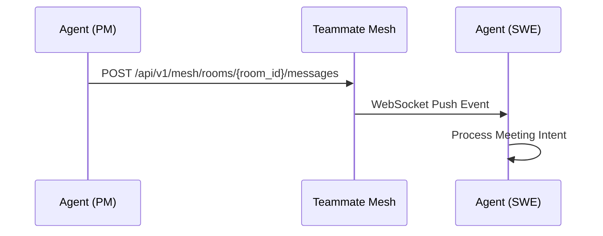
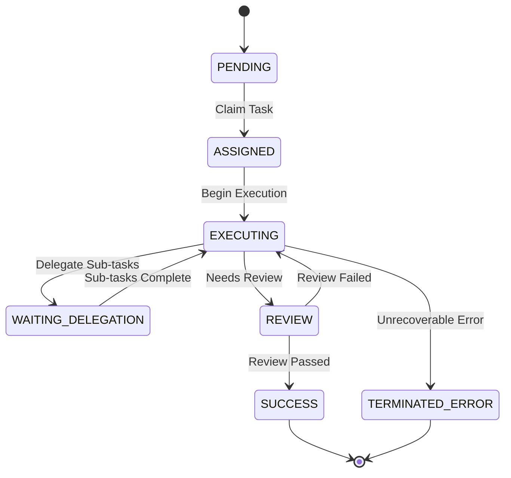
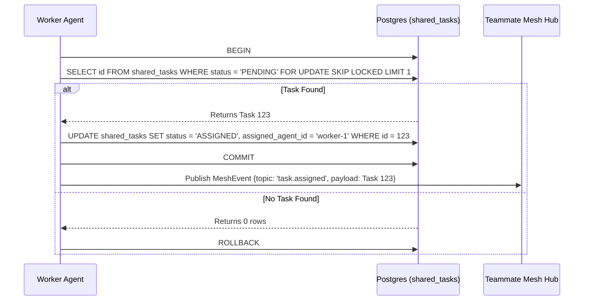
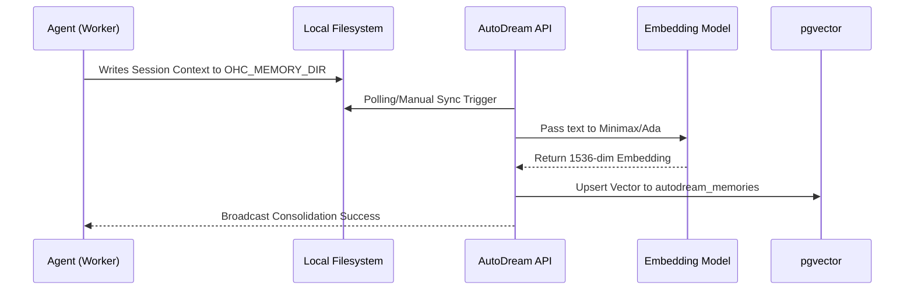
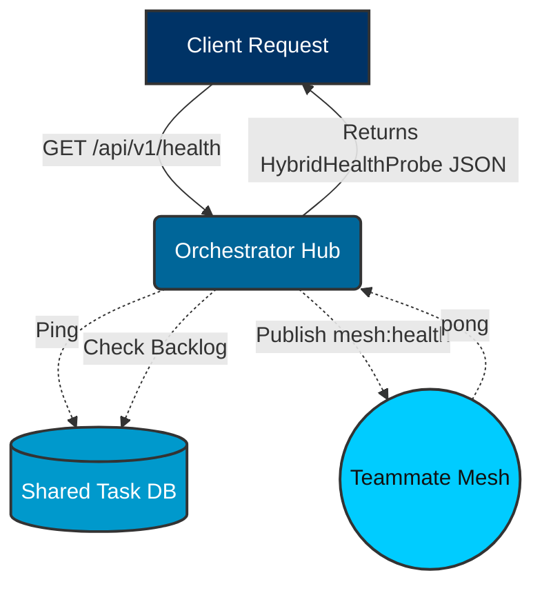
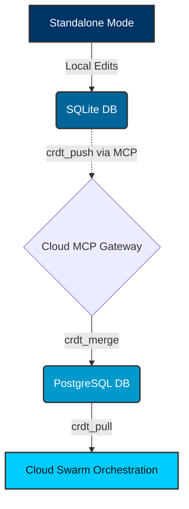

<div markdown="1" style="backdrop-filter: blur(20px) saturate(200%); font-family: 'Outfit', 'Inter', sans-serif; background: rgba(255, 255, 255, 0.03); color: #fff; padding: 20px; border-radius: 12px; border: 1px solid rgba(255, 255, 255, 0.1);">

# KAIROS Master API Guide

Welcome to the KAIROS Master API Guide, the central nervous system of the Agentic OS. This guide provides comprehensive, interactive, and diagram-driven insights into the Swarm Intelligence Protocol (OHC-SIP).

## 1. Zero Secrets Authentication Flow

All endpoints in OHC are secured via SPIFFE/SPIRE zero-trust principles. We eliminate static API keys to ensure maximum security.

```mermaid
graph TD
    Client[Human CEO / External Tools] --> API[OHC Gateway]
    API --> Auth{SPIFFE / OIDC}
    Auth -->|Valid| Hub[Orchestration Hub]
    Auth -->|Invalid| 401[401 Unauthorized]
    Hub --> K8s[K8s Operator]
    Hub --> Agents[Swarm Intelligence]

    classDef premium fill:rgba(255,255,255,0.03),stroke:rgba(255,255,255,0.08),stroke-width:1px,color:#fff,backdrop-filter:blur(20px) saturate(200%);
    class Client,API,Auth,Hub,401,K8s,Agents premium;
```

## 2. Teammate Mesh Architecture

The Teammate Mesh is the real-time communication backbone for agent-to-agent coordination.

```mermaid
graph TD
    subgraph Swarm
        A1[Worker Agent 1]
        A2[Worker Agent 2]
    end

    subgraph Teammate Mesh (Redis/Centrifugo)
        M[Mesh Hub]
    end

    A1 <-->|Pub/Sub| M
    A2 <-->|Pub/Sub| M

    classDef premium fill:rgba(255,255,255,0.03),stroke:rgba(255,255,255,0.08),stroke-width:1px,color:#fff,backdrop-filter:blur(20px) saturate(200%);
    class A1,A2,M premium;
```

### Key Endpoints

*   **Broadcast Message**
    *   **Method**: `POST`
    *   **Path**: `/api/mesh/v2/broadcast`
    *   **Description**: Broadcasts a message to a specific mesh channel.
    *   **Payload Example**:
        ```json
        {
          "channel": "swarm-events",
          "data": {
            "event": "status_update",
            "status": "IN_PROGRESS"
          }
        }
        ```

*   **Publish to Room**
    *   **Endpoint:** `POST /api/v1/mesh/rooms/{room_id}/messages`
    *   **Description:** Broadcasts an intent to the designated room. Centrifuge downstream WebSocket propagation handles bursts of up to 10k messages/sec.
    *   **Payload Example:**
        ```json
        {
          "agent_id": "agent_pm_001",
          "action": "ultraplan_deliberation",
          "status": "active",
          "payload": {
             "content": "I propose we use pgvector instead of Pinecone for AutoDream."
          }
        }
        ```



## 3. Shared Task List and Distributed State Machine

The Shared Task List manages the distributed state machine, preventing race conditions when sub-agents claim tasks.
See [Distributed State Machine Feature](../../features/kairos/distributed_state_machine.md) for more info.



### Key Endpoints

*   **Enqueue Task**
    *   **Method**: `POST`
    *   **Path**: `/api/queue/subagent`
    *   **Description**: Queues a new task for sub-agents to claim.
    *   **Payload Example**:
        ```json
        {
          "parent_task_id": "T-123",
          "action": "summarize"
        }
        ```

*   **Claim a Task**
    *   **Endpoint:** `POST /api/v1/tasks/claim`
    *   **Description:** Claims a `PENDING` task from the shared task queue. Behind the scenes, KAIROS uses `FOR UPDATE SKIP LOCKED` (Cloud) or explicit transaction locking (Standalone).
    *   **Payload Example:**
        ```json
        {
          "agent_id": "agent_swe_007",
          "role": "swe"
        }
        ```



## 4. Sub-Agent Queuing Workflow

The API queues and routes tasks to the appropriate sub-agents depending on your deployment mode (Cloud-Native or Standalone).
See [Sub-Agent Queue Feature](../../features/kairos/sub_agent_queue.md) for more info.

```mermaid
graph TD
    Manager[Task Manager] -->|Enqueues| API[POST /api/queue/subagent]
    API --> QueueInterface{SubAgent Queue Interface}
    QueueInterface -->|Cloud-Native| Redis[(Redis ZSETs)]
    QueueInterface -->|Standalone| SQLite[(SQLite Mutexed Table)]
    Redis -->|Dequeues| Worker[Sub-Agent Worker]
    SQLite -->|Dequeues| Worker
    Worker -->|State Transition| V2Mesh[POST /api/mesh/v2/broadcast]
    V2Mesh --> Centrifuge[Centrifuge Node Pub/Sub]
    Centrifuge --> Swarm[Teammate Swarm]

    classDef premium fill:rgba(255,255,255,0.03),stroke:rgba(255,255,255,0.08),stroke-width:1px,color:#fff,backdrop-filter:blur(20px) saturate(200%);
    class Manager,API,QueueInterface,Redis,SQLite,Worker,V2Mesh,Centrifuge,Swarm premium;
```

## 5. AutoDream Pipeline

The AutoDream Pipeline consolidates ephemeral agent memories from `agent_session_data` and the runtime memory directory (`OHC_MEMORY_DIR`, typically `.ohc/runtime/memory`) into long-term vector embeddings in `pgvector`. This process runs autonomously as part of the backend orchestration loop.
See [AutoDream Pipelines Feature](../../features/kairos/autodream_pipelines.md) for more info.

```mermaid
graph TD
    Trigger[POST /api/v1/autodream/] --> Hub[Orchestration Hub]
    Hub --> Parser[Memory Artifact Parser]
    Parser --> Embedding[Minimax / Anthropic Embedding Model]
    Embedding --> VectorDB[(pgvector / Pinecone)]
    VectorDB --> RAGSync[RAG Sync Engine]
    RAGSync --> Mesh[Teammate Mesh Broadcast]

    classDef premium fill:rgba(255,255,255,0.03),stroke:rgba(255,255,255,0.08),stroke-width:1px,color:#fff,backdrop-filter:blur(20px) saturate(200%);
    class Trigger,Hub,Parser,Embedding,VectorDB,RAGSync,Mesh premium;
```

### Key Endpoints

*   **Trigger Manual AutoDream Sync**
    *   **Endpoint:** `POST /api/v1/autodream/sync`
    *   **Description:** Forces the background worker to scan any `*.yml` files in `OHC_MEMORY_DIR`, generate Minimax embeddings, and upsert them into `autodream_memories`.
    *   **Payload Example:**
        ```json
        {
          "force_reindex": false
        }
        ```

*   **Query Consolidated Memories**
    *   **Endpoint:** `POST /api/v1/autodream/query`
    *   **Description:** Executes an exact Nearest Neighbor search (`ORDER BY embedding <-> $1` in PostgreSQL) against the long-term swarm memory.
    *   **Payload Example:**
        ```json
        {
          "query_text": "How does the Teammate Mesh handle fallback in Standalone mode?",
          "limit": 5
        }
        ```



## 6. Hybrid Health and Synchronization

### Hybrid Health Probe Flow



### Hybrid CRDT State Synchronization

Manages state synchronization between Cloud-Native and Standalone modes.

*   **Push State Mutation**
    *   **Tool Invoke**: `crdt_push`
    *   **Description**: Pushes local state mutations to the cloud gateway via the MCP protocol.
    *   **Payload Example**:
        ```json
        {
          "entity_id": "task_12345",
          "mutations": [
            {
              "clock": 42,
              "op": "set",
              "path": "status",
              "value": "COMPLETED"
            }
          ]
        }
        ```



</div>
