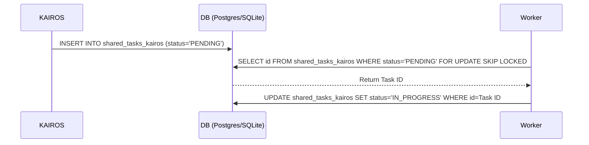

<div markdown="1" style="backdrop-filter: blur(20px) saturate(200%); background: rgba(255, 255, 255, 0.03); font-family: 'Outfit', 'Inter', sans-serif; padding: 24px; border-radius: 12px; border: 1px solid rgba(255, 255, 255, 0.1); color: #ffffff;">

# 🚀 KAIROS Master Design Doc: Hybrid AI OS Orchestration
**Author:** Principal Product Architect & KAIROS Orchestrator (L7)

## 1. Phase 1: Shared Task List (UltraPlan & Decomposition)
The Shared Task List is the foundational database schema for tracking task decomposition across the swarm.

### Architecture
- **Cloud-Native Mode (PostgreSQL):** Utilizes `FOR UPDATE SKIP LOCKED` for horizontally scaled pod concurrency without race conditions.
- **Standalone Mode (SQLite):** Degrades gracefully utilizing application-level Mutexes and single-writer SQLite transactions.

### Database Schema Definition
```sql
CREATE TABLE IF NOT EXISTS shared_tasks_kairos (
    id UUID PRIMARY KEY DEFAULT gen_random_uuid(),
    organization_id VARCHAR NOT NULL,
    title VARCHAR NOT NULL,
    description TEXT,
    status VARCHAR NOT NULL DEFAULT 'PENDING',
    agent_id VARCHAR,
    priority VARCHAR NOT NULL DEFAULT 'P2',
    payload JSONB,
    parent_plan_id TEXT,
    dependencies JSONB NOT NULL DEFAULT '[]',
    created_at TIMESTAMP WITH TIME ZONE DEFAULT CURRENT_TIMESTAMP,
    updated_at TIMESTAMP WITH TIME ZONE DEFAULT CURRENT_TIMESTAMP
);
```

### Sequence Diagram


## 2. Phase 2: Orchestration (Teammate Mesh APIs)
The Teammate Mesh layer provides real-time IPC (Inter-Process Communication) across the swarm.

### Transport
- **Cloud-Native Mode:** Redis Pub/Sub via the `mesh:tasks` and `mesh:coordination` channels.
- **Standalone Mode:** Local in-process transport for host-machine efficiency.

### API Contract (`/api/mesh/v2/broadcast`)
```json
{
  "channel": "mesh:tasks",
  "event_type": "TASK_TRANSITION",
  "data": {
    "task_id": "uuid-1234",
    "previous_state": "PENDING",
    "new_state": "IN_PROGRESS"
  }
}
```

## 3. Phase 3: autoDream (Memory Consolidation)
Background workers consolidate temporary YAML memories into long-term vector embeddings.

### Architecture
- Extracts context from `agent_session_data` and optional runtime memory files in `OHC_MEMORY_DIR`.
- Generates LLM embeddings.
- Stores in `consolidated_memory_kairos` table utilizing `pgvector` for exact semantic search.

## 4. Sub-Agent Orchestration Queue
Robust background queueing logic to spawn isolated sub-agents.
```sql
CREATE TABLE IF NOT EXISTS sub_agent_queue_kairos (
    id UUID PRIMARY KEY DEFAULT gen_random_uuid(),
    organization_id VARCHAR NOT NULL,
    parent_task_id UUID NOT NULL,
    payload JSONB,
    status VARCHAR NOT NULL DEFAULT 'QUEUED',
    worker_id VARCHAR,
    created_at TIMESTAMP WITH TIME ZONE DEFAULT CURRENT_TIMESTAMP,
    updated_at TIMESTAMP WITH TIME ZONE DEFAULT CURRENT_TIMESTAMP
);
```

</div>
