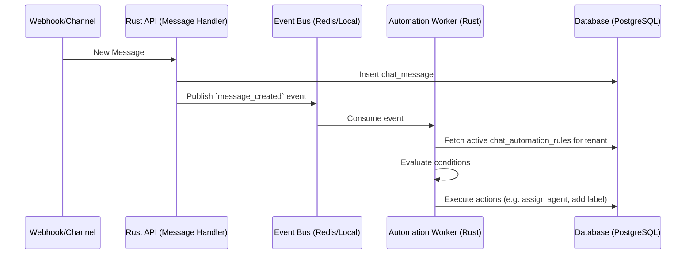

# Architecture: Native Rust Omnichannel Automation, Macros, and SLA Engine

## Problem Statement
Currently, OHC is transitioning away from Chatwoot to a 100% native Rust omnichannel chat system. While the base data models for inboxes, channels, conversations, and messages exist (`217_native_omnichannel_chat.sql`), we lack the automation rule engine, macros, and SLA policies that made Chatwoot powerful. Small-business owners (like Maya the baker or Carlos the handyman) cannot manually triage every incoming message. They need the system to automatically assign conversations, tag VIP customers, reply during off-hours, and flag breached SLAs—completely transparently and effortlessly.

## Architecture Diagram (Mermaid.js)

## Mobile UX Flow (375px first)
- "Automations" tab in the unified inbox settings.
- Glassmorphic (blur 20px) list of active rules, macros, and SLAs following the OHC Premium Token library (`rgba(255, 255, 255, 0.05)`).
- Tapping a rule shows a simplified, non-technical conditional logic builder: "When [New Message] AND [Time is Outside Working Hours] THEN [Send Canned Reply 'Out of Office']".
- Buttons are 44x44px minimal touch targets.

## AI Agent Integration Points
- **Customer Assistant Agent**: Can be one of the "Actions" in an automation rule (e.g., `action: 'handoff_to_ai'`). The rule engine passes the conversation context to the agent to draft a reply.
- **Decision Assistant Agent**: Analyzes SLA breaches and suggests new automation rules to the owner (e.g., "I noticed 50% of your messages are about store hours. Would you like me to create an auto-reply rule?").

## Key Design Decisions
- **Data Model**: We need new tables `chat_automation_rules`, `chat_macros`, and `chat_sla_policies` with strict `tenant_id` RLS (`tenant_id = current_setting('app.current_tenant_id')`).
- **Execution Engine**: Rust-based background worker consuming events from the mesh transport (`src/agents/builtin/mesh/transport.rs`).
- **Condition Evaluation**: A Rust trait-based evaluator that parses the JSONB condition tree and executes against the conversation/message entity safely and concurrently.
