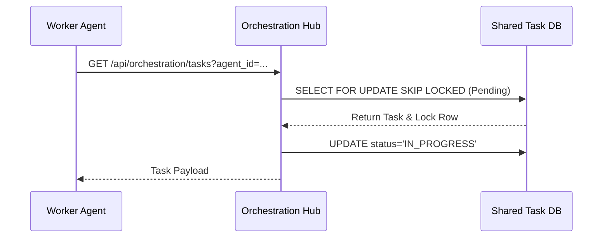
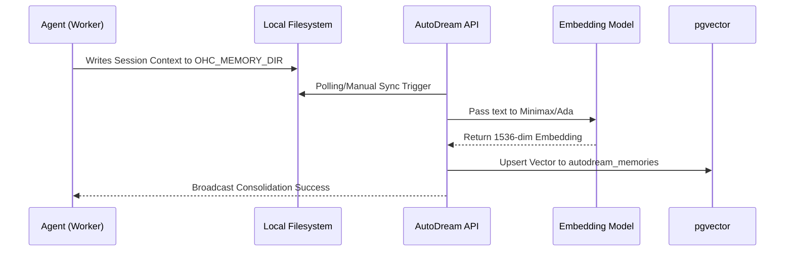
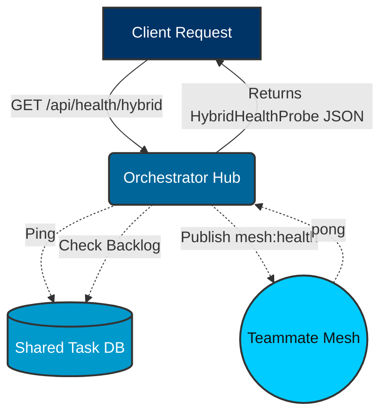

<div markdown="1" style="backdrop-filter: blur(20px) saturate(200%); font-family: 'Outfit', 'Inter', sans-serif; background: rgba(255, 255, 255, 0.03); color: #fff; padding: 20px; border-radius: 12px; border: 1px solid rgba(255, 255, 255, 0.1);">

# KAIROS Interactive API Playbook Walkthrough

Welcome to the interactive walkthrough for the KAIROS Orchestration APIs. This guide provides the ground-truth technical specifications for the OHC Hybrid Agentic OS.

## Teammate Mesh Architecture

```mermaid
graph TD
    subgraph Swarm
        A1[Worker Agent 1]
        A2[Worker Agent 2]
    end

    subgraph Teammate Mesh (Redis/Centrifugo)
        M[Mesh Hub]
    end

    A1 <-->|Pub/Sub| M
    A2 <-->|Pub/Sub| M

    classDef premium fill:rgba(255,255,255,0.03),stroke:rgba(255,255,255,0.08),stroke-width:1px,color:#fff,backdrop-filter:blur(20px) saturate(200%);
    class A1,A2,M premium;
```

## Comparative Features

| Feature | KAIROS | Legacy |
| :--- | :--- | :--- |
| **Messaging** | Centrifugo / Redis | Bare WebSockets |
| **Task Claiming** | `FOR UPDATE SKIP LOCKED` | Memory Queue |
| **Scalability** | Horizontal (Cloud) / SQLite (Standalone) | Monolithic |

See also:
- [Sub-Agent Queue](../../features/kairos/sub_agent_queue.md)
- [Distributed State Machine](../../features/kairos/distributed_state_machine.md)
- [AutoDream Pipelines](../../features/kairos/autodream_pipelines.md)

## Interactive Endpoints

### 1. Create Orchestration Task
**POST** `/api/orchestration/tasks`
- **Payload**: `{"mission_id": "M-123", "title": "Audit Security", "description": "Verify tenant isolation in K8s", "priority": "P1"}`
- **Response**: `201 Created` with the full `SharedTask` object.

### 2. Broadcast Mesh Event (v2)
**POST** `/api/mesh/v2/broadcast`
- **Payload**: `{"channel": "swarm-events", "data": {"event": "status_update", "status": "IN_PROGRESS", "agent_id": "agent_swe_001"}}`
- **Security**: Requires mTLS SPIFFE Identity.

### 3. Hybrid Health Probe
**GET** `/api/health/hybrid`
- **Response**: `{"mode": "cloud", "status": "healthy", "details": {"mesh_active": true, "sync_queue": 0, "stuck_missions": 0}}`

### 4. Poll and Claim Tasks
**GET** `/api/orchestration/tasks?agent_id={agent_id}`
- **Description**: Agents poll this endpoint to claim pending tasks. Uses `FOR UPDATE SKIP LOCKED` (Postgres) or application-level mutexes (SQLite) to ensure atomic claiming.



### 5. Update Task Status
**PUT** `/api/orchestration/tasks/{task_id}/status`
- **Payload**: `{"status": "COMPLETED", "agent_id": "agent_swe_001", "result": "Security audit finished. No leaks detected."}`

### 6. Trigger AutoDream Sync
**POST** `/api/v1/autodream/sync`
- **Payload**: `{"force_reindex": false}`



## Hybrid Architecture Visualizations

### Hybrid Health Probe Flow



### AutoDream Consolidation Flow


</div>
