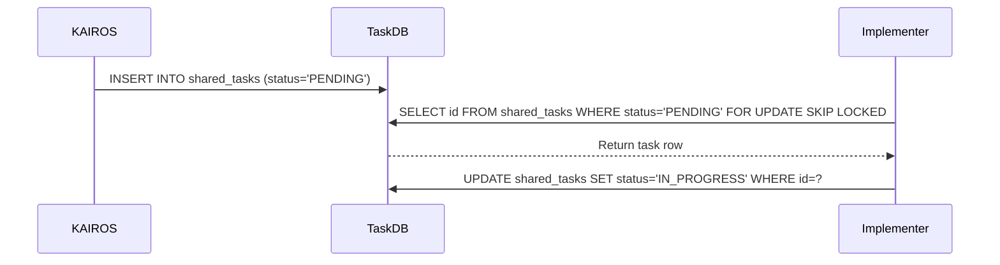

<div markdown="1" style="backdrop-filter: blur(20px) saturate(200%); font-family: 'Outfit', 'Inter', sans-serif; border: 1px solid rgba(255, 255, 255, 0.1); padding: 20px; border-radius: 12px; background: rgba(255, 255, 255, 0.03); color: #fff;">

# KAIROS Orchestrator Shared Task Mesh Architecture
**Author:** Principal Product Architect & KAIROS Orchestrator (L7)

## 1. Phase 1: Shared Task List (Decomposition)
KAIROS orchestrates the swarm by decomposing complex high-level feature requests into a `shared_tasks` table.

**Database Schema (PostgreSQL):**
```sql
CREATE TABLE IF NOT EXISTS shared_tasks (
    id UUID PRIMARY KEY DEFAULT gen_random_uuid(),
    organization_id VARCHAR NOT NULL,
    title VARCHAR NOT NULL,
    description TEXT,
    status VARCHAR NOT NULL DEFAULT 'PENDING',
    agent_id VARCHAR,
    priority VARCHAR NOT NULL DEFAULT 'P2',
    payload JSONB,
    parent_plan_id TEXT,
    dependencies JSONB NOT NULL DEFAULT '[]',
    locked_until TIMESTAMP,
    created_at TIMESTAMP WITH TIME ZONE DEFAULT CURRENT_TIMESTAMP,
    updated_at TIMESTAMP WITH TIME ZONE DEFAULT CURRENT_TIMESTAMP
);
```

**Sequence Diagram:**


## 2. Phase 2: Orchestration (Teammate Mesh Architecture)
Realtime communication via transport components defined in `src/server/orchestration/`.

- **Cloud-Native Mode:** Uses Redis Pub/Sub to manage highly concurrent distributed queues via channels like `mesh:events:task_created`.
- **Standalone Mode:** Degrades gracefully to an in-memory channel broadcast to ensure low-latency IPC.

**Teammate Mesh API Contract:**
```json
{
  "agent_id": "kairos-orchestrator-1",
  "channel": "mesh:events:status_update",
  "action": "TASK_COMPLETED",
  "status": "SUCCESS",
  "payload": {
    "task_id": "uuid-1234",
    "priority": "P0",
    "timestamp": "2026-04-18T17:02:23Z"
  }
}
```

## 3. Phase 3: autoDream (Memory Consolidation Pipeline)
Background workers consolidate episodic memories to embeddings stored in PostgreSQL with pgvector, granting the swarm exact semantic search capabilities.

**pgvector Schema Definition:**
```sql
CREATE EXTENSION IF NOT EXISTS vector;

CREATE TABLE IF NOT EXISTS autodream_vectors (
    id UUID PRIMARY KEY DEFAULT gen_random_uuid(),
    organization_id VARCHAR NOT NULL,
    agent_id VARCHAR NOT NULL,
    memory_type VARCHAR NOT NULL,
    content TEXT NOT NULL,
    embedding vector(1536),
    created_at TIMESTAMP WITH TIME ZONE DEFAULT CURRENT_TIMESTAMP
);

CREATE INDEX idx_autodream_vectors ON autodream_vectors USING ivfflat (embedding vector_cosine_ops) WITH (lists = 100);
```

## 4. Phase 4: Sub-Agent Orchestration Queue
Background worker system with Redis or SQLite implementations for spawning isolated sub-agents processing jobs from KAIROS task decomposition.

**Sub-Agent Job Payload:**
```json
{
  "job_id": "worker-task-77",
  "queue_name": "l5-implementers",
  "data": {
    "issue_ref": "GitHub issue ref here",
    "repository_state_hash": "sha256-abc",
    "execution_timeout_ms": 3600000
  }
}
```

</div>
