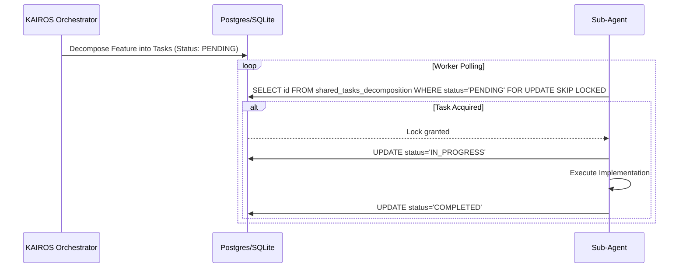
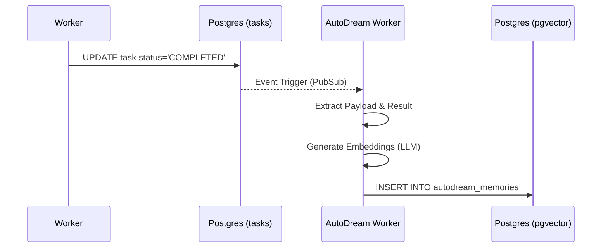

<div markdown="1" style="backdrop-filter: blur(20px) saturate(200%); background: rgba(255, 255, 255, 0.03); font-family: 'Outfit', 'Inter', sans-serif; padding: 20px; border-radius: 12px; border: 1px solid rgba(255, 255, 255, 0.1); color: #FFFFFF;">

# KAIROS AI OS: Hybrid Core Design

## Vision
The One Human Corp (OHC) AI OS is powered by the **KAIROS Orchestrator**, a distributed system designed to manage complex agent swarms with zero friction. KAIROS ensures that a single human can orchestrate vast AI teams by providing a unified, aesthetics-first interface for task decomposition, real-time coordination, and long-term memory consolidation across Cloud-Native (PostgreSQL/Redis) and Standalone Desktop (SQLite) modes.

## Phase 1: Shared Task List (Decomposition)
The Shared Task List tracks complex feature decomposition into actionable, sequenced tasks.

KAIROS utilizes a database-backed state machine to manage the lifecycle of `shared_tasks`.
- **Hybrid Locking:** PostgreSQL uses `FOR UPDATE SKIP LOCKED` for high-concurrency cloud environments. Standalone mode utilizes SQLite with Go-level Mutexes and explicit transactions to prevent TOCTOU (Time-of-Check to Time-of-Use) vulnerabilities.
- **DAG Support:** Tasks can have multiple dependencies, forming a Directed Acyclic Graph. KAIROS enforces circular dependency checks at the middleware layer.

**Shared Task List Schema (PostgreSQL/SQLite):**
```sql
CREATE TABLE IF NOT EXISTS shared_tasks_decomposition (
    id UUID PRIMARY KEY DEFAULT gen_random_uuid(),
    organization_id VARCHAR NOT NULL,
    title VARCHAR NOT NULL,
    description TEXT,
    status VARCHAR NOT NULL DEFAULT 'PENDING',
    assigned_agent_id VARCHAR,
    priority VARCHAR NOT NULL DEFAULT 'P2',
    payload JSONB,
    parent_plan_id TEXT,
    dependencies JSONB NOT NULL DEFAULT '[]',
    locked_until TIMESTAMP,
    created_at TIMESTAMP WITH TIME ZONE DEFAULT CURRENT_TIMESTAMP,
    updated_at TIMESTAMP WITH TIME ZONE DEFAULT CURRENT_TIMESTAMP
);
```

**Task Decomposition Sequence:**


## Phase 2: Teammate Mesh APIs (Orchestration)
The Teammate Mesh provides low-latency communication across the swarm, serving as the system's nervous system.
- **Unified API:** A single gateway (`POST /api/mesh/broadcast`) handles event routing.
- **Hybrid Transport:**
    - **Cloud:** Powered by Redis Pub/Sub connected to Centrifuge hubs for WebSocket propagation to thin clients and sub-agents.
    - **Standalone:** Powered by local in-process transport for maximum host-machine efficiency.

**Payload Contract (OHC-SIP Compliance):**
```json
{
    "agent_id": "sub_agent_xyz123",
    "channel": "mesh:tasks",
    "event_type": "TASK_TRANSITION",
    "data": {
        "task_id": "uuid-1234",
        "previous_state": "PENDING",
        "new_state": "IN_PROGRESS"
    }
}
```

## Phase 3: autoDream (Memory Consolidation Pipeline)
The Swarm Intelligence Protocol (OHC-SIP) dictates that temporary agent scratchpads and completed task results be consolidated into long-term durable state. autoDream serves as the omni-context memory layer for continuous learning.

Worker agents process completed tasks via the background pipeline, generating LLM embeddings for semantic recall. The system relies heavily on PostgreSQL's `pgvector` extension.

**Vector Storage Schema:**
```sql
CREATE EXTENSION IF NOT EXISTS vector;

CREATE TABLE IF NOT EXISTS autodream_memories (
    id UUID PRIMARY KEY DEFAULT gen_random_uuid(),
    task_id UUID REFERENCES shared_tasks_decomposition(id),
    content TEXT NOT NULL,
    embedding vector(1536),
    created_at TIMESTAMP WITH TIME ZONE DEFAULT CURRENT_TIMESTAMP
);
```

**AutoDream Vector Pipeline Sequence:**


## Phase 4: Sub-Agent Orchestration Queue
KAIROS missions regularly spawn asynchronous sub-agents for executing isolated tasks, retries, and scoped execution paths. This logic is managed by the Sub-Agent Orchestration Queue.

- **Queue Architecture:** A background worker system polls the internal state machine queue. Cloud implementations utilize distributed Redis sets, while standalone falls back to local SQLite tables.
- **Isolation:** For Standalone mode, use goroutines with OS-level resource limits. For Cloud, use a sidecar pattern or K8s Jobs.

**Queue Schema:**
```sql
CREATE TABLE IF NOT EXISTS sub_agent_queue (
    id TEXT PRIMARY KEY,
    organization_id TEXT NOT NULL,
    parent_task_id TEXT NOT NULL,
    payload JSONB,
    status TEXT NOT NULL DEFAULT 'QUEUED',
    worker_id TEXT,
    created_at TIMESTAMPTZ DEFAULT CURRENT_TIMESTAMP,
    updated_at TIMESTAMPTZ DEFAULT CURRENT_TIMESTAMP
);
```

---
*Authored by: Principal Product Architect & KAIROS Orchestrator (L7)*
*Identity: One Human Corp*

</div>
