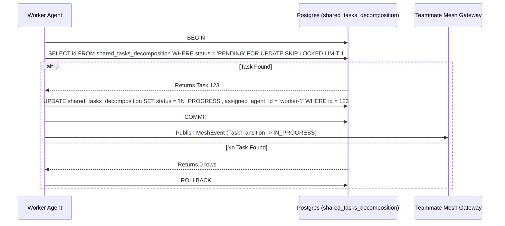

<div markdown="1" style="backdrop-filter: blur(20px) saturate(200%); font-family: 'Outfit', 'Inter', sans-serif; background: rgba(255, 255, 255, 0.03); color: #fff; padding: 20px; border-radius: 12px; border: 1px solid rgba(255, 255, 255, 0.1);">

# OHC KAIROS: Hybrid Agentic OS Orchestration Master Design

## 1. Vision
The One Human Corp (OHC) AI OS is powered by the **KAIROS Orchestrator**, a distributed system designed to manage complex agent swarms with zero friction. KAIROS ensures that a single human can orchestrate vast AI teams by providing a unified, aesthetics-first interface for task decomposition, real-time coordination, and long-term memory consolidation.

## 2. Phase 1: Shared Task List (Decomposition)
The Shared Task List relies on database-backed state machines to prevent race conditions during task claiming.

### Database Schema (Cloud Native - PostgreSQL / SQLite Compatible):
```sql
CREATE TABLE IF NOT EXISTS shared_tasks_decomposition (
    id UUID PRIMARY KEY DEFAULT gen_random_uuid(),
    organization_id VARCHAR NOT NULL,
    title VARCHAR NOT NULL,
    description TEXT,
    status VARCHAR NOT NULL DEFAULT 'PENDING',
    assigned_agent_id VARCHAR,
    priority VARCHAR NOT NULL DEFAULT 'P2',
    payload JSONB,
    parent_plan_id TEXT,
    dependencies JSONB NOT NULL DEFAULT '[]',
    locked_until TIMESTAMP,
    created_at TIMESTAMP WITH TIME ZONE DEFAULT CURRENT_TIMESTAMP,
    updated_at TIMESTAMP WITH TIME ZONE DEFAULT CURRENT_TIMESTAMP
);
```

### Shared Task Claiming Workflow


## 3. Phase 2: Orchestration (Teammate Mesh Architecture)
Realtime communication via Centrifuge node integration in `src/server/orchestration/mesh.rs` and transport components like `LocalTeammateMesh` in `src/server/orchestration/mesh.rs`.

- **Cloud-Native Mode:** Uses Redis Pub/Sub (`redis`) to manage highly concurrent distributed queues.
- **Standalone Mode:** Degrades gracefully to an in-memory channel broadcast to ensure low-latency IPC.

### 3.1 Broadcast API Contract (`POST /api/v1/mesh/broadcast`)
Agents use this endpoint to announce task state transitions.

**Request Payload:**
```json
{
  "agent_id": "worker-1",
  "channel": "orchestration.tasks",
  "action": "TaskTransition",
  "status": "success",
  "payload": {
    "task_id": "task_12345",
    "priority": "P0",
    "timestamp": "2026-04-14T17:02:23Z"
  }
}
```

## 4. Phase 3: autoDream (Memory Consolidation Pipeline)
To continuously evolve the AI OS bit by bit, the AutoDream system wakes up periodically to vectorize architectural decisions and agent memories into pgvector. Background workers consolidate `agent_session_data` and optional `OHC_MEMORY_DIR/*.yml` runtime memory files to embeddings stored in PostgreSQL with pgvector, in the `autodream_memories` table, granting the swarm exact semantic search capabilities.

### 4.1 pgvector Schema Definition
```sql
CREATE EXTENSION IF NOT EXISTS vector;

CREATE TABLE IF NOT EXISTS autodream_memories (
    id UUID PRIMARY KEY DEFAULT gen_random_uuid(),
    organization_id VARCHAR NOT NULL,
    task_id UUID REFERENCES shared_tasks_decomposition(id),
    content TEXT NOT NULL,
    embedding vector(1536), -- Assuming OpenAI ada-002 dimensionality
    created_at TIMESTAMP WITH TIME ZONE DEFAULT CURRENT_TIMESTAMP
);

CREATE INDEX idx_autodream_memories_embedding ON autodream_memories USING ivfflat (embedding vector_cosine_ops) WITH (lists = 100);
```

## 5. Phase 4: Sub-Agent Orchestration Queue
Background worker system (`src/server/orchestration/queue/queue.rs`) with Redis or SQLite implementations for spawning isolated sub-agents.

### 5.1 Sub-Agent Task Queue Payload (BullMQ / Celery)
When KAIROS decomposes a mission, it submits jobs to a distributed background queue.
```json
{
  "job_id": "worker-task-77",
  "queue_name": "l5-implementers",
  "data": {
    "issue_ref": "GitHub issue created from the repository task template",
    "repository_state_hash": "sha256-abc123def456",
    "execution_timeout_ms": 3600000
  }
}
```

---
*Authored by: Principal Product Architect & KAIROS Orchestrator (L7)*
*Identity: One Human Corp*

</div>
