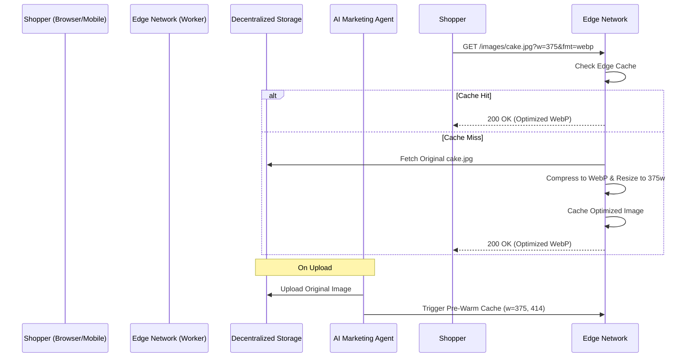

# Decentralized Edge-Computed Image Optimization Service

## Problem Statement
Small business owners on OHC, like Maya (The Home Baker) or Priya (The Boutique Owner), frequently upload high-resolution images from their mobile devices. Currently, these assets are uploaded directly to centralized storage and processed in the cloud, leading to significant latency, increased bandwidth costs, and poor user experiences over slow networks. To ensure an instant, mobile-first experience on 375px screens, we need a decentralized, edge-computed image optimization service that compresses, resizes, and delivers WebP images instantly at the edge without hitting the core database or monolith servers.

## Research Report

**Market Competitive Analysis:**
- **Shopify:** Utilizes a global CDN for image delivery, dynamically resizing and formatting images based on device capabilities and screen size. However, the initial upload processing is still centralized.
- **Wix:** Employs advanced image processing algorithms, but heavily relies on their monolithic backend to handle media manipulation before distributing to CDNs.
- **Vercel/Next.js:** Next.js Image Optimization is powerful, utilizing edge functions to resize and compress images on the fly.
- **OHC Opportunity:** By leveraging Edge Computing (e.g., Cloudflare Workers or similar edge nodes), OHC can intercept image uploads, optimize them to WebP, and store them directly at the edge or in decentralized storage. This guarantees sub-100ms asset delivery and completely offloads the monolith from media processing, aligning perfectly with our mobile-first, low-data mode non-negotiables.

## Design Doc

### Core Architectural Concepts
1. **Edge-Based Image Transformation:** Implement a serverless edge function layer that intercepts all media requests and performs on-the-fly resizing, cropping, and WebP compression based on query parameters (e.g., `?w=375&fmt=webp`).
2. **Decentralized Storage:** Integrate an edge-adjacent storage solution (like Cloudflare R2 or an S3 compatible distributed network) to store the original high-resolution assets securely.
3. **Agentic Pre-Computation:** The "Marketing & Advertising" Agent pre-computes optimal image sizes for standard mobile breakpoints (375px, 414px) and pre-warms the CDN cache whenever a new product image is uploaded.
4. **Low-Data Mode Fallback:** Implement progressive image loading and extremely compressed placeholders (BlurHash) for users on slow mobile networks.

### Architecture Diagram

### Mobile-First UX Flow
1. Priya uploads a 10MB photo of a new dress from her iPhone.
2. The OHC mobile app performs initial lightweight client-side compression.
3. The image is uploaded to the Edge Storage. The Marketing Agent pre-warms the cache.
4. A shopper on a 3G network views the storefront. The Edge Network instantly delivers a 30KB WebP image tailored to their 375px screen. The layout shifts are zero due to pre-calculated aspect ratios.

## Implementation Prompt

**Role:** Implementer Agent
**Goal:** Build the edge-computed image optimization service and integrate it with the OHC backend.

**Acceptance Criteria:**
1. Implement an edge worker (or similar proxy) capable of resizing and formatting images to WebP on the fly based on query parameters.
2. Configure the OHC backend to generate pre-signed URLs for direct-to-edge uploads, bypassing the Go monolith.
3. Update the Flutter app and Web PWA to utilize the new image serving URLs with appropriate breakpoint parameters.
4. Integrate BlurHash generation on the client-side during upload to provide immediate low-fidelity placeholders.

**Priority:** P1 (High)
**Estimated Scope:** Medium
