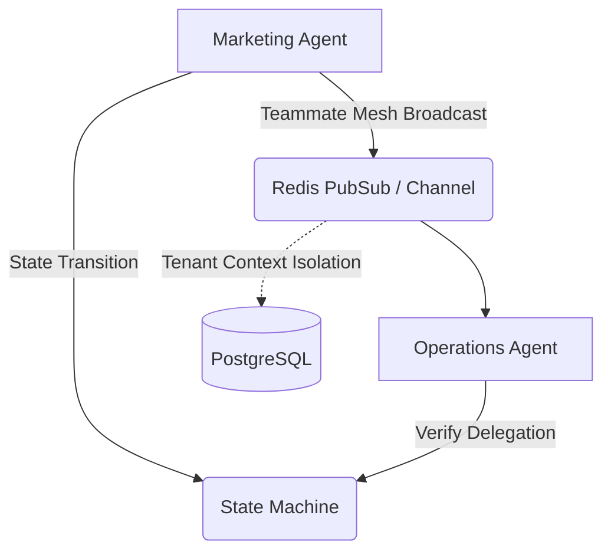

# Title: KAIROS Hub Architectural Gap Discovery

## Problem Statement
While OneHumanCorp provides multi-agent orchestration via KAIROS, a core architectural gap is the lack of a standardized Hub topology to cleanly isolate inter-departmental agent communications via a "Teammate Mesh".
Currently, we have `src/server/orchestration/mesh.rs` and `src/server/orchestration/hub.rs`, but we lack a comprehensive mesh layer with real-time broadcast APIs and deep integration for inter-agent delegation and state transitions. As SMB users (like Maya the baker) scale their operations, they need AI agents across distinct departments (e.g., Marketing and Operations) to securely and reliably sync context.

## Research Report
Our competitive analysis indicates that basic setups in Shopify or Wix do not provide native multi-agent coordination (often relying on disjointed third-party app webhooks). OHC's value proposition relies on treating AI as infrastructure. We have an existing KAIROS foundation (`src/server/orchestration/kairos.rs`) and shared tasks (`src/server/orchestration/shared_tasks.rs`), but the system lacks robust hub infrastructure to connect them at scale natively for cross-department handoff.

## Design Doc
### Architecture
*   **Mesh API**: A Teammate Mesh API to be designed under the Hub component to handle Pub/Sub (Redis for Cloud, Channels for Standalone).
*   **Isolation**: Utilize OHC's row-level security (`tenant_id`) down to the mesh broadcast level to prevent data leakage between tenants.
*   **Integration**: Connect the `mesh.rs` broadcasts directly into `handoff.rs` and the centralized state machine for verifiable inter-agent delegation.

### Architecture Diagram

### UI Wireframes
*   **Mobile Experience (375px)**: A "Teammate Sync" indicator in the Glassmorphism UI showing when agents are communicating (e.g., "The Promoter is briefing The Manager").
*   A read-only log for the business owner to monitor inter-agent delegation.

## Implementation Prompt
Implement the Teammate Mesh APIs within the KAIROS Orchestration layer (specifically extending `src/server/orchestration/mesh.rs` and `hub.rs`). Set up proper multi-tenant broadcast boundaries. Integrate the mesh with the state machine (`src/server/orchestration/statemachine_v2.rs`) so that events emitted by one agent's completion transition the state of a dependent agent task securely. Ensure unit test coverage is 100%.

**Priority**: P1
**Estimated Scope**: Large
