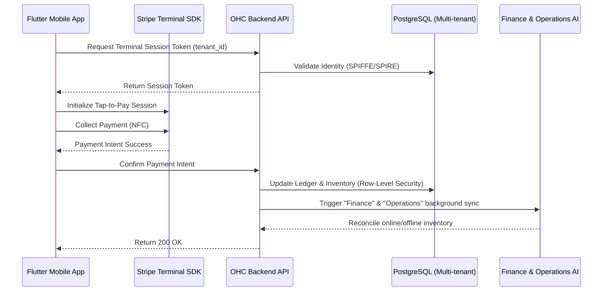

# Title: Unified Tap-to-Pay POS Architecture

## Problem Statement
Priya (Boutique Owner), Carlos (Handyman), and Fatima (Food Cart) need a reliable way to process in-person payments directly from their phones. Currently, OHC lacks a unified Tap-to-Pay (POS) architecture integrated with Stripe Terminal. Without this, non-technical owners are forced to juggle external card readers, and manually reconcile in-person sales with online storefront inventory, breaking the core "Zero Technical Knowledge" promise of the OHC platform.

## Research Report
### Market Context
Leading platforms like Shopify, Square, and Wix provide POS experiences. However, they often rely heavily on dedicated proprietary hardware or complex app integrations that require significant setup time.

### Opportunity
OHC has the opportunity to leapfrog competitors by natively leveraging **Stripe's Tap to Pay on iPhone and Android**. This means users like Maya, Carlos, or Priya only need their smartphone to accept contactless payments. It reduces the friction of adopting a POS system to zero—no extra dongles, no Bluetooth pairing, and no complex configuration required for basic operations.

### Competitive Analysis
| Feature | OHC (Proposed) | Shopify POS | Square | Wix POS |
|---|---|---|---|---|
| Hardware needed | **None (Smartphone only)** | Reader recommended | Reader recommended | Proprietary terminal |
| Setup time | **< 1 minute** | 10+ minutes | 10+ minutes | Hardware delivery time |
| Inventory sync | **Real-time (AI Agent)** | Real-time | Real-time | Real-time |
| Cost | **Standard Stripe fee** | Monthly fee + hardware | Transaction fee + hardware | High hardware cost |

## Design Doc

### Architecture Diagram (Mermaid.js)

### UI Wireframes & Screen Flow (375px First)
1. **Home Dashboard (Glassmorphism layout)**: A clean "Tap to Charge" floating action button prominently displayed at the bottom right.
2. **Charge Entry Screen**: Large native numeric keypad to enter the amount. A toggle for "Attach to Order/Product" to seamlessly link the transaction to an existing inventory item.
3. **Tap-to-Pay Overlay**: Native Stripe Tap-to-Pay OS overlay showing the amount and NFC instructions.
4. **Success Screen**: Confetti micro-animation, total amount, and buttons for "Send Receipt (SMS/Email)" and "Done".

### Mobile UX Flow
- The user taps "Tap to Charge".
- Enters the price using the native numeric keyboard.
- Presents their phone to the customer.
- Customer taps their contactless card or Apple/Google Pay on the owner's phone.
- Haptic feedback confirms the transaction.
- The Finance AI agent automatically updates daily revenue analytics and inventory.

### AI Agent Integration Points
- **Finance & Payments ("The Accountant")**: Instantly reconciles the offline transaction with the daily revenue metrics and adjusts the next forecasted payout.
- **Operations ("The Manager")**: If a specific product was selected for the charge, Operations immediately deducts it from the global inventory to prevent online overselling.

### Key Design Decisions
- **No Hardware Required**: By depending purely on Stripe Terminal's Tap to Pay on iPhone/Android, we eliminate hardware barriers.
- **Strict Tenant Isolation**: Every Terminal session token must be scoped strictly to the `tenant_id` at the database level.
- **Offline Resilience**: The app must handle temporary network loss after a successful NFC read, using a retry queue to sync the transaction with the backend once connectivity is restored.

## Implementation Prompt
**Task**: Implement the backend API infrastructure for the Stripe Tap-to-Pay POS architecture.
**User Journey**: Priya wants to charge an in-store customer $45 for a dress. She opens the OHC app, enters 45, and the app prompts the customer to tap their card on her phone. The payment is processed, and her inventory is automatically updated.
**Acceptance Criteria**:
1. Implement the `POST /api/v1/terminal/connection_token` endpoint to vend Stripe Terminal session tokens, strictly validated by the user's `tenant_id`.
2. Implement the `POST /api/v1/terminal/capture` endpoint to finalize the payment intent and update the tenant's ledger.
3. Emit a structured event to the background job queue (e.g., `pos.payment_succeeded`) to trigger the Finance and Operations AI agents.
4. Write 100% unit test coverage for the new endpoints and business logic.
5. Provide a Playwright E2E test verifying the mock flow of a successful POS transaction from the UI to the database.

## Priority
P0

## Estimated Scope
Large
