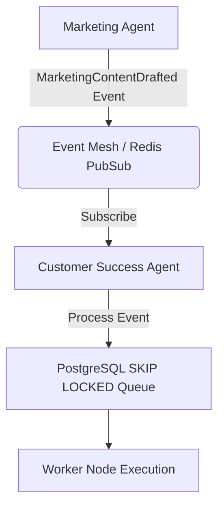

# OHC Agent Architecture & Technical Research

## Missing Architecture Discovery

Currently, OneHumanCorp (OHC) is missing a robust background queue and event architecture for asynchronous Agent interactions. Our existing infrastructure lacks a dedicated architecture for "Autonomous Departments" (e.g. Sales, Marketing, Customer Success, Finance) that proactively perform tasks on behalf of small business owners.

## Competitor Audit

Shopify Sidekick is limited to reactive chatbot behavior. Other tools like Wix and GoDaddy similarly lack deep agent integration.

To leapfrog our competitors and fulfill the OHC vision of radical simplicity and invisible AI automation, we need:
1. **Background Job Queue:** PostgreSQL `SKIP LOCKED` based background job queues for agent task execution with retries and dead-letter queues.
2. **Event Sourcing / Messaging:** An architecture where Agents communicate with each other via events and messages securely within tenant boundaries.

This architecture will act as the foundation for the 5 Pillar Automations.

## Architecture Design

### Mobile UX Flow
The user will primarily interact with these background tasks via 1-Tap Approvals on their mobile device (375px viewport):
1. User receives a push notification: "Marketing agent drafted a post."
2. User taps notification, opening the OHC app.
3. A clean, glassmorphic card displays the drafted content and an "Approve" button.
4. User taps "Approve."
5. An event is emitted to the Event Mesh, triggering the actual posting workflow.

### Implementation Prompt
Implement a scalable Event Mesh for Autonomous Departments. The mesh should accept events via a new gRPC service (`DepartmentEventBus`), securely validate the `tenant_id`, and distribute the events to listening agents (e.g., Operations, Finance) via a Redis-backed channel or PostgreSQL SKIP LOCKED table if standalone. E2E tests must verify that an event emitted by Marketing is successfully consumed by Customer Success.

**Acceptance Criteria:**
- `DepartmentEventBus` gRPC service implemented.
- Redis Pub/Sub integration for cloud-native mode.
- PostgreSQL SKIP LOCKED queue integration for standalone mode.
- Unit and E2E tests passing.

**Priority:** P0
**Estimated Scope:** Large
