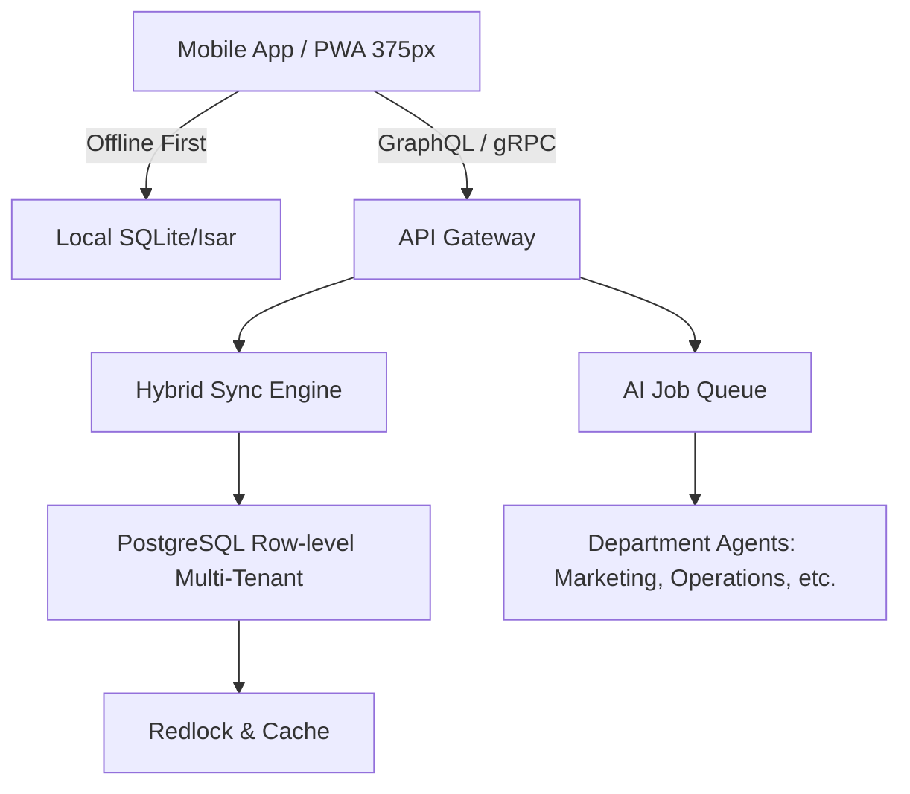

# OHC Mobile-First High-Performance SMB Platform Architecture

## Problem Statement
Small business owners (bakers, handymen, food cart operators) typically manage their businesses from low to mid-tier mobile devices. Traditional SaaS platforms force complex web-first interfaces that scale poorly to a 375px viewport and require fast, continuous network connections. There is a need for an architecture that enables real-time, offline-capable, AI-powered business management entirely from a mobile phone, allowing users like Maya (baker) and Fatima (food cart operator) to perform zero-latency operations even with spotty internet connectivity.

## Research Report

**Competitor Analysis:**
- **Shopify:** Excellent web-based capabilities; however, mobile app often feels like a port. Full capabilities require desktop.
- **Wix/Squarespace:** Mobile apps are secondary to the web builders; real-time operations and point-of-sale functionality are often bolted on.
- **OHC Vision:** 100% functionality on a 375px mobile screen. Offline-first read-write functionality, transparent AI agent interaction.

**Key Technical Requirements:**
- **Viewport Target:** 375px width primary focus.
- **Network Resilience:** Offline-first architecture with background sync.
- **Data Footprint:** Minimized data transfer (gRPC-Web/Protocol Buffers, compressed image delivery).
- **Compute:** Push AI processing to backend queue; local client should only render states and emit intentions.

## Design Doc

### Architecture Diagram

### Key Components:
1. **Local-First Sync Engine:** The client writes to a local datastore first, allowing zero-latency UI updates. A background worker syncs via delta updates.
2. **Optimistic UI:** Every critical operation (order acceptance, catalog update) shows optimistic completion, queueing for background retry.
3. **AI Task Delegation:** Rather than complex forms, users interact via conversational intents or simple prompts. The client sends intents to the AI Job Queue for asynchronous execution.
4. **Adaptive Asset Delivery:** WebP compression on edge CDN, delivering appropriately sized images based on network bandwidth and device capabilities.

## Implementation Prompt
**For Implementer Agent:**
Implement the core `HybridSyncEngine` rust service component for the backend, focusing on handling offline-first client deltas. Establish the gRPC endpoints for syncing entity state (e.g., `CatalogItem`, `Order`) with conflict resolution strategies (Last-Write-Wins based on client timestamps). Ensure it integrates strictly with the existing multi-tenant PostgreSQL schema.

**Acceptance Criteria:**
- Clients can submit batched operations.
- Backend resolves conflicts using a defined strategy.
- Responses indicate accepted, rejected, or modified states.

## Priority
P0 (critical)

## Estimated Scope
Large
