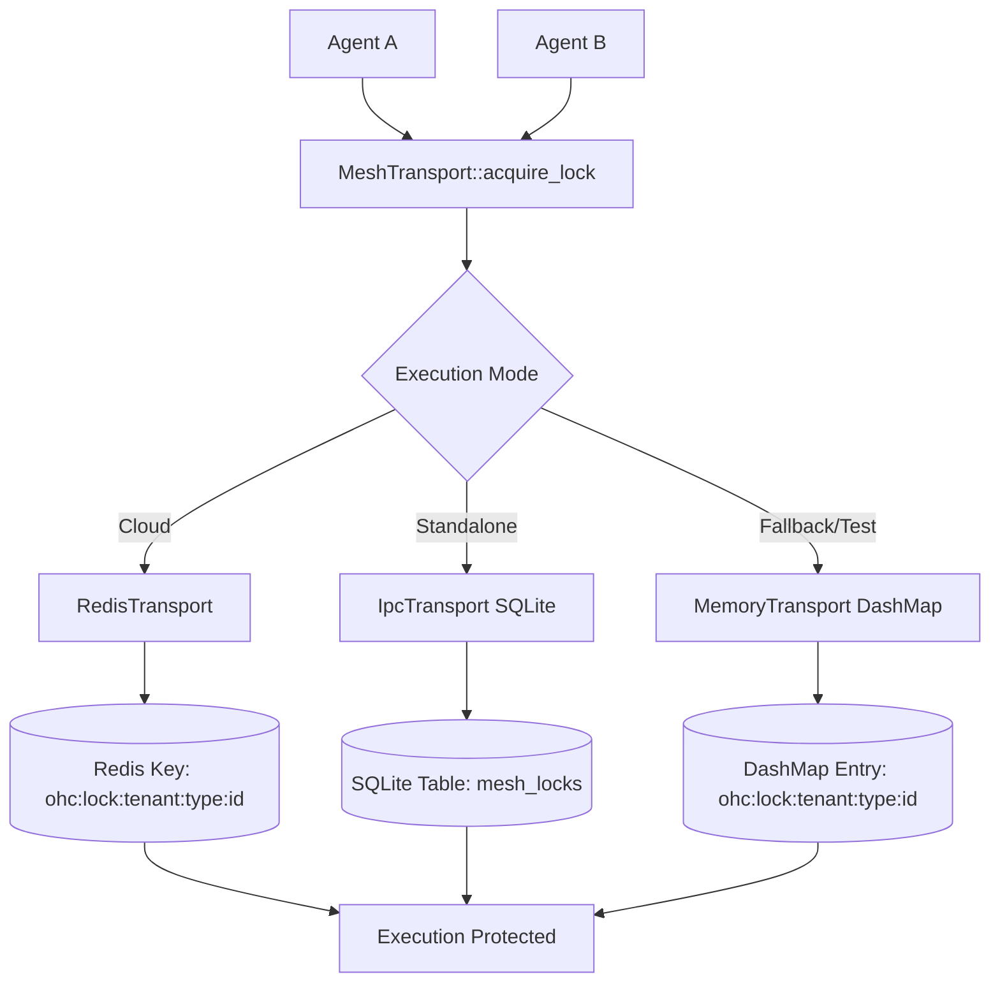

# Distributed Locking Protocol

## Overview

OneHumanCorp (OHC) operates across two primary environments:
- **Cloud Mode** (Multi-tenant)
- **Standalone Mode** (Single-tenant / Local)

In both modes, various AI agents ("The Promoter", "The Manager", etc.) operate concurrently. It is critical that distributed resources—such as shared task modifications, external API coordination, or cache writes—are protected from race conditions via a uniform Distributed Locking Protocol.

## The `TeammateMesh` Locking API

To abstract the underlying transport and state layer across modes, agents rely entirely on the `MeshTransport` interface:

```rust
async fn acquire_lock(&self, tenant_id: &str, resource_type: &str, resource_id: &str, owner: &str, ttl_seconds: u64) -> Result<bool, String>;
async fn release_lock(&self, tenant_id: &str, resource_type: &str, resource_id: &str, owner: &str) -> Result<(), String>;
```

This strict multi-parameter signature fulfills the **Mandatory Lock Key Pattern**: `ohc:lock:{tenant_id}:{resource_type}:{resource_id}` ensuring strict tenant-isolation across both Cloud and Standalone environments.

## Mode Behavior & Implementations

### Cloud Mode (`RedisTransport`)

In Cloud Mode, distributed locking utilizes **Redis**. The key `ohc:lock:{tenant_id}:{resource_type}:{resource_id}` is created using `SET NX EX`. Release operations execute an atomic Lua script to ensure an agent only deletes the lock if it currently owns it, preventing premature release bugs.

### Standalone Mode (`IpcTransport`)

In Standalone (Desktop) Mode, the application leverages SQLite via an IPC mechanism (`mesh_locks` table).
- Locking uses an `INSERT ... ON CONFLICT DO NOTHING` statement.
- Expired locks are cleared via background sweep or inline deletes using `expires_at <= datetime('now')`.

### Development / Fallback Mode (`MemoryTransport`)

For fast test execution and fallback environments, `MemoryTransport` uses an in-memory `DashMap` containing lock expiry timers, completely fulfilling the `TeammateMesh` locking API contract without persistent I/O.

## Architecture Diagram


