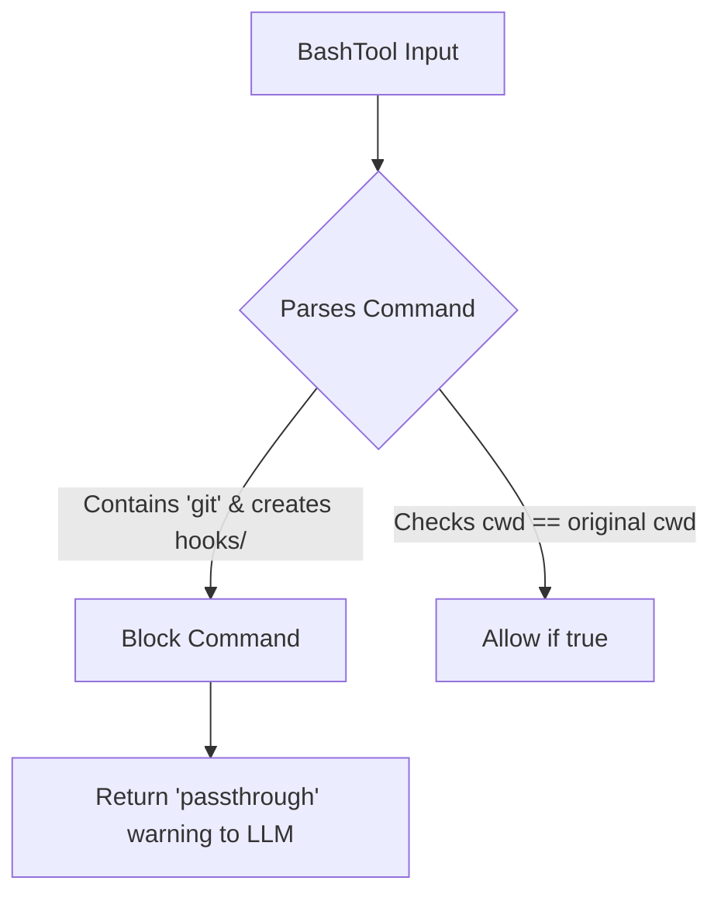

# Research Report: Agent Harness & Sandbox Architecture (Claude Code Analysis)

## 1. Executive Summary
This report analyzes the Agent Harness and Sandbox implementation of the leaked Claude Code application. We discovered that Claude Code has a deeply integrated sandbox that intercepts tool outputs to communicate sandbox violations, implements explicit overrides (`dangerouslyDisableSandbox`), and has deep protection mechanisms to stop sandbox escapes via internal git files.

## 2. Competitive Analysis: Claude Code vs. OHC
| Feature | Claude Code (Market Leader) | OHC Hybrid OS | Gap |
| :--- | :--- | :--- | :--- |
| **Sandbox Execution** | Yes, `bwrap`/`sandbox-exec` | Yes, basic blockedPatterns in `harness/sandbox/manager.rs` | Minimal |
| **Sandbox Escape Mitigations** | Advanced (Git internal path write blocking, cwd manipulation checks) | Basic Regexp matching | **Critical Gap** |
| **Telemetry Injection** | Injects `<sandbox_violations>` directly into `stderr` | None | **Critical Gap** |
| **User Override** | LLM-driven `dangerouslyDisableSandbox` capability | Strict policies only | **Feature Gap** |

## 3. Deep Technical Architecture (Claude Code Harness)
### A. Git-Internal Path Mitigations (Sandbox Escape)
Claude Code explicitly parses bash commands to detect operations that create git-internal files (`HEAD`, `objects/`, `refs/`, `hooks/`) and then sequentially run `git`.
If a sandboxed shell could write a malicious script to `.git/hooks/pre-commit` and then invoke `git status`, it would result in arbitrary, potentially unsandboxed execution via the hook. Claude Code blocks this explicitly in its validation layer.

### B. Telemetry & `<sandbox_violations>` Injection
When an operation fails due to Sandbox boundaries (e.g., "Operation not permitted" on a blocked domain or file), Claude Code's `sandbox-runtime` intercepts the failure and appends a `<sandbox_violations>...details...</sandbox_violations>` XML block to the `stderr`.
The `BashToolResultMessage` UI component extracts this XML chunk, rendering a specific warning color, while the LLM parses it to understand exactly *why* the task failed, enabling self-correction.

## 4. Actionable Missions for Implementers
Based on these findings, we will inject two actionable GitHub issues for the Swarm to close these gaps.

1.  **[research] Implement Git-Internal Path Write Protections (Sandbox Escape Prevention)**
2.  **[research] Implement Sandbox Violation XML Tag Injection & Extraction**

