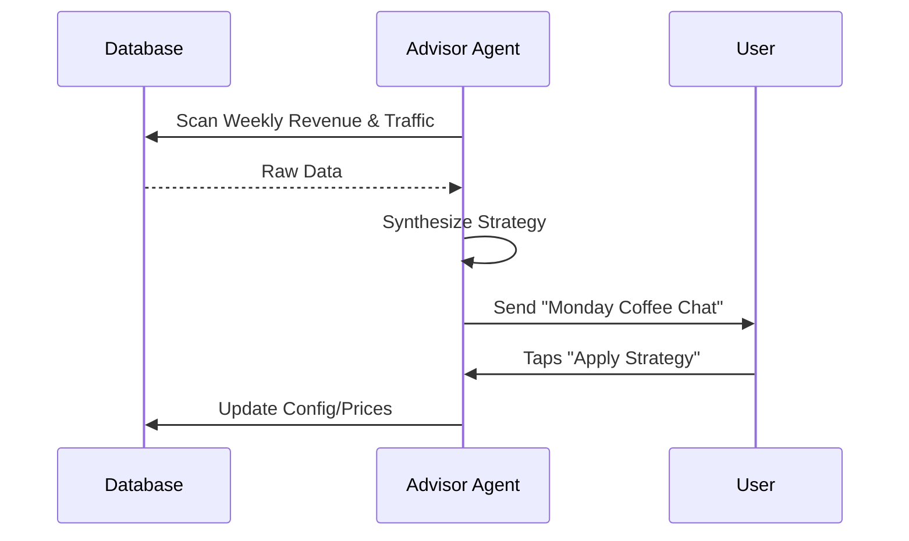

# [Advisory] Plain-Language Business Health Insights

## Problem Statement
Analytics dashboards (Google Analytics, Shopify reports) are often too complex for non-technical users. They see numbers but don't know what *action* to take.

## Research Report
- **Competitors:** Provide charts and graphs. AI assistants like Sidekick can answer questions *if asked*, but aren't proactive "advisors" that deliver strategy ([Source: Competitive Audit](feature_gap_matrix.md)).
- **OHC Opportunity:** The Business Advisory department should send a weekly "Coffee Chat" summary—a plain-language report that explains what happened and what to do next.

### Advisory Workflow

## Design Doc
- **Entity Types:** `BusinessInsight`, `WeeklyReport`.
- **Logic:**
  1. **Aggregation:** Advisor agent scans revenue, traffic, and inventory data.
  2. **Synthesis:** Identifies trends (e.g., "Sales of sourdough are up 20% on Tuesdays").
  3. **Recommendation:** Suggests actions (e.g., "Bake more sourdough on Monday nights").
  4. **Delivery:** Premium mobile-optimized report delivered every Monday morning.

## Implementation Prompt
**Outcome:** Proactive plain-language business advisory system.
**CUJ:** Maya receives her Monday report: "Great week, Maya! You sold 4 more cakes than last week. Your 'Vegan Chocolate' is trending—consider running a 10% discount on it to clear your extra cocoa stock."
**Acceptance Criteria:**
- Generation of human-readable insights from raw DB data.
- 375px optimized report UI.
- Actionable deep-links (e.g., "Apply Discount" button).

## Priority
P2

## Estimated Scope
Small

