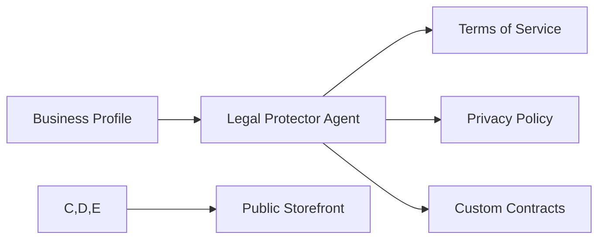

# [AI] Legal 'Protector' Suite

## Title
AI Legal 'Protector' Suite: Automated Compliance for Everyone

## Problem Statement
Legal compliance is a major source of anxiety for new founders. Maya is worried about food allergy liability; Carlos is worried about contract disputes for home repairs. Hiring a lawyer is too expensive. Founders need "invisible protection" — automated terms of service, privacy policies, and custom order contracts that are legally sound but written in plain language.

## Research Report
- **Market Comparison:**
    - **Termly / GetTerms:** Separate paid services that require manual setup.
    - **OHC Approach:** The **Legal & Compliance Agent ("The Protector")** automatically scans the business type (e.g., "Food & Beverage") and generates the necessary disclaimers and policies during onboarding.
- **Key Risks Managed:**
    - Liability disclaimers for food/allergies (Fatima/Maya).
    - Service agreements with deposit/refund terms (Carlos/Leo).
    - GDPR/CCPA compliance for global storefronts.

## Design Doc
### Automated Policy Generation
The "Protector" agent uses the business metadata (from onboarding) to select the correct legal templates and "fill in the blanks" autonomously.

### Component Interaction

## Implementation Prompt
Design and implement the AI Legal 'Protector' suite.
- **Outcome:** Every OHC business is protected by default from day one.
- **CUJ:** Maya selects "Custom Cakes" in the setup wizard -> The Protector Agent generates a "Custom Order Agreement" that explains the non-refundable deposit policy and food allergy disclaimers.
- **Criteria:** Policies must be presented in a glassmorphism "Legal Center" on the storefront. Content must be plain-language but legally robust.

## Priority
P1

## Estimated Scope
Small
