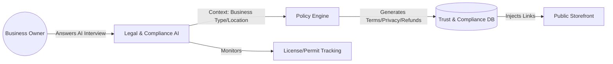

# [AI] Protector: Legal & Compliance Suite

## Title
AI "Protector" Department: Automated Legal Policies and Compliance for Solo Entrepreneurs.

## Problem Statement
Starting a business involves scary legal "jargon" that paralyzes non-technical founders. Maya and Fatima don't know how to write a "Privacy Policy" or a "Refund Policy" for custom cakes. Hiring a lawyer is too expensive, and copy-pasting from the internet is risky. OHC needs an "Invisible" Legal department that generates these protections automatically based on the business type.

## Research Report
### Current Gap
- Most platforms (Shopify) provide generic templates that users must edit.
- Users often skip legal setup, leaving them vulnerable to chargebacks or GDPR fines.
- There is no "Guardian" that alerts the owner when a local license or permit is about to expire.

### Solution: The "Protector" Agent
Instead of a static template, the AI interviews the owner: "Do you sell food?" -> "Yes" -> "Protector generates a Health & Safety disclaimer and a Food Allergy warning."

## Design Doc
### Architecture Diagram

### AI Agent Integration
- **Legal & Compliance Department ("The Protector")**:
  - **Skills**: Policy generation, GDPR/CCPA compliance check, Contract drafting (for services).
  - **Trigger**: Runs during onboarding and whenever the business adds a new "Category" (e.g., if Maya adds "Cooking Classes", Protector drafts a liability waiver).

### Key Design Decisions
- **Zero-Manual-Entry**: Policies are derived from the `business_profile` and `industry` tags.
- **Dynamic Policy Update**: If the user changes their location (e.g., moves from US to UK), the Protector automatically flags that the Privacy Policy needs a GDPR update.

## Implementation Prompt
Implement the `Legal & Compliance` agent department. The primary CUJ is: "As Carlos, I want a service agreement generated for my $500 repair job that protects me if the customer doesn't pay."
Acceptance Criteria:
- AI-driven generation of Terms of Service, Privacy Policy, and Refund Policy.
- "Risk Scanner": AI reviews product descriptions for high-risk claims (e.g., "Cures all diseases") and flags them to the owner.
- Integration with the Storefront to auto-inject legal links in the footer.
- Support for "Liability Waivers" for service-based businesses.

## Priority
P2 (Medium)

## Estimated Scope
Medium
