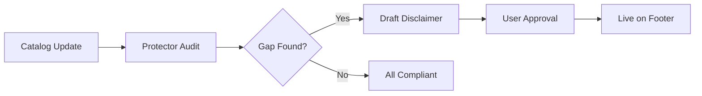

# [AI] Protector: Legal & Compliance Suite

## Problem Statement
Small businesses often ignore terms of service, privacy policies, and industry-specific regulations (GDPR, HACCP) because legal help is expensive. This leaves them vulnerable. The OHC "Legal" department exists in name in the code but lacks functional capabilities.

## Research Report
- **Competitors:** Most platforms provide generic templates that are rarely updated or tailored to the specific business nuance. SMBs often search for "free legal templates" only to find outdated or irrelevant documents ([Source: Reddit r/legaladvice](https://www.reddit.com/r/legaladvice/)).
- **OHC Opportunity:** An active "Protector" agent that scans the business profile and generates bespoke, compliant documents and alerts the user to upcoming license expirations.

### Compliance Loop

## Design Doc
- **Capabilities:** `PolicyGeneration`, `ComplianceAudit`, `LicenseTracking`.
- **Process Flow:**
  1. **Audit:** Legal agent reviews website content and product catalog.
  2. **Generation:** Drafts "Refund Policy" and "Privacy Policy" tailored to the locale and product types.
  3. **Monitoring:** Tracks business license dates and sends "Action Required" notifications 30 days before expiry.

## Implementation Prompt
**Outcome:** Functional Legal & Compliance agent capabilities.
**CUJ:** Fatima (food cart) adds a new spicy sauce. The Legal agent identifies the need for a "Heat Warning" disclaimer and drafts it for her website footer.
**Acceptance Criteria:**
- Bespoke policy generation using RAG on local/regional regulations.
- Proactive license expiry tracking.
- Plain-language compliance health score.

## Priority
P1

## Estimated Scope
Medium

