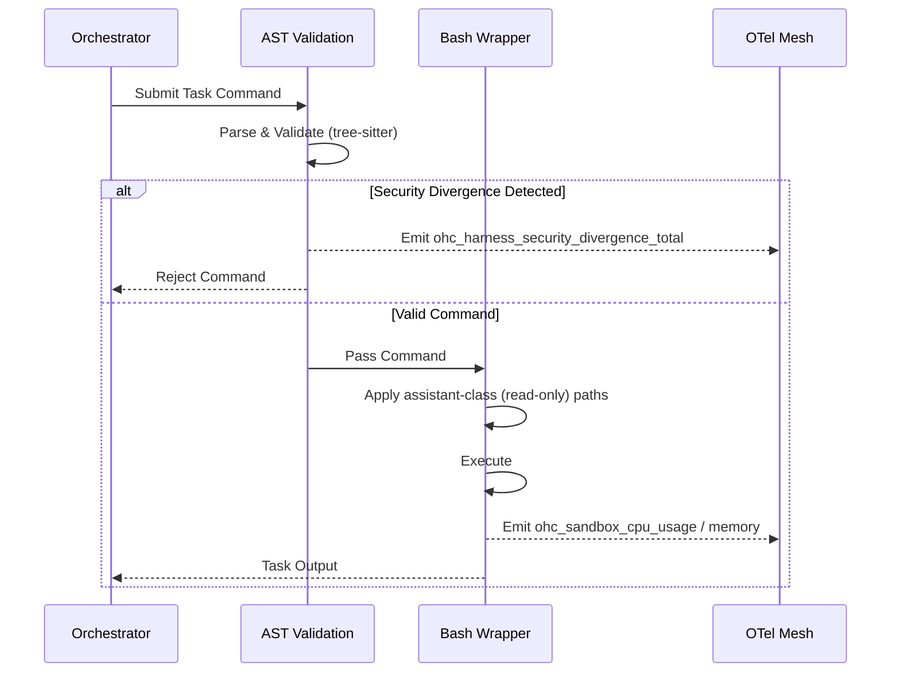

# [research] Architect assistant-Class Agent Harness & Sandbox Telemetry

## Problem Statement
To ensure small business owners have a premium, secure, and fully transparent experience, the OHC platform requires a highly robust execution environment: the **assistant-Class Agent Harness**. Market analysis reveals a severe gap in observable, secure local agents. We must implement strict "assistant-class" isolation (e.g. read-only path enforcement) alongside rich **Sandbox Telemetry** to provide full-spectrum observability, capturing resource utilization and security divergence using OpenTelemetry.

## Research Report & Competitive Analysis
A synthesis of the market shows that existing local orchestrators (Claude Code, Hermes, OpenClaw) struggle with balancing deep sandbox isolation and detailed observability.

- **Isolation Strategy**: "assistant-class" requires simulating read-only enforcement paths and blocked domains without relying entirely on heavyweight virtual machines.
- **Observability Gap**: Most tools offer custom event logs. OHC needs a standard OpenTelemetry approach capturing metrics such as `ohc_sandbox_cpu_usage`, `ohc_sandbox_memory_bytes`, and AST parser violations (`ohc_harness_security_divergence_total`).

### Competitive Matrix

| Feature | Market Average | OHC Vision (assistant-Class) |
|---|---|---|
| **Execution Isolation** | Basic Docker / Generic CLI | Fine-grained `bwrap` with simulated read-only enforcement |
| **Command Validation** | Regex | Tree-sitter AST parsing |
| **Security Telemetry** | Local logs | OpenTelemetry (`ohc_harness_security_divergence_total`) |
| **Resource Metrics** | None / Container runtime | OpenTelemetry (`ohc_sandbox_cpu_usage`, `ohc_sandbox_network_io`) |

### Architecture Flow (Mermaid)

## Design Doc
1. **assistant-Class Wrapper**: The `BashWrapper` applies simulated `READ_ONLY_PATHS` and `BLOCKED_DOMAINS` to the execution sandbox.
2. **Telemetry Integration**:
   - Add `ohc_harness_security_divergence_total` to track any command blocked by the AST parser (e.g., `zmodload`, process substitution).
   - Add resource metrics (`ohc_sandbox_cpu_usage`, `ohc_sandbox_memory_bytes`) pulled via standard system interfaces.
3. **SPIFFE/SPIRE Sync**: Telemetry generated within the sandbox must buffer locally to SQLite and sync to the cloud MCP via the `Hybrid Swarm-Aware MCP Telemetry Mesh`.

## Implementation Prompt
**Objective**: Build the OpenTelemetry infrastructure for the assistant-Class Agent Harness.
1. Update the telemetry pipeline (`src/server/telemetry/mod.rs`) to include `ohc_harness_security_divergence_total` and sandbox resource metrics.
2. Hook the AST parser (`src/server/harness/sandbox/ast.rs`) to emit security divergence metrics when malicious tokens are blocked.
3. Enhance the `BashWrapper` to properly track execution latency and link it to the task/agent.

**Priority**: P0
**Estimated Scope**: Medium

