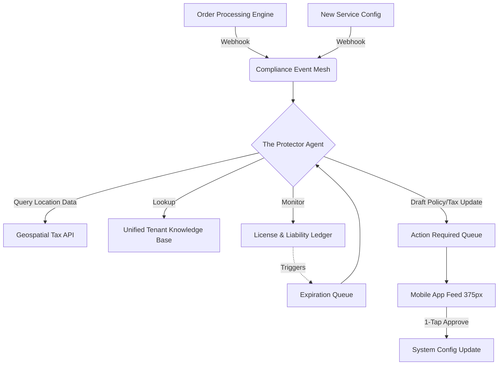

# [architecture] Autonomous Tax & Compliance Liability Shield

## Title
Autonomous Agentic Tax & Compliance Liability Shield for SMBs

## Problem Statement
Small business owners, particularly solopreneurs and non-technical individuals (like Maya the baker or Carlos the handyman), struggle significantly with legal, regulatory, and tax compliance. According to SMB pain point research, while it represents a high-anxiety area, traditional platforms offer either no help or force the use of complex, confusing 3rd-party accounting plugins that do not provide dynamic, continuous shielding. Business owners are paralyzed by the fear of making a mistake related to local tax laws, licensing requirements, terms of service, and physical liability. They need a system that acts as an "Autonomous Legal & Compliance Shield" that works invisibly in the background.

## Research Report
**Findings & Competitive Analysis:**
- **Shopify:** Provides basic tax calculation using Avalara, but requires manual setup and configuration. Terms of service generators are static templates that don't auto-update.
- **Wix / Squarespace:** No integrated dynamic legal advisory. Relies entirely on the merchant to know when to collect tax and what legal documents to include.
- **GoDaddy:** Bundled tools are rudimentary and offer no proactive liability shielding or license expiration tracking.
- **OHC Opportunity:** Utilize "The Protector" AI department to continuously monitor the tenant's transaction flow, business type, and physical location to dynamically calculate tax obligations, generate and enforce custom contracts, and proactively monitor business licenses. This agent acts as a personal compliance officer, moving from reactive "plugins" to proactive, invisible "infrastructure."

## Design Doc

### Architecture Diagram

### UX & Mobile Flow (375px First)
- **Zero Configuration Default:** When a user sets up their store, the agent implicitly infers their location and business type to set tax defaults.
- **Proactive Notification:** If a user crosses a local tax nexus threshold (e.g., selling beyond state lines), they receive a single Glassmorphism card in their mobile feed: "You've sold $X in State Y. Tap 'Enable Tax Collection' to stay compliant."
- **Contract Auto-Generation:** When Carlos sets up a new service ("Roof Repair"), the system automatically drafts a dynamic liability waiver and requires customers to e-sign before payment is accepted.
- **Visual Excellence:** The compliance feed uses soothing, non-alarmist UI elements. Translucent glass backgrounds and clear typography (Outfit font) ensure users feel guided, not warned.

### AI Agent Integration (The Protector)
- **Event-Driven:** Listens to `OrderCreated`, `ProductAdded`, and `ServiceConfigured` events.
- **Memory & Context:** Uses pgvector embeddings to maintain historical context of the tenant's past legal interactions and tax filings.
- **Coordination:** Coordinates with "The Accountant" (Finance) for tax remittance and "The Manager" (Operations) to block risky orders.

## Implementation Prompt
Implement the underlying event mesh and agent protocol for the "Autonomous Tax & Compliance Liability Shield".
- Create the core webhook listeners that route `OrderCreated` and `ServiceConfigured` events to The Protector agent queue.
- Implement the baseline agent context pipeline that pulls tenant location and business type data into the prompt context for Legal & Compliance evaluations.
- Build the initial mobile-first (375px) "Compliance Feed" UI card that allows a user to approve an auto-generated liability waiver with a single tap.
- Acceptance criteria: A mock order creation successfully triggers the agent evaluation, and the resulting recommendation appears in the mobile UI action queue without requiring manual configuration by the user. Do NOT prescribe the specific PostgreSQL schema or gRPC definitions. Focus on the agent logic and mobile UI integration.

## Priority
P0

## Estimated Scope
Medium
