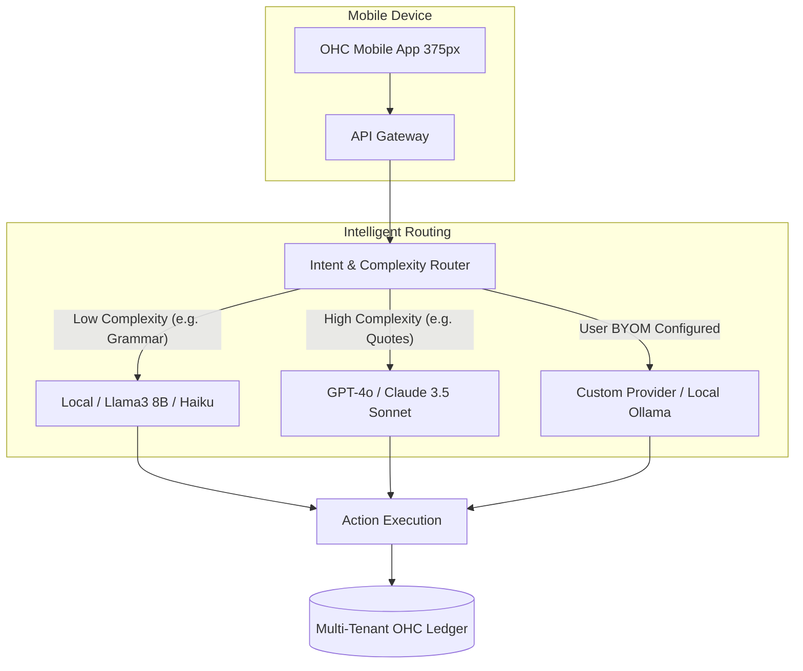

# [Architecture] Bring Your Own Model (BYOM) Routing Architecture

## Problem Statement
Small business owners like Priya (boutique owner) and Carlos (handyman) don't understand LLMs, API endpoints, or parameter tuning. They just know they want the AI agents powering their business—like the Operations Agent or the Marketing Agent—to be fast, private, and cheap. Currently, relying strictly on a single frontier model vendor can cause latency spikes, unexpected cost surges, and privacy concerns. Certain simple tasks (like fixing a typo in an Instagram DM reply) do not require a heavy, expensive model, whereas generating a complex, multi-item quote for Carlos does. Furthermore, power users want the ability to plug in their own local models (like Ollama) for ultimate privacy without breaking the unified OHC experience. We need an agnostic, intelligent LLM backend routing system.

## Research Report
**Findings from `50_features_mandate.json`:**
The mandate highlights "Bring Your Own Model (BYOM)" (Rank 20) as a High-Traffic, High-Feasibility requirement. This entails an agnostic LLM backend supporting OpenAI, Anthropic, Gemini, and local models (Ollama/vLLM) interchangeably.

**Competitive Analysis:**
- **Shopify/Wix:** Bundle AI features tightly to specific, opaque model providers. They do not allow merchants to swap models or connect local inference engines for privacy/cost control.
- **Standalone AI Wrappers:** Offer model switching but lack deep integration with a business's inventory, ledger, and customer data.
- **OHC Unfair Advantage:** By providing an invisible, intelligent model router as part of the core Zero-Setup AI, we automatically optimize for cost and speed. For power users, placing the BYOM capability behind an "Advanced Settings" switch gives ultimate control without sacrificing the grandmother-test simplicity for standard users.

## Design Doc

### Architecture Diagram

### Mobile UX Flow (375px First)
1. **Standard User (Invisible Mode):** For Maya, everything is automatic. The app feels instantaneously responsive. The UI never mentions "GPT" or "Claude."
2. **Advanced User (BYOM Mode):** Leo, a tech-savvy tutor, taps the gear icon -> "Advanced Settings" -> "AI Provider."
3. **Configuration:** A clean, translucent UniFi-style card list appears: "OHC Auto-Optimize (Default)", "OpenAI", "Anthropic", "Custom Endpoint".
4. **Custom Connection:** Leo selects "Custom Endpoint" and enters his local `vLLM` server URL and API key. The UI validates the connection instantly with a green checkmark.

### AI Agent Integration Points
- **System-Wide Agents (Ops, Finance, CS):** All agents utilize the abstract `Provider` interface. The central orchestrator injects the appropriate model instance based on the tenant's configuration and the specific task's complexity scoring.

### Key Design Decisions
- **Zero Trust & Security:** Custom API keys are stored in a secure credential vault, cryptographically isolated per tenant using SPIFFE SVIDs.
- **Abstracted Provider Interface:** The core codebase must never hardcode provider-specific API calls. All generation must pass through a unified trait/interface.
- **Fallback Mechanisms:** If a BYOM endpoint times out, the system must gracefully degrade and fall back to the OHC default provider to prevent business disruption.

## Implementation Prompt
Implement the Bring Your Own Model (BYOM) Routing layer.
- **User-Facing Outcome:** Standard users experience faster, cheaper AI actions invisibly. Power users can configure custom LLM endpoints (OpenAI, Anthropic, Ollama) via an "Advanced Settings" menu.
- **CUJ:** User navigates to advanced settings, inputs a custom API base URL and key, and subsequent agent actions for their tenant utilize the new provider seamlessly.
- **Acceptance Criteria:**
  - Create a generic LLM Provider interface abstraction in the backend.
  - Implement a tenant-scoped configuration store for custom LLM preferences.
  - Ensure the mobile UI configuration adheres to the Premium Translucent Glass aesthetic and remains hidden behind Advanced Settings.
  - Implement automatic fallback to the default OHC provider if the custom endpoint fails.
  - Do not prescribe specific database tables or REST endpoints; let the implementers design the data schema.

## Priority
P0

## Estimated Scope
Large
