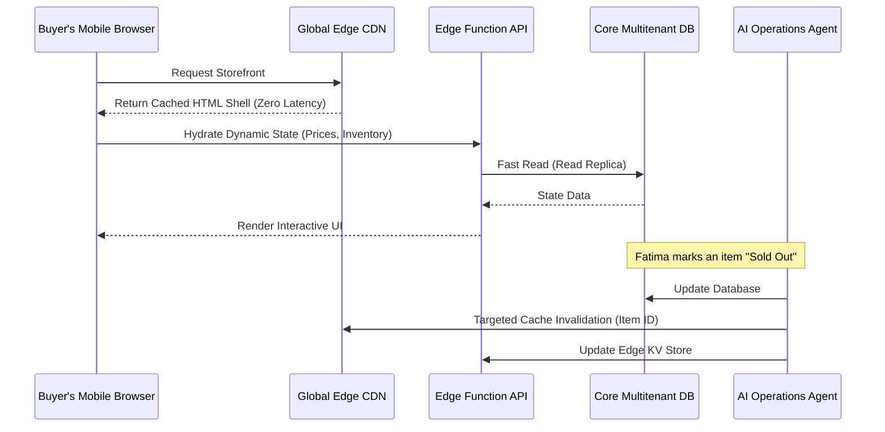

# Edge-Cached Dynamic Storefronts
**Priority:** P0
**Estimated Scope:** Large

## Problem Statement

For OneHumanCorp’s core users—Maya (the baker), Carlos (the handyman), Priya (the boutique owner), Leo (the music tutor), and Fatima (the food cart operator)—speed is revenue. Their customers are scrolling TikTok or Instagram on mobile devices, often with spotty cell reception. If a storefront takes more than 1 second to load, they lose the sale.

Currently, generic website builders require database lookups for every page load, resulting in high latency, especially for users geographically distant from the primary servers. We need an architecture where dynamic content (inventory, prices, calendars) feels instantaneous to load everywhere, handling high traffic spikes (e.g., a viral TikTok video) invisibly without the user ever worrying about "scaling" or "bandwidth."

## Research Report

Leading platforms handle scale via heavy edge caching and static site generation, but struggle with dynamic elements:
- **Shopify:** Utilizes a global edge network but heavily relies on liquid templates which can sometimes incur server-side rendering penalties for complex queries.
- **Wix/Squarespace:** Often suffer from heavy frontend payload sizes and slower time-to-interactive (TTI) on mobile devices.
- **Vercel/Next.js (Industry Standard):** Paved the way for Incremental Static Regeneration (ISR) and Edge rendering, showing that the sweet spot is serving static files from the edge while fetching dynamic state via low-latency edge functions.

**OneHumanCorp Advantage:**
By deeply integrating with our multi-tenant identity mesh (SPIFFE) and Agent OS, we can preemptively cache storefronts globally and use AI agents to smartly invalidate and regenerate caches only when business state changes (e.g., when Fatima toggles "sold out").

## Design Doc

### Core Architecture

Our approach combines **Edge-Cached Content Delivery** with **Dynamic State Hydration via Edge Functions**.

1. **Global CDN / Edge Network**: Serves the static shell of the storefront (HTML/CSS/JS) directly from the node closest to the buyer.
2. **Edge Functions API**: Lightweight, region-aware functions that handle dynamic queries (e.g., "Is this timeslot still available?" or "How many cakes left?").
3. **Agentic Cache Invalidation**: The AI Operations Agent monitors the central ledger and inventory systems. When a state change occurs, it intelligently triggers a targeted cache invalidation at the edge.

### Architecture Diagram

### Data Model & Invariants
- **Multi-Tenant Isolation**: Storefronts are partitioned by `tenant_id`. Every edge API request validates the `tenant_id` context.
- **Zero Trust**: Edge APIs utilize SPIFFE workloads for secure, mTLS-authenticated connections back to the core database replicas.

### Mobile-First UX Flow (375px)
- **Instant Load**: Screen displays skeleton UI instantly from the edge cache.
- **Glassmorphic UI**: Uses standard OHC translucent glass materials for cards and buttons.
- **Offline Resilience**: Progressive Web App (PWA) capabilities allow buyers to view previously cached menus even if connection drops momentarily.
- **One-Tap Action**: Primary CTA (Buy, Book, Pre-order) is always sticky at the bottom of the viewport.

## Implementation Prompt

**To the Implementer Swarm:**
Your mission is to construct the Edge-Cached Dynamic Storefront routing and caching layer.

**User Facing Outcome:** Buyers visiting any OHC merchant link must see a fully rendered, interactive storefront in under 500ms (Time to Interactive), regardless of geographic location.

**Core Tasks:**
1. Design the edge delivery mechanism that serves the merchant's storefront shell globally.
2. Implement the secure, multi-tenant Edge Function API to hydrate dynamic data (inventory, availability).
3. Build the event-driven invalidation hooks that allow the AI Operations Agent to selectively purge edge caches when the merchant's core business state changes.
4. Ensure all cross-boundary communications adhere strictly to the SPIFFE/SPIRE Zero Trust protocols.

**Note:** Do not lock into specific cloud vendors (e.g., AWS CloudFront, Cloudflare Workers) in your core logic. Abstract the edge deployment capability so OHC can route via its unified control plane.

