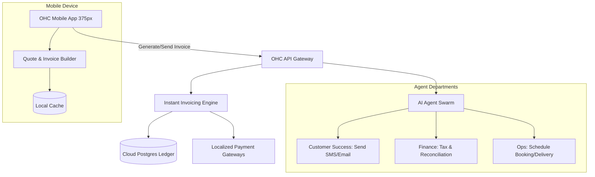

# [Architecture] Instant Localized Invoicing & Quote Generation Engine

## Problem Statement
Small business owners like Carlos (a handyman operating out of his truck) and Maya (a baker doing custom wedding cakes) struggle with creating, sending, and tracking invoices for their services. Currently, if Carlos visits a client to assess a repair, he has to either write down a quote on a piece of paper, or use a separate, clunky invoicing app. When the job is done, getting paid means waiting for a bank transfer or dealing with another app. He needs to instantly generate a professional, localized invoice right from his Android phone while standing in the client's living room, automatically tracking deposits, tax rules, and local payment methods, without understanding accounting jargon.

## Research Report
**Competitor Systems Audit:**
- **Stripe Invoicing / Stripe Billing:** Powerful and scalable, with multi-currency and tax localization capabilities. However, it is heavily developer-focused and the dashboard can be overwhelming for non-technical users.
- **Wave / QuickBooks:** Provide solid accounting and invoicing but act as standalone systems. Users must manually sync their operations (like a booking calendar or a bakery order) with these tools.
- **Shopify:** Good for standard e-commerce, but their B2B and custom service invoicing features are often add-ons or require external apps.

**Gaps Identified:**
OHC lacks a deeply integrated, mobile-first invoicing capability that seamlessly converts quotes (e.g., generated by an AI agent during a customer inquiry) into legally compliant, localized invoices that support deposits and instant local payment methods (like Pix in Brazil, ACH in the US, or SEPA in Europe).

## Design Doc

### Architecture Diagram

### Mobile UX Flow (375px First)
1. **Quote Generation:** Carlos opens the OHC app. He navigates to a customer chat and taps "Generate Quote." An AI prompt asks for the job details ("Fix leaky sink, $150"). The app displays a beautiful, Glassmorphism-styled quote card.
2. **Quote to Invoice:** Once the customer approves the quote via SMS link, Carlos taps "Convert to Invoice."
3. **Localization:** The system automatically applies local tax rates and selects the preferred localized payment methods based on the client's location.
4. **Sending & Tracking:** Carlos taps "Send." The status changes to "Pending Payment." When the client pays, Carlos gets an instant push notification on his Android phone, and the status turns green ("Paid").

### AI Agent Integration Points
- **Customer Success Agent:** Automatically drafts and sends a polite follow-up SMS or email if an invoice remains unpaid for 3 days.
- **Finance Agent:** Determines the correct local tax rates (e.g., VAT vs. Sales Tax) invisibly, and reconciles the payment against the unified omnichannel ledger once paid.

### Key Design Decisions & Security
- **Zero-Trust Multi-Tenancy:** Invoices and financial data are strictly isolated per tenant using SPIFFE SVIDs. Each tenant's billing engine requests are scoped by their identity, ensuring no data leakage between different businesses.
- **Edge-Caching & Offline Capabilities:** The invoice builder uses local CRDT-based caching so Carlos can draft invoices even in a client's basement with no cell service. They sync and send the moment his phone reconnects.
- **Abstracted Complexity:** No accounting terminology (like "Accounts Receivable" or "Net 30"). Just "Sent", "Paid", and "Overdue".

## Implementation Prompt
Implement the Instant Localized Invoicing engine.
- **User-Facing Outcome:** Users can generate beautiful, localized invoices and quotes from their mobile devices in under 30 seconds, which customers can pay instantly using local payment methods.
- **CUJ:** User drafts a quote, converts it to an invoice, and sends it. The customer pays via a localized link, and the user receives a push notification of successful payment.
- **Acceptance Criteria:** Ensure the UI is mobile-first, adhering to the 375px baseline and OHC design system. Support offline drafting that syncs when online. Ensure strict tenant data isolation in the backend. Integrate with the Finance and Customer Success AI agents for automatic follow-ups and tax calculations. Do not expose complex accounting terms to the user.

## Priority
P0

## Estimated Scope
Large
