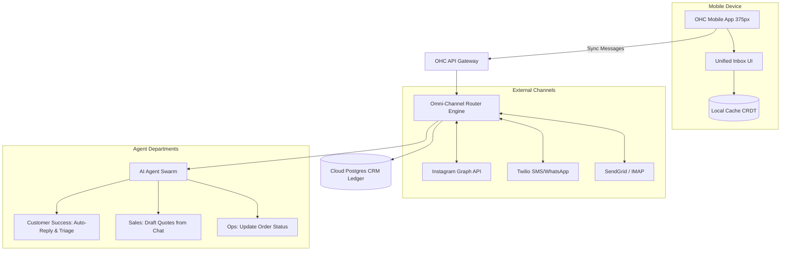

# [Architecture] Unified Omni-Channel AI Inbox & CRM Engine

## Problem Statement
Small business owners like Maya (who receives custom cake orders via Instagram DMs), Carlos (who gets quote requests via text messages), and Priya (who fields customer support emails) are constantly context-switching between different apps just to talk to their customers. When Maya wakes up, she has to manually check Instagram, WhatsApp, and iMessage to reply to customers asking "do you do vegan cakes?" or "can I change my order?". This fragmentation leads to missed sales, slow response times, and an inability to track the full history of a customer's relationship. They need a single, unified "inbox" on their phone that aggregates every message from every channel, where an AI agent can automatically reply to routine questions, draft quotes, and categorize leads while they sleep.

## Research Report
**Competitor Systems Audit:**
- **Shopify Inbox:** Consolidates Apple Business Chat, Instagram, Messenger, and Shop App chats. Good integration with the Shopify store but limited external CRM capabilities (e.g., doesn't handle general SMS/WhatsApp for non-Shopify related tasks easily).
- **Gorgias / Zendesk:** Powerful helpdesk software that aggregates channels, but they are designed for support teams of larger e-commerce brands, not for solopreneurs on a mobile device. They are complex and require setup.
- **Wix Inbox:** Provides a unified inbox for live chat, email, and social media, but lacks deep, autonomous AI agent capabilities to negotiate or draft personalized invoices natively inside the chat.

**Gaps Identified:**
OHC lacks a centralized communication hub that merges external messaging channels (Instagram, SMS, WhatsApp, Email, Web Chat) with our native AI agent swarm. We need an inbox where the Customer Service (CS) Agent can proactively intercept and respond to inquiries (e.g., booking requests, FAQ) across any channel, leaving only complex negotiations or approvals for the human owner to handle on their 375px mobile device.

## Design Doc

### Architecture Diagram

### Mobile UX Flow (375px First)
1. **The Inbox View:** Maya opens the OHC app and taps the "Inbox" tab at the bottom. She sees a beautiful, Glassmorphism-styled list of active conversations. Each row shows the customer's name, a snippet of the message, and an icon indicating the source (Instagram, SMS, WhatsApp).
2. **AI Triage Indicators:** Threads handled entirely by the AI (e.g., "Yes, we make vegan cakes!") have a subtle sparkle ✨ icon and are marked "Resolved". Threads requiring Maya's attention are pinned at the top with a "Needs Action" badge.
3. **Drafting a Quote:** Maya taps into an SMS conversation with a customer asking for a wedding cake. The Sales AI has already drafted a response and a quote card. Maya just taps "Approve & Send".
4. **Customer CRM View:** Swiping left on any conversation reveals a rich customer profile card: their lifetime value, past orders, and current active bookings, fetched directly from the unified backend ledger.

### AI Agent Integration Points
- **Customer Success (CS) Agent:** Listens to all incoming webhooks from the `Omni-Channel Router Engine`. Uses RAG on the business's knowledge base (past orders, FAQs, inventory) to auto-reply to routine queries instantly.
- **Sales Agent:** Detects buying intent in messages. If a user asks for pricing, it drafts a formalized OHC Quote (integrating with the Instant Localized Invoicing engine) and presents it to the business owner for one-tap approval.
- **Operations Agent:** Detects status update requests ("Where is my order?") and replies automatically with tracking links or real-time prep status without bothering the human owner.

### Key Design Decisions & Security
- **Abstracted Channel Complexity:** The user never has to configure API keys for Twilio or Instagram. OHC handles the OAuth flows securely via SPIFFE-authenticated background workers. To the user, they just tap "Connect Instagram" and it works.
- **Zero-Trust Multi-Tenancy:** Webhooks from external providers (like Meta or Twilio) are ingested through a unified gateway, scrubbed, and routed to strictly isolated tenant queues to prevent cross-contamination of customer data.
- **Offline Capabilities:** The inbox uses local CRDT syncing so users can read past messages and draft replies while offline (e.g. Fatima in an area with bad cell service). Replies are queued and sent when reconnected.

## Implementation Prompt
Implement the Unified Omni-Channel AI Inbox & CRM Engine.
- **User-Facing Outcome:** Users can view and reply to messages from Instagram, SMS, WhatsApp, and Email from a single, unified inbox on their mobile device. AI agents handle routine inquiries automatically and draft context-aware replies for complex questions.
- **CUJ:** A customer DMs the business on Instagram asking for a quote. The message appears in the OHC mobile app. The AI Sales Agent drafts a reply with an attached invoice. The business owner opens the app, reviews the draft, and taps "Approve". The reply is sent back to the customer's Instagram DM seamlessly.
- **Acceptance Criteria:**
  - Ensure the UI is mobile-first, adhering to the 375px baseline and OHC design system.
  - Support OAuth connection flows for Meta (Instagram/WhatsApp) and Twilio (SMS).
  - Messages must sync to the local CRDT store for offline reading and queued sending.
  - The AI CS Agent must successfully intercept and draft replies for incoming messages before presenting them to the user.

## Priority
P0

## Estimated Scope
Large