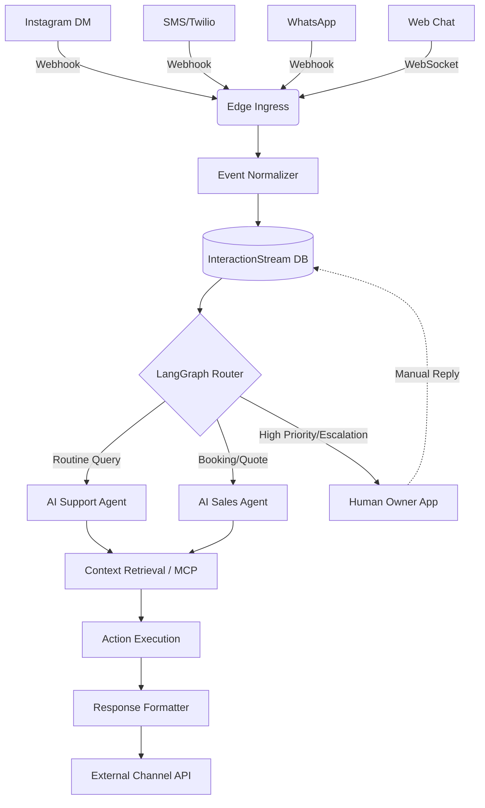

# [architecture] Universal Omnichannel AI Inbox

## 1. Title
Universal Omnichannel AI Inbox

## 2. Problem Statement
Small business owners (like Maya the baker, or Carlos the handyman) are overwhelmed by fragmented communication channels. They receive inquiries via Instagram DMs, WhatsApp, SMS, email, and their website contact form. Managing these disjointed streams manually leads to missed leads, delayed responses, and lost revenue. They need a single unified hub where an AI agent can proactively respond to common queries, filter spam, and escalate only the high-value conversations (like custom quotes or angry customers) to their phone. The existing platform lacks a cohesive strategy to centralize these communications, heavily relying on third-party integrations with poor latency and no intelligent context sharing.

## 3. Research Report
### Market Findings
- **Shopify Inbox:** Offers a centralized chat interface and basic automated replies, but relies heavily on pre-configured rule sets rather than dynamic generative AI. Struggles with complex negotiations or multi-turn conversational commerce without human intervention.
- **Wix Inbox:** Aggregates messages well across channels but treats them as passive tickets. It lacks proactive multi-agent orchestration capable of pulling real-time inventory or issuing secure invoices directly within the chat stream.
- **GoDaddy Conversations:** Basic unified inbox but with very limited AI capabilities, mostly restricted to simple auto-responders.

### Competitive Advantage for OHC
One Human Corp can dominate this space by leveraging our existing LangGraph orchestration and K8s StatefulSets. We can introduce an "Omnichannel Protocol" that ingests streams from all platforms (IG, SMS, Email, Web) into a standardized `InteractionStream` CRD. By pairing this with our AI Customer Service Department, the AI can not only reply but also execute transactions (like securely dispatching a payment link or booking a calendar slot) directly inside the unified thread, completely invisibly to the merchant.

## 4. Design Doc
### Architecture Diagram

### UI Wireframes & Mobile UX Flow (375px First)
**Screen 1: Unified Inbox View**
- **Header:** "Inbox" with a total unread count badge. A toggle switch to view "AI Handled" vs. "Needs Your Attention".
- **List Items:** Modular cards (Translucent Glass UI) showing the customer's avatar, platform icon (IG, SMS, Web), a snippet of the latest message, and an AI-generated summary tag (e.g., "Ready to Pay", "Vegan Cake Question").
- **Bottom Nav:** Persistent OHC mobile navigation.

**Screen 2: Conversation Thread View**
- **Header:** Customer name and platform. A prominent "Take Over" button if the AI is currently handling the chat.
- **Message Stream:**
  - Customer messages left-aligned.
  - AI responses right-aligned with a subtle sparkle icon indicating automated handling.
  - Interactive widgets embedded in chat: e.g., an "Invoice Sent" card that the owner can tap to see details.
- **Input Area:** Text field, voice dictation button, and a "+" button to instantly generate a payment link, booking slot, or product card to send.

**UX Flow (Grandmother Test):**
1. Maya receives an Instagram DM: "Can I get 20 vegan cupcakes for Saturday?"
2. She receives a push notification: "AI is drafting a quote for 20 vegan cupcakes. Tap to review."
3. She taps the notification, opening the Conversation Thread.
4. She sees the AI drafted a response and an attached invoice widget.
5. She taps "Send and Approve".

### AI Agent Integration Points
- **Triage & Routing Agent:** Immediately analyzes incoming messages to determine intent (support, sales, spam, human escalation).
- **Drafting Agent (Sales/Support):** Uses RAG (retrieving the catalog, availability, and pricing) to draft contextual responses and executable actions (like a checkout link).
- **Episodic Memory Agent:** Recalls past interactions across channels (e.g., remembering this user previously asked about gluten-free options on WhatsApp).

### Key Design Decisions
- **Unified Event Schema:** All incoming messages are immediately normalized into a standard schema. This decouples the agent logic from the channel-specific API quirks.
- **Optimistic AI Handling:** The system will default to AI handling for standard queries unless explicitly configured otherwise by the merchant. The "Needs Your Attention" queue ensures human intervention only when necessary.
- **Zero-Trust Isolation:** Conversation histories are strictly isolated per tenant using our SPIFFE/SPIRE identity mesh, ensuring one merchant's AI cannot leak data into another's inbox.
- **Translucent Glass UI:** Emphasizes content while maintaining a premium feel, avoiding visual clutter so the focus remains entirely on the conversation and actionable items.

## 5. Implementation Prompt
**User-Facing Outcome:**
Build the "Universal Omnichannel AI Inbox". When a small business owner receives messages across Instagram, SMS, Email, or their website, they should all appear in a single, unified, chronological stream within the mobile app. The AI should automatically respond to routine questions (like hours or catalog availability) and draft quotes/booking links for complex inquiries, only alerting the owner when human approval or intervention is needed.

**Core User Journey (CUJ):**
1. A customer sends a WhatsApp message asking for a service quote.
2. The AI reads the message, accesses the business's pricing context, and generates a draft response with a payment link.
3. The business owner receives a mobile push notification: "Draft quote ready for [Customer Name]".
4. The owner taps the notification, reviews the draft in the unified UI, and taps "Approve & Send".
5. The customer receives the response and pays the invoice, which is instantly reflected in the chat.

**Acceptance Criteria:**
- All channel messages normalize into a single unified data stream.
- Mobile UI (optimized for 375px) displays the "Needs Attention" vs "AI Handled" queues.
- The UI includes glassmorphism cards and passes the "grandmother test" (no complex settings exposed by default).
- AI agents successfully route, draft, and embed executable widgets (invoices, bookings) into the chat.
- Secure, multi-tenant isolation of all message data is verified.
- The feature is fully functional offline/low-connectivity with optimistic UI updates.

## 6. Priority
P0

## 7. Estimated Scope
Large
