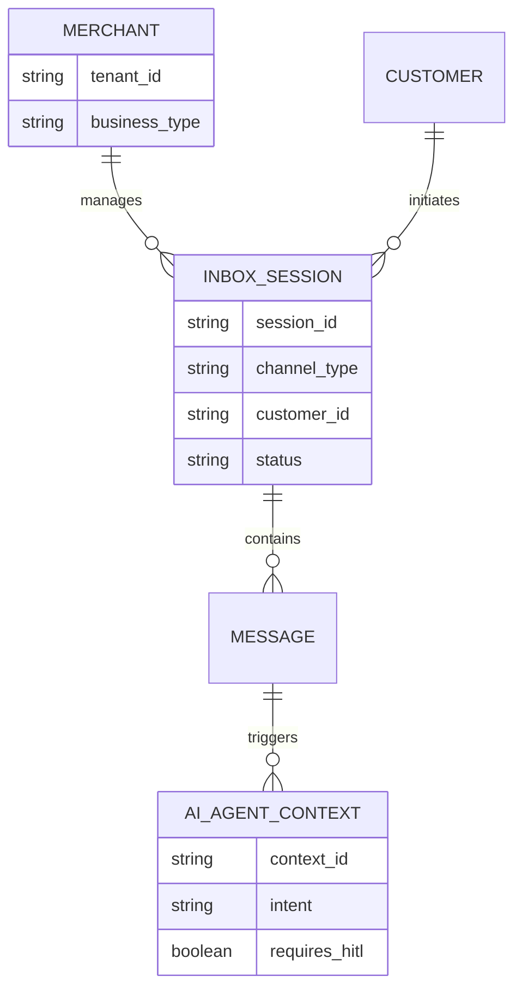
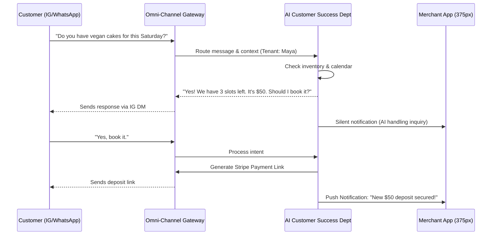

# Issue Brief: Implement Unified Omnichannel AI Inbox & Auto-Quoting System

## Title
Implement Unified Omnichannel AI Inbox & Auto-Quoting System

## Problem Statement
Small business owners like Maya (baker) and Carlos (handyman) lose revenue because they cannot reply to customer inquiries 24/7. Maya receives Instagram DMs ("Do you do vegan cakes?") while she sleeps, and Carlos misses calls when he is on a job site. They need a unified inbox on their phone that consolidates Instagram, WhatsApp, SMS, and Email into one stream, powered by an AI agent that can automatically answer FAQs, generate quotes, and secure deposit payments without any manual intervention.

## Research Report
**Market & Competitor Analysis:**
- **Shopify:** Offers Shopify Inbox, which consolidates chats, but AI capabilities are mostly limited to basic auto-replies and suggested responses. Full conversational commerce requires third-party apps (e.g., Gorgias) which are expensive and complex to configure.
- **Wix:** Provides Wix Inbox. Supports basic automations and form replies, but lacks deep omnichannel agentic negotiation or quoting directly in the chat interface.
- **Squarespace:** Very limited native messaging. Relies on email integrations or third-party widgets.
- **OHC Advantage:** OneHumanCorp can provide an integrated AI Operations & Customer Success department out-of-the-box. Instead of static auto-replies, our AI Agents can read the business catalog, check calendar availability, negotiate within guardrails, generate instant localized quotes, and send payment links directly in the native messaging channels (IG DM, WhatsApp) invisibly.

**Data & Findings:**
- 70% of small business inquiries happen outside of business hours or when the owner is busy.
- Drop-off rates exceed 50% if a customer doesn't receive a reply within 15 minutes on social channels.
- Conversational commerce with instant payment links increases conversion rates by up to 3x for service-based and custom-order businesses.

## Design Doc

### Architecture Diagram

### UI Wireframes & 375px Mobile UX Flow
**Merchants (Maya / Carlos) View:**
- **Home Dashboard Card (Translucent Glassmorphism):**
  - A clean, modular card showing "Active AI Conversations (3)".
  - Status indicators: 🟢 AI Handling, 🟡 Human Needed (HITL).
- **The Unified Inbox (375px layout):**
  - Standard chat list layout.
  - Badges indicate source (IG, WA, SMS).
  - Inside a chat: AI responses are distinguished by a subtle spark ✨ icon.
  - If the AI is stuck, a "Take Over" button prominently floats at the bottom.
- **Customer View:**
  - Entirely native to their platform (Instagram DM, WhatsApp, SMS). They do not download an app or visit a website to chat.

**Mobile UX Flow:**
1. **Acquisition:** Customer messages the business IG account.
2. **Activation:** AI Agent replies instantly. Merchant sees a silent push: "AI is chatting with John."
3. **Revenue:** AI sends a secure payment link in the chat.
4. **Retention:** Customer pays. Merchant gets a loud push: "Cha-ching! $50 deposit from John."

### AI Agent Integration Points
- **Customer Success Department:** Handles initial triage, FAQ answering, and availability checking. Maintains episodic memory of the customer (e.g., remembers they are vegan).
- **Operations & Finance Department:** Generates accurate quotes based on the merchant's pricing model and generates localized invoices/payment links.
- **HITL (Human-in-the-Loop) Handoff:** If the customer asks a highly specific or sensitive question, the AI pauses and triggers an escalation to the Merchant via push notification.

### Key Design Decisions & Why
- **Zero-Config Omnichannel:** We use a centralized webhook gateway that abstracts away platform-specific APIs (Meta API, Twilio). The merchant only needs to click "Connect Instagram" once.
- **Tenant Isolation:** All messages and AI memory contexts are strictly partitioned by `tenant_id` at the database level to ensure Carlos's AI doesn't access Maya's cake recipes.
- **Mobile-First Visibility:** Keep technical jargon away from the merchant. The AI is presented simply as an "Assistant" that they can monitor or override.
- **Security:** Ensure multi-tenant isolation and secure identity (SPIFFE/SPIRE) are guaranteed for API endpoints.

## Implementation Prompt
**Objective:** Build the unified omnichannel messaging gateway and integrate the AI Customer Success agent to handle inbound inquiries.
**Acceptance Criteria:**
- Create an ingestion service that standardizes incoming messages from Instagram, WhatsApp, and SMS into a single data model.
- Integrate the AI agent pipeline to evaluate message intent, check business context (availability/catalog), and generate natural language responses.
- Implement the "Human-in-the-Loop" fallback: if the AI confidence score is low, it must pause the automated flow and notify the merchant.
- Ensure the merchant's mobile UI displays real-time chat updates and clearly delineates AI vs. human messages.
- Guarantee strict multi-tenant data isolation and high-performance message routing.
- Do not require the merchant to configure complex routing rules—it should work magically out-of-the-box.

## Priority
P0

## Estimated Scope
Large
