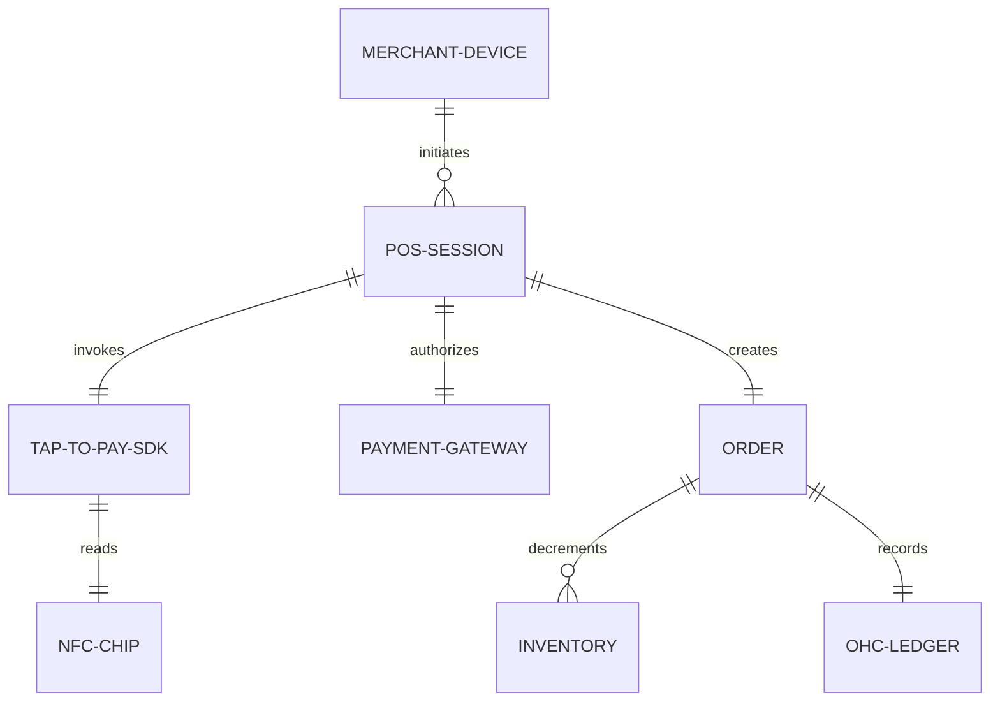

# Title: In-Person Tap-to-Pay Mobile POS System

## Problem Statement
Small business owners like Priya (boutique owner) and Fatima (food cart operator) conduct a significant portion of their business in person. Currently, they are forced to use secondary point-of-sale hardware (like a Square reader) or a separate app to take physical payments, leading to disjointed inventory, disconnected revenue tracking, and a fractured customer experience. They need a way to seamlessly accept contactless payments (Tap-to-Pay) directly on their existing mobile devices (iPhone/Android) without requiring extra dongles or terminals, all completely integrated into the OneHumanCorp platform.

## Research Report
*   **Market Analysis**:
    *   **Shopify**: Offers Shopify POS, but often pushes physical card reader hardware. Their Tap-to-Pay on iPhone/Android exists but is sometimes gated by app requirements.
    *   **Square**: The market leader in POS, but requires downloading a separate POS app and often using their hardware.
    *   **Wix/Squarespace**: Limited native mobile POS capabilities; mostly rely on third-party integrations (like Stripe Terminal) which can feel clunky and require multiple setups.
*   **Opportunity for OHC**: By building a native Tap-to-Pay experience integrated directly into the OHC mobile app, we eliminate the need for extra hardware and third-party apps. The business owner can instantly transition from managing their online store to taking an in-person payment in seconds.
*   **User Pain Points Resolved**: No hardware to charge or lose, unified online/offline inventory syncing instantly, unified financial dashboard.

## Design Doc
### Architecture Diagram

### UI Wireframes & Screen Flow (375px First)
1.  **Home Dashboard**: A prominent, large action button "Take Payment" floating at the bottom right.
2.  **Amount/Cart Screen**: A clean keypad to enter an amount, or a simple cart view to tap items from the catalog. "Charge $X.XX" button at the bottom.
3.  **Tap to Pay Screen**: Apple/Google native Tap-to-Pay modal slides up. A sleek, macOS-style Translucent Glass overlay instructs the customer to "Hold card or phone near top of screen."
4.  **Success Screen**: A satisfying green checkmark animation with an immediate prompt for "Send Receipt (Email/SMS)" via the AI Agent.

### Mobile UX Flow
- The entire flow must pass the "grandmother test" — taking less than 30 seconds for a first-time user.
- Focus strictly on a 375px viewport with large touch targets, 8px/16px rounded corners, and clear typography (Outfit/Inter).
- Any technical configuration (e.g., Stripe account linking, hardware settings) is hidden in the "Advanced Settings".

### AI Agent Integration Points
- **Finance Agent**: Automatically reconciles the in-person transaction with the OHC Ledger and triggers instant payout routing.
- **Operations Agent**: Updates unified inventory (deducting the physical item sold) and alerts if stock is low.
- **Customer Success Agent**: Can automatically follow up with the customer via SMS (if receipt is texted) asking for a review or offering a discount on their next online purchase.

### Key Design Decisions
- **No External Hardware**: Rely exclusively on iOS Tap-to-Pay and Android NFC payment SDKs.
- **Unified Ledger**: All offline and online transactions write to the exact same immutable ledger for instant financial parity.
- **Zero-Trust Multi-Tenancy**: The POS session relies on SPIFFE/SPIRE for identity, ensuring one merchant cannot accidentally read or authorize a payment on behalf of another.

## Implementation Prompt
**Role**: Principal Software Engineer & Canvas (L7)
**Task**: Implement the native Tap-to-Pay Mobile POS flow in the OneHumanCorp app.
**CUJ**: A boutique owner taps "Take Payment", enters $25.00, and hands their phone to a customer who taps their credit card to the phone, completing the transaction seamlessly.
**Acceptance Criteria**:
- A functional "Take Payment" UI (375px optimized) with amount entry and catalog selection.
- Integration of the mock/sandbox Tap-to-Pay SDK that simulates reading an NFC card.
- Successful transaction must instantly reflect in the global OHC Ledger and deduct from inventory.
- Post-payment receipt screen with an option for AI-driven SMS/Email receipt.
- Adhere strictly to the Visual Excellence Mandate (Translucent Glass aesthetic, Ubiquiti UniFi modular cards).

## Priority
P0

## Estimated Scope
Medium
