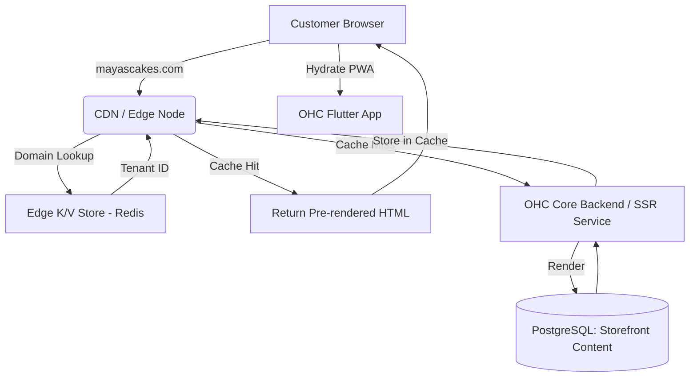

<div markdown="1" style="backdrop-filter: blur(20px) saturate(200%); font-family: Outfit, Inter, sans-serif; border: 1px solid rgba(255, 255, 255, 0.1); padding: 20px; border-radius: 12px; background: rgba(255, 255, 255, 0.05);">

# Design Doc: OHC Universal Edge-Cached Dynamic Storefront & Agentic SEO Pre-rendering Architecture

**Author(s):** System Architect
**Status:** Final
**Last Updated:** 2024-06-06

## 1. Problem Statement
**The Pain Point:** Users like Maya (Baker) and Leo (Musician) experience massive traffic spikes when their social media posts go viral. Their storefronts, currently reliant on centralized database queries for every load, face significant risk of latency degradation, timeouts, and poor user experience, potentially costing them critical sales. Additionally, current dynamic rendering limits SEO performance as web crawlers struggle with slow, client-side rendered content. Small business owners cannot and should not have to manage complex caching or SEO infrastructure themselves.

Small business storefronts must correctly route traffic to the appropriate tenant based on custom domains (e.g., `mayascakes.com` -> `tenant_id: 123`). OHC needs a globally distributed, edge-cached serving architecture that supports millions of distinct tenant domains while remaining fast and cost-effective.

## 2. Research Report
- **Competitor Analysis:**
  - **Shopify:** Utilizes a globally distributed edge network (Cloudflare) to cache storefront assets and read-only API requests, ensuring fast delivery. They aggressively cache at the edge but struggle with dynamic localized pricing.
  - **Vercel / Next.js:** Employs ISR (Incremental Static Regeneration) and Edge caching to deliver instant load times without sacrificing dynamic content availability.
  - **Wix/Squarespace:** Provide easier SEO tools, but they still require manual configuration and historically suffered from slow load times due to heavy JS payloads. Have moved towards SSR + CDN, but TTFB can still lag.
- **OHC Requirement:** Serve static assets via CDN, use edge compute for instant tenant domain resolution and initial HTML rendering, and hydrate with the Flutter/PWA application for dynamic interactions.

## 3. Design Doc

### 3.1 Architecture Diagram


### 3.2 Mobile UX Flow (375px)
1. Customer taps a link on Instagram.
2. The edge node instantly returns the skeletal HTML and critical CSS (sub-500ms TTFB).
3. The browser paints the storefront immediately on a mobile screen.
4. The Flutter PWA engine loads asynchronously in the background, hydrating the page for smooth, app-like interactions (e.g., Tap to Pay, Add to Cart).

### 3.3 Key Design Decisions
- **Edge Routing (Domain to Tenant Mapping):** DNS and initial HTTP requests hit an edge network (e.g., Nginx, Cloudflare Workers). The edge node maps the custom domain (via Host header) to the internal `tenant_id` using a high-speed distributed Key/Value store (like Redis). This prevents the core database from handling routing lookups.
- **Stale-While-Revalidate:** The CDN cache uses `Cache-Control: stale-while-revalidate` headers. When a cached page goes stale, the CDN serves the stale content instantly to the user while asynchronously fetching the updated version from the OHC Core Backend, ensuring zero wait time.
- **Asset Compression:** All images uploaded by the owner are automatically compressed to WebP format and served directly from the CDN.
- **Agentic SEO Pre-rendering & Cache Invalidation:**
  - **Marketing Agent / Operations Agent:** Automatically invalidates the edge cache via a Webhook / API event whenever the owner updates a product, changes a price, or publishes a new blog post. The system instantly purges the corresponding surrogate keys globally.

### 3.4 Reverse Proxy Configuration (Nginx + Lua/NJS)
To inspect incoming HTTP Host headers and map them to a specific OHC `tenant_id` via a high-speed cache (Redis), an Nginx proxy with Lua (OpenResty) can be utilized.

**Nginx Configuration Example (OpenResty):**
```nginx
worker_processes auto;

events {
    worker_connections 1024;
}

http {
    include       mime.types;
    default_type  application/octet-stream;

    # Define Redis caching for domain lookup
    lua_shared_dict domain_cache 10m;

    proxy_cache_path /var/cache/nginx levels=1:2 keys_zone=ohc_storefront_cache:10m max_size=1g inactive=60m use_temp_path=off;

    server {
        listen 80;
        server_name _; # Catch-all

        location / {
            set $tenant_id "";

            # Map Domain to Tenant ID via Redis
            access_by_lua_block {
                local redis = require "resty.redis"
                local red = redis:new()
                red:set_timeouts(1000, 1000, 1000)

                local ok, err = red:connect("redis", 6379)
                if not ok then
                    ngx.log(ngx.ERR, "failed to connect to Redis: ", err)
                    return ngx.exit(500)
                end

                local host = ngx.var.host
                -- Try to get from local worker cache
                local cache = ngx.shared.domain_cache
                local cached_tenant = cache:get(host)

                if cached_tenant then
                    ngx.var.tenant_id = cached_tenant
                else
                    -- Query Redis
                    local res, err = red:get("domain_map:" .. host)
                    if res ~= ngx.null then
                        ngx.var.tenant_id = res
                        cache:set(host, res, 300) -- Cache mapping for 5 mins locally
                    else
                        -- Fallback for unmatched domains or redirect to OHC main page
                        ngx.exit(404)
                    end
                end

                -- Keepalive connection
                red:set_keepalive(10000, 100)
            }

            # Proxy the request to the SSR service with the mapped tenant ID
            rewrite ^(.*)$ /api/v1/storefront/$tenant_id$1 break;

            proxy_pass http://ohc-core:18789;
            proxy_set_header Host $host;
            proxy_set_header X-Real-IP $remote_addr;
            proxy_set_header X-Tenant-Id $tenant_id;

            # Caching Strategy: Stale-While-Revalidate
            proxy_cache ohc_storefront_cache;
            proxy_cache_key "$tenant_id:$uri";
            proxy_cache_valid 200 60m;
            proxy_cache_valid 404 1m;
            proxy_cache_use_stale error timeout updating http_500 http_502 http_503 http_504;
            proxy_cache_background_update on;

            # Honor backend Cache-Control (s-maxage, stale-while-revalidate)
            proxy_ignore_headers Expires;
            add_header X-Proxy-Cache $upstream_cache_status;
        }
    }
}
```

## 4. Testing Plan
- **Domain Resolution Verification:** Write an integration test where a mock custom domain (e.g., `test.mayascakes.com`) is injected into the Redis store mapping to `tenant_id: 123`. The test sends an HTTP GET request to the reverse proxy with the custom domain Host header and verifies that the request is successfully rewritten and routed to the correct `tenant_id` endpoint.
- **Cache Hit/Miss Validation:** Verify the caching mechanism by sending sequential requests. The first request should result in an `X-Proxy-Cache: MISS` and cache the response. The subsequent request should result in an `X-Proxy-Cache: HIT`.
- **Cache Invalidation:** Using E2E testing (Playwright), simulate an inventory update (e.g., modifying a product via the Operations Agent). Verify that the system emits a cache invalidation webhook/event. Immediately fetch the storefront again and assert that it correctly results in a cache MISS and the response includes the updated data (and regenerated SEO metadata/JSON-LD).
- **Stale-While-Revalidate Testing:** Simulate a high-latency response from the backend. Verify that the proxy immediately returns the stale cache while initiating a background fetch for updated data.
- **Performance/TTFB Check:** Ensure the initial HTML/CSS load time falls consistently below 500ms using synthetic load tests and E2E verifications.

## 5. Metadata
- **Priority:** P0
- **Estimated Scope:** Large
- **Target Release:** Q3

</div>
