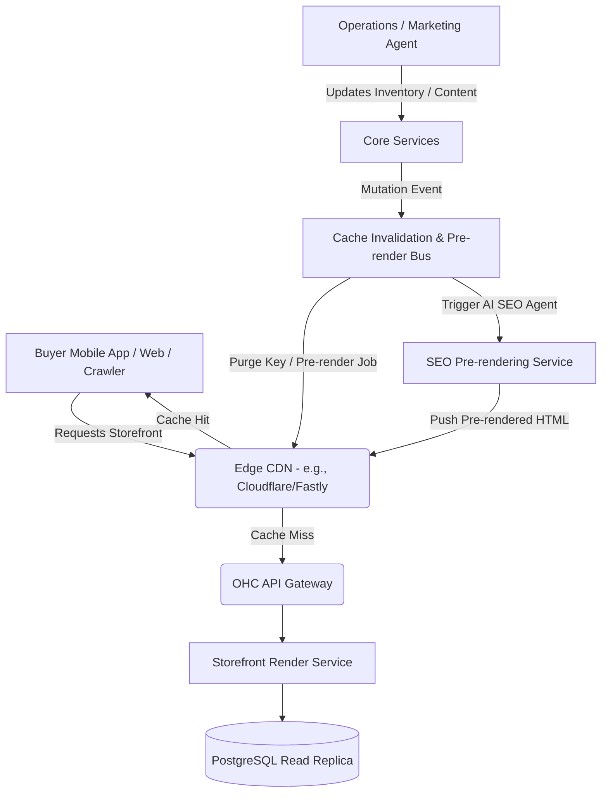

# Design Doc: OHC Universal Edge-Cached Dynamic Storefront & Agentic SEO Pre-rendering Architecture

**Author(s):** System Architect
**Status:** Draft
**Last Updated:** 2024-06-06

## 1. Problem Statement
**The Pain Point:** Users like Maya (Baker) and Leo (Musician) experience massive traffic spikes when their social media posts go viral. Their storefronts, currently reliant on centralized database queries for every load, face significant risk of latency degradation, timeouts, and poor user experience, potentially costing them critical sales. Additionally, current dynamic rendering limits SEO performance as web crawlers struggle with slow, client-side rendered content. Small business owners cannot and should not have to manage complex caching or SEO infrastructure themselves.

## 2. Research Report
- **Competitor Analysis:**
  - **Shopify:** Utilizes a globally distributed edge network (Cloudflare) to cache storefront assets and read-only API requests, ensuring fast delivery.
  - **Vercel / Next.js:** Employs ISR (Incremental Static Regeneration) and Edge caching to deliver instant load times without sacrificing dynamic content availability.
  - **Wix:** Offers advanced SEO tools but requires manual configuration and technical knowledge to leverage effectively.
- **OHC Requirement:** The caching and SEO optimization must be completely invisible to the user. A sold-out item must instantly invalidate the cache across the edge network so that Fatima (Food Cart) doesn't over-sell pre-orders. AI agents should automatically pre-render SEO-optimized pages.

## 3. Design Doc

### 3.1 Architecture Diagram

### 3.2 Key Design Decisions
- **Universal Edge Caching:** All public-facing storefront queries and static assets will be cached at the edge using surrogate keys (e.g., `storefront:{tenant_id}`, `product:{product_id}`).
- **Agent-Driven Cache Invalidation:** Any inventory mutation or website redesign by Operations/Marketing Agents triggers an async event to purge corresponding surrogate keys globally.
- **Agentic SEO Pre-rendering:** When content is updated, the Marketing Agent triggers a pre-rendering service that generates static, SEO-optimized HTML for web crawlers, pushing it to the edge cache.
- **Mobile UX Flow:** Storefronts must load instantly (<100ms) on a 375px viewport even on slow 3G connections. High-quality WebP images are served directly from the Edge.

## 4. Implementation Prompt
**For Implementer Agent:**
Implement the Universal Edge-Cached Dynamic Storefront & Agentic SEO Pre-rendering Architecture.
- **Objective:** Integrate a reverse-proxy CDN layer that caches GET requests for public storefront APIs and pre-renders SEO-optimized HTML.
- **CUJ:** When a customer opens Maya's storefront link, the product list is served from the cache. When Maya updates a cake price, the system publishes a cache invalidation event and triggers the SEO Agent to pre-render the updated page, ensuring the next customer sees the new price instantly and search engines receive the updated content.
- **Acceptance Criteria:**
  - E2E tests verifying cache hits for repeated reads.
  - E2E tests verifying cache misses and subsequent cache population following an inventory update.
  - Tests ensuring the SEO pre-rendering service correctly generates static HTML upon content updates.
  - Strict tenant isolation maintained within the cache layer.

## 5. Metadata
- **Priority:** P1
- **Estimated Scope:** Large
- **Target Release:** Q3

