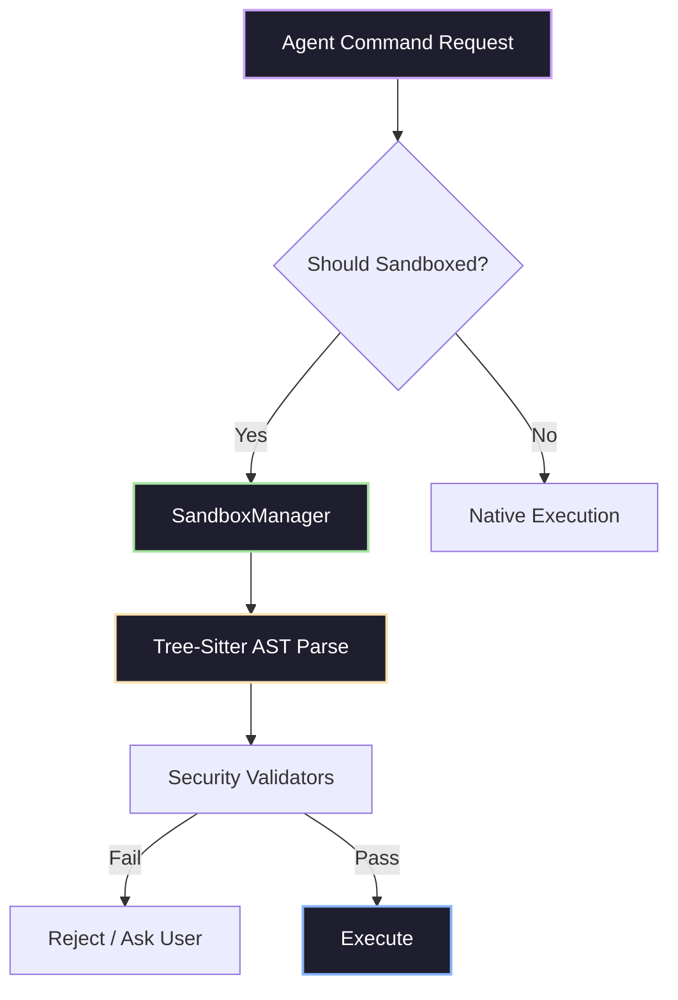

# Title: Implement OHC-Harness Core Bash Security Module

## Problem Statement
The current OHC codebase requires a robust, secure, and fully sandboxed Agent Harness environment for safely executing arbitrary bash commands, python code, and file manipulations during agent execution. By auditing the leaked Claude Code repository, we can distill the architecture of a production-grade Agent Harness and incorporate those findings into the OHC project to secure our agent deployments.

## Research Report
The Claude Code Agent Harness (`src/tools/BashTool`) presents a deeply robust architecture for command sandboxing and security:
- **Sandbox Manager Adapter**: Integrates with a broader sandboxing framework (`src/utils/sandbox/sandbox-adapter.ts`), controlling when and if commands should run sandboxed (`shouldUseSandbox.ts`).
- **AST Parsing for Security**: Utilizes Tree-sitter (`ParsedCommand.parse`) instead of just regex for deeply nested Bash syntax parsing to accurately intercept malicious or bypassed patterns.
- **Divergence Monitoring**: In `bashSecurity.ts`, divergence between regex paths and Tree-sitter paths triggers `logEvent` telemetry (`tengu_tree_sitter_security_divergence`).
- **Deep Security Validations**: Contains ~20 validators in `bashSecurity.ts`, validating malformed tokens, shell-quote single quote bug, unicode whitespace, brace expansions, Zsh-specific dangerous commands (`zmodload`), parameter substitutions (`${}`), process substitutions (`<()`), and IFS injections.
- **Git Tracking**: Integrates `trackGitOperations` for state snapshots.
- **Durable File IO History**: Incorporates `fileHistoryTrackEdit` to manage file states safely during automated interactions.

**Comparison Table: OHC vs Market Leaders**

| Feature | OHC (Current) | Claude Code | OpenClaw / GStack |
| :--- | :--- | :--- | :--- |
| **Parsing Engine** | Regex / Basic | Tree-sitter (AST) | Varies (mostly Regex) |
| **Command Sandboxing**| Basic | SandboxManager Adapter | Basic |
| **Zsh / Edge case protection** | No | Yes (Blocks zmodload, =) | No |
| **Telemetry / Divergence** | OpenTelemetry | Custom `logEvent` telemetry | Minimal |

## Design Doc
**OHC Hybrid Harness Architecture (`ohc-harness`):**
1. **Tree-sitter Bash Parsing Engine**: To replicate the level of accuracy seen in Claude, OHC will use a backend wrapper around Tree-sitter for analyzing bash commands before they run locally in desktop mode or remotely in Cloud mode.
2. **Deterministic Sandboxing Flag**: Provide `shouldUseSandbox` evaluations natively through the `SandboxManager`, dynamically toggled via the Central Database (`OHC-SIP`).
3. **Deep Validation Pipeline**: Instead of a simple regex match, OHC will pass every command execution through a sequence of validators (IFS injection check, Zsh equals expansion, command substitution blocking) defined in `ohc_harness/bash_security.rs`.
4. **Heredoc and Quoted Strings Processor**: Safely extract heredocs prior to AST inspection, matching `extractHeredocs(command, { quotedOnly: true })` from Claude Code.

## Implementation Prompt
**Task**: Build the `OHC-Harness` Core Bash Security Parsing Module
**Context**: Replicate the bash security validations extracted from Claude Code into the OHC `src/` directory.

**Steps**:
1. Implement a Rust-based `ParsedCommand` structure in `src/backend/harness/bash_security.rs` utilizing Tree-sitter (e.g. `tree-sitter/bash`) to parse incoming shell commands.
2. Port the 20 validators from the Claude Code `bashSecurity.ts` into Rust functions:
   - `ValidateJqCommand`
   - `ValidateDangerousVariables`
   - `ValidateZshDangerousCommands` (block `zmodload`)
   - `ValidateCarriageReturn`
   - `ValidateIFSInjection`
3. Add a sandbox determination endpoint (`harness.ShouldUseSandbox(cmd string) bool`) which checks OHC-SIP Redis configurations to enable or disable sandboxing dynamically.
4. Ensure 100% unit test coverage for the `harness` package using mocked commands that simulate attacks (e.g., `<()`, `$()`, `=curl`, `\r\n`).
5. **Requirement**: All validation events must expose OpenTelemetry metrics to Prometheus (`ohc_harness_security_divergence_total`).
6. Update the `docs/research/agent_harness_architecture.md` if the API contract changes.

**Priority**: P0
**Estimated Scope**: Large
