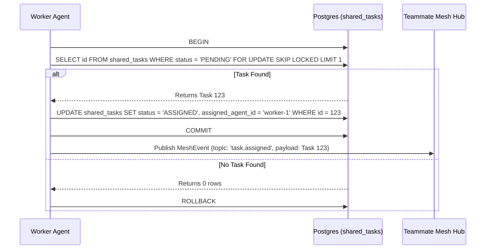

# [Architect] Implement Shared Task List Decomposition for KAIROS

## Problem Statement
The swarm needs a central, distributed tracking system to coordinate efforts and avoid duplicate work when acting upon high-level feature requests. Currently, agents operate in silos and lack a unified "Brain" to decompose UltraPlans into actionable nodes. KAIROS orchestrates the agent team by decomposing high-level feature requests into actionable tasks within a distributed Shared Task List, preventing race conditions during task claiming.

## Research Report
The Shared Task List handles the complex Directed Acyclic Graph (DAG) dependencies for agentic workflows, orchestrating tasks across both Cloud-Native (PostgreSQL + Redis) and Standalone (SQLite) modes. The Shared Task List relies on database-backed state machines to prevent race conditions during task claiming.

## Design Doc
<div markdown="1" style="backdrop-filter: blur(20px) saturate(200%); background: rgba(255, 255, 255, 0.03); font-family: 'Outfit', 'Inter', sans-serif; padding: 20px; border-radius: 12px; border: 1px solid rgba(255, 255, 255, 0.1);">

**Shared Task List Architecture**

To support both Cloud-Native and Standalone Desktop modes, the Shared Task List relies on a hybrid DB schema `shared_tasks`.

**Database Schema (`shared_tasks`)**
```sql
CREATE TABLE IF NOT EXISTS shared_tasks (
    id UUID PRIMARY KEY DEFAULT gen_random_uuid(),
    organization_id VARCHAR NOT NULL,
    title VARCHAR NOT NULL,
    description TEXT,
    status VARCHAR NOT NULL DEFAULT 'PENDING',
    agent_id VARCHAR,
    priority VARCHAR NOT NULL DEFAULT 'P2',
    payload JSONB,
    parent_plan_id TEXT,
    dependencies JSONB NOT NULL DEFAULT '[]',
    created_at TIMESTAMP WITH TIME ZONE DEFAULT CURRENT_TIMESTAMP,
    updated_at TIMESTAMP WITH TIME ZONE DEFAULT CURRENT_TIMESTAMP
);
```

**Task Claiming Workflow (Postgres/Cloud)**
Uses `SELECT id FROM shared_tasks WHERE status = 'PENDING' FOR UPDATE SKIP LOCKED LIMIT 1`.

**Task Claiming Workflow (SQLite/Standalone)**
Uses `sync.Mutex` and local transactions to simulate distributed locking.

</div>

## Implementation Prompt
Implement the `shared_tasks` database schema and the task claiming workflow for both PostgreSQL (using `FOR UPDATE SKIP LOCKED`) and SQLite. Update `src/server/orchestration/tasks_db.rs` or equivalent to handle the task DAG and state machine transitions (PENDING -> IN_PROGRESS -> REVIEW -> COMPLETED). Integrate with the Teammate Mesh to broadcast task assignments. Ensure the codebase correctly switches locking strategies based on the runtime mode. Write comprehensive tests verifying the DAG constraints and lock guarantees.

## Priority
P0

## Estimated Scope
Large

**Shared Task Claiming Workflow Sequence Diagram**

