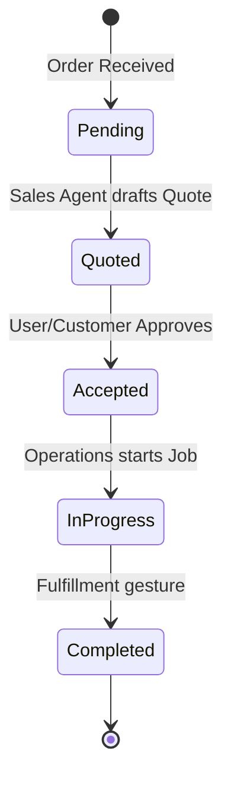

# [Backend] Unified Fulfillment Orchestration

## Problem Statement
Handymen like Carlos and food cart operators like Fatima miss orders or lose track of bookings because they lack a unified fulfillment view. Manual quoting and scheduling are time-consuming. OHC currently lacks a backend domain for handling the lifecycle of an "Order" or "Booking".

## Research Report
- **Square Online:** Strong for retail/food but less flexible for service-based bookings (Carlos). Users report difficulty managing hybrid service/product businesses ([Source: Reddit r/smallbusiness](https://www.reddit.com/r/smallbusiness/)).
- **GoDaddy:** Booking system feels "bolted on" and lacks proactive agent automation.
- **OHC Opportunity:** A unified "Mission" based fulfillment system where every order/booking is a shared task handled by the Operations (Manager) department.

### Fulfillment State Machine

## Design Doc
- **Entity Types:** `Order`, `Booking`, `FulfillmentState`, `Quote`.
- **Process Flow:**
  1. **Inbound:** Order/Booking request comes in via Web/Mobile/DM.
  2. **Routing:** Operations agent creates a `SharedTask`.
  3. **Automation:** If a quote is needed, Sales agent drafts it. If a reminder is needed, Customer Success schedules it.
  4. **Fulfillment:** User updates status (e.g., "Out for Delivery", "Job Started") via simple mobile gestures.

## Implementation Prompt
**Outcome:** A robust backend orchestration for orders and bookings.
**CUJ:** Carlos receives a request for "Plumbing Repair". The system auto-drafts a quote based on historical data. Carlos taps "Approve", and the quote is sent to the customer. Once accepted, it moves to "Scheduled".
**Acceptance Criteria:**
- Atomic state transitions for fulfillment lifecycle.
- Integration with Teammate Mesh for cross-department coordination.
- Support for both physical goods (Shipping) and services (Scheduling).

## Priority
P0

## Estimated Scope
Large

