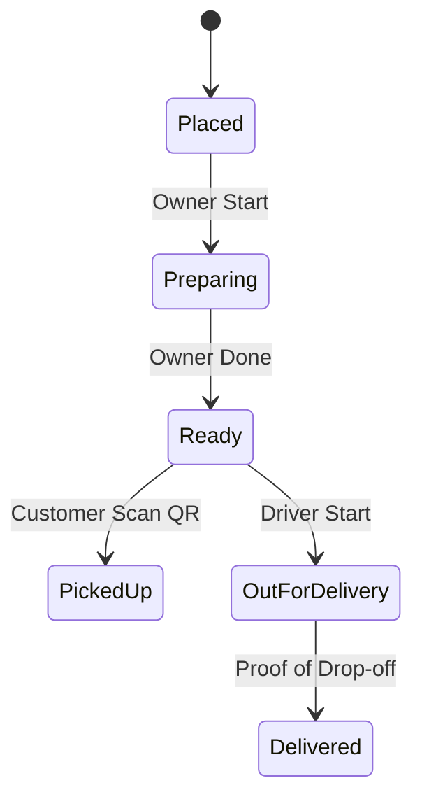

# [Backend] Unified Fulfillment Orchestration

## Title
Unified Fulfillment Orchestration: From Order to Hand-off

## Problem Statement
Small businesses face "fulfillment friction." Fatima needs to notify customers when their food is ready for pickup, and Maya needs to coordinate cake deliveries. Currently, managing these flows requires juggling multiple apps or manual texting. There is no unified system that handles physical shipping, local delivery, and in-person pickup in a single, automated pipeline that keeps the customer informed without the owner lifting a finger.

## Research Report
- **Gap:** Most platforms treat "Shipping" as the only fulfillment method. "Local Pickup" is often a checkbox with no workflow.
- **OHC Advantage:** The "Operations" AI Agent can autonomously move orders through a state machine (Placed -> Preparing -> Ready -> Out for Delivery -> Delivered).
- **User Journey:**
    - Fatima: Order received -> Fatima taps "Start" -> AI notifies customer "We're cooking!" -> Fatima taps "Ready" -> AI notifies customer "Come get it!" + provides map.

## Design Doc
### Fulfillment State Machine

### AI Integration
The **Operations Agent** monitors order status and triggers notifications (SMS/Email) at every transition. It also flags orders that have been in "Preparing" for too long.

## Implementation Prompt
Implement the Unified Fulfillment Orchestration backend and API.
- **User-facing outcome:** Owners can manage shipping, delivery, and pickup from one list.
- **CUJ:** Customer Fatima's food cart -> Fatima taps 'Ready' on the dashboard -> Customer gets a 'Ready for Pickup' push notification with a 1-tap navigation link.
- **Technical Requirements:** Implement the `order_fulfillment` table, status transition logic with event triggers for the `Customer Success` and `Operations` agents.

## Priority
P0

## Estimated Scope
Medium
