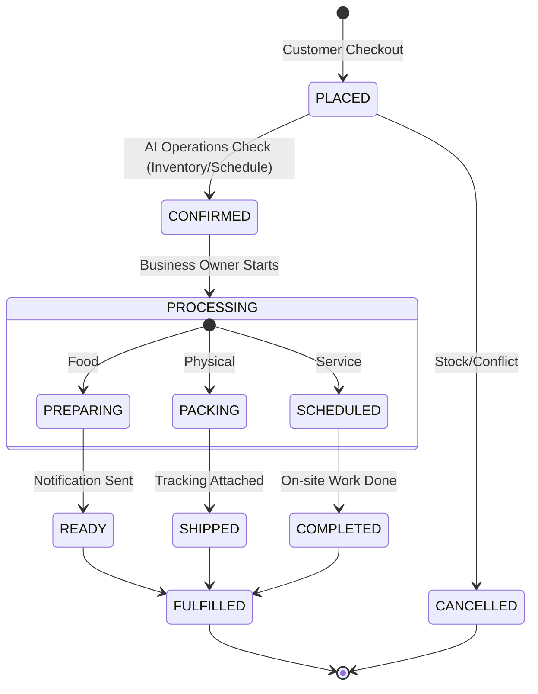

# [Backend] Unified Order Fulfillment & Operations Orchestration

## Title
Design a Unified Orchestration Layer for Multi-Modal Order Fulfillment (Products, Services, Food).

## Problem Statement
Fatima (Food Cart) and Carlos (Handyman) operate in fundamentally different ways, but both need a "fulfillment" engine. Fatima needs a 15-minute pickup timer and a "Sold Out" toggle. Carlos needs a booking calendar with GPS-linked arrival notifications. Currently, OHC lacks a unified "Operations" department that can orchestrate these diverse fulfillment lifecycles under a single, reliable state machine.

## Research Report
### Persona Requirements
- **Fatima (Food)**: High frequency, low latency. Needs "Kitchen View" and "Customer Notification" on order status change (Received -> Preparing -> Ready).
- **Carlos (Services)**: Low frequency, high duration. Needs "Quote -> Deposit -> Appointment -> Completion -> Final Payment".
- **Maya (Physical)**: Medium frequency. Needs "Order -> Packing -> Shipping Label -> Delivered".

### Competitive Analysis
- **Shopify**: Great for Maya, poor for Fatima (requires "Shopify POS" or specific apps).
- **Toast/Square**: Great for Fatima, poor for Carlos.
- **Calendly/Thumbtack**: Great for Carlos, poor for Maya.

OHC's "Unfair Advantage" is the **Unified State Machine** that handles "Delivery of Value" regardless of the modal (Physical/Service/Food).

## Design Doc
### Architecture Diagram

### AI Agent Integration
- **Operations Department ("The Manager")**:
  - Monitors the state machine.
  - Automatically flags "Stuck" orders (e.g., Fatima hasn't marked food as ready in 20 mins).
  - Drafts apologies to customers if delays occur.
  - Suggests "Sold Out" status if inventory trends indicate a stockout.

### Key Design Decisions
- **Event-Driven**: Every state transition emits a gRPC event to the Teammate Mesh.
- **Mobile-First Fulfillment**: The "Kitchen View" must be a simplified, large-button interface optimized for Fatima's low-end Android phone.

## Implementation Prompt
Implement the `Operations` orchestration service. This service must manage the lifecycle of an `Order` or `Booking`.
Acceptance Criteria:
- Implement a state machine that supports Physical, Digital, Service, and Food modalities.
- Every state change must be recorded in the `order_history` table for auditability.
- Integration with the `Customer Success` agent to auto-send status updates via the Mesh Mailbox.
- Support for "Proactive Alerting": if an order stays in `PLACED` for > 1 hour without owner action, trigger an AI triage event.

## Priority
P1 (High)

## Estimated Scope
Large
