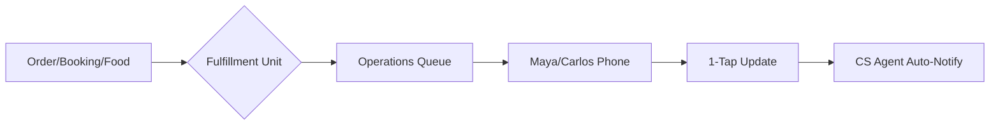

# [backend] Unified Order Fulfillment & Delivery Orchestration

**Priority:** P0
**Estimated Scope:** Large

---

## Problem Statement
For business owners like Carlos (handyman) and Fatima (food cart), the "sale" is only the beginning. The real chaos happens in fulfillment: tracking what needs to be made, who needs to pick it up, and when a service is scheduled. Existing tools separate "E-commerce" from "Calendar" and "Shipping." OHC needs a single, unified "Operations Department" that treats every sale—whether a physical cake, a plumbing repair, or a chicken wrap—as a fulfillment task with a clear status and AI-managed communication.

## Research Report

### Unified Fulfillment Flow

### Competitor Audit
*   **Square:** Strong on POS/Food, but weak on "Service/Booking" fulfillment (feels like two different products).
*   **Calendly:** Great for Carlos's bookings, but doesn't handle the "Inventory" or "Shipping" if he wants to sell a repair kit.
*   **ShipStation:** Overkill for Maya. She just needs to know "Deliver to 123 Main St at 2 PM."

## Design Doc (High-Level)
### Entity Types
*   **FulfillmentUnit**: A unified object representing an Order, a Booking, or a Pickup.
*   **StatusState**: Transition graph (Pending -> Preparing -> Out for Delivery -> Completed).
*   **DispatchSlot**: Time-based slot for pickup/delivery/service.

### Mobile UX Flow (375px First)
1.  **Unified Feed:** A single "Today's Work" feed combining Maya's cake deliveries and Carlos's 2 PM repair.
2.  **One-Tap Status:** Big, touch-friendly buttons (≥ 44px) to "Start Preparing" or "Mark Delivered."
3.  **AI Auto-Update:** When status changes, Customer Success agent drafts (or auto-sends) the update to the customer.

### AI Integration Points
*   **Operations Agent**: Monitors the "FulfillmentUnit" and flags if a delivery is likely to be late based on traffic or volume.
*   **Auto-Route**: For food carts (Fatima), suggests the most efficient order of preparation for upcoming pickups.

## Implementation Prompt
Implement a Unified Fulfillment Orchestration system. The system must treat products, services, and food orders as a single "FulfillmentUnit" flow. Create a "Today's Work" dashboard that is mobile-optimized (375px) and allows the owner to manage their entire day's output with simple status taps. Integrate this with the Customer Success department so that every status change triggers an appropriate (and customizable) customer notification. The backend must support PostgreSQL `SKIP LOCKED` for high-concurrency order processing.

---
**Acceptance Criteria:**
*   Unified data model for physical, digital, and service fulfillment.
*   Mobile-first "Today's Feed" UI with one-tap status updates.
*   Automated AI customer notifications on status changes.
*   Real-time sync between fulfillment state and customer-facing status page.
