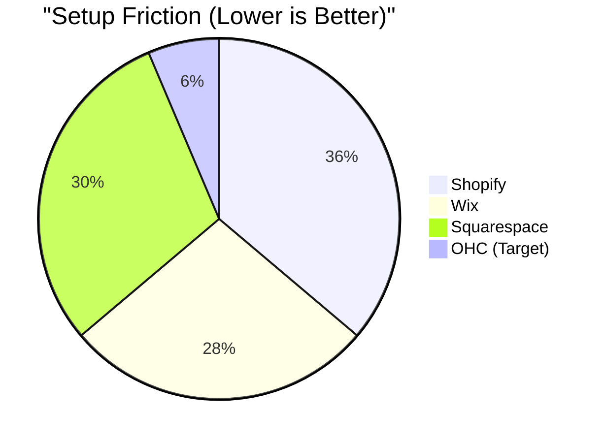

# [frontend] Mobile-First Storefront & Product Catalog Editor

**Priority:** P0
**Estimated Scope:** Large

---

## Problem Statement
Small business owners like Maya (the baker) and Priya (the boutique owner) often find themselves trapped between two extremes: overly complex "desktop-first" store builders (Shopify, Wix) that are frustrating to use on a phone, or "link-in-bio" tools that are too simple to handle actual inventory and variants. There is no solution that allows a non-technical owner to photograph a product, add variants (size/color), and publish a high-end, glassmorphic storefront entirely from a 375px mobile screen in under 60 seconds.

## Research Report

### Competitive Landscape: Mobile Setup Velocity

### Competitor Audit
*   **Shopify:** Mobile app is great for *managing* orders, but *setting up* a storefront and complex products (variants, custom metafields) is tedious and often redirects to web views.
*   **Wix:** Mobile editor is cramped. "ADI" generates a site but editing specific product layouts on mobile is a high-friction experience.
*   **Durable/Hocoos:** Can generate a site quickly, but the "editing" experience post-generation lacks the depth needed for a real retail business (inventory sync, variant-specific pricing).
*   **Instagram DMs:** Where Maya currently lives. Zero structure, no inventory tracking, manual payment links.

### User Pain Points
1.  **"Desktop-Required" Editors:** 70% of SMB owners in our target personas primarily use their phones. Forcing them to a laptop to add a "Vegan" option to a cake is a failure.
2.  **Variant Complexity:** Managing S/M/L or Red/Blue usually requires a table-based UI which breaks on 375px.
3.  **Aesthetic Gap:** Simple mobile builders often look "cheap." Users want the "Premium" OHC Glassmorphism look without hiring a designer.

## Design Doc (High-Level)
### Entity Types
*   `Product`: Core item with title, description (AI-generated), and base price.
*   `Variant`: Linked to Product (Size, Color, Material).
*   `Collection`: Grouping of products (e.g., "Holiday Cakes").
*   `StorefrontConfig`: Visual settings (themes, Glassmorphism intensity).

### Mobile UX Flow (375px First)
1.  **Quick-Add Camera:** Tap '+', take photo -> AI auto-removes background and suggests Title/Description.
2.  **Visual Variant Builder:** Instead of tables, use "Chip-based" selection or "Stackable Cards" for variants.
3.  **Live Preview Toggle:** A floating "View Store" button that shows the customer-facing glassmorphic view instantly.

### AI Integration Points
*   **Vision-to-Catalog:** AI analyzes the photo to suggest categories, tags, and SEO descriptions.
*   **Smart Pricing:** Advisor agent suggests pricing based on competitor data in the region.

## Implementation Prompt
Implement a Mobile-First Storefront and Product Catalog Editor. The primary CUJ is a user (like Maya) opening the app on their phone, taking a photo of a new cake, and having a live, buyable product page with "Size" and "Flavor" variants published in under 60 seconds. The UI must strictly adhere to OHC's Glassmorphism design system (20px blur, Outfit/Inter fonts) and be fully functional on a 375px width without horizontal scrolling. Ensure the product listing integrates with the existing Stripe payment flows.

---
**Acceptance Criteria:**
*   100% Mobile-functional (375px) product creation flow.
*   AI-assisted product description and photo optimization.
*   Support for multiple variants with individual inventory/pricing.
*   Instant "Live Preview" of the glassmorphic storefront.
