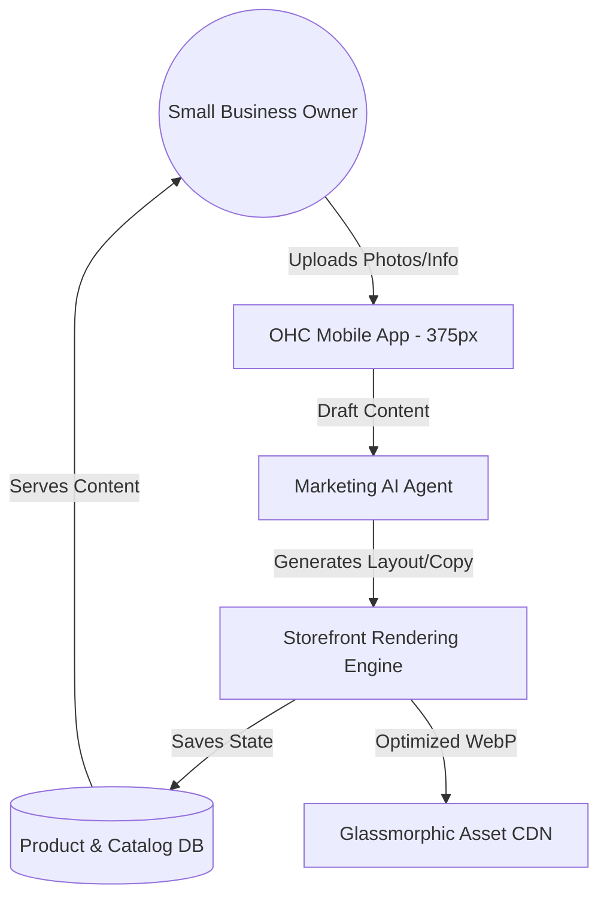

# [Frontend] Mobile-First Storefront & Catalog Editor

## Title
Implement a Mobile-First, AI-Assisted Storefront & Catalog Editor for Non-Technical Founders.

## Problem Statement
Small business owners like Maya (Home Baker) and Priya (Boutique Owner) find existing e-commerce platforms (Shopify, Wix) too complex and overwhelming. They often start by selling via Instagram DMs or WhatsApp because setting up a "proper" website feels like a technical hurdle they can't clear. There is no simple, mobile-only way to quickly upload a photo, set a price, and have a beautiful, glassmorphic storefront live in under 5 minutes.

## Research Report
### Market Analysis
- **Shopify**: Powerful but requires a desktop for efficient setup. Mobile app exists but is management-focused, not design-focused. Pricing is high for starters ($39/mo+).
- **Wix/Squarespace**: Drag-and-drop is still "drag-and-drop" which is hard on a 375px screen. Templates often look broken if not carefully tuned.
- **Instagram/WhatsApp**: Easy to start, but no structured checkout, no inventory management, and no professional "brand" presence.

### Competitive Differentiation
OHC will treat the "Editor" as a conversation with an AI agent. Instead of a complex grid system, the user "shows" the AI what they have (photos) and the AI "designs" the storefront invisibly.

## Design Doc
### Architecture Diagram

### UI & Mobile UX Flow (375px First)
1.  **Quick Add**: Single "+" button on the dashboard.
2.  **AI Interview**: AI asks: "What are we selling today? (Photo/Service/Digital)".
3.  **Visual Upload**: User snaps a photo. AI auto-removes background, enhances lighting, and suggests a title/description.
4.  **Pricing & Variants**: Simple toggle for variants (e.g., "Size: S, M, L"). No complex tables.
5.  **Live Preview**: A mini-glassmorphic card showing exactly how it looks to customers.
6.  **One-Tap Publish**: Generates a `maya.ohc.life` link immediately.

### AI Agent Integration
- **Marketing Department**: Handles SEO meta-tags, auto-generates product descriptions from photos using Vision LLMs, and suggests "trending" layout styles (e.g., "Minimalist", "High-Saturation Glass").

## Implementation Prompt
Implement a mobile-first Storefront Editor in the Flutter app. The primary CUJ is: "As Maya, I want to upload a photo of my new chocolate cake, set a price of $45, and have it appear on my public website immediately."
Acceptance Criteria:
- Must fit perfectly on a 375px wide screen with no horizontal scrolling.
- Includes an "AI Assistant" section that auto-generates product copy.
- Supports product variants (Size/Color) via a simple chip-based UI.
- Direct integration with the `products` table (to be designed by implementer).
- Real-time preview of the glassmorphic product card.

## Priority
P0 (Critical)

## Estimated Scope
Large
