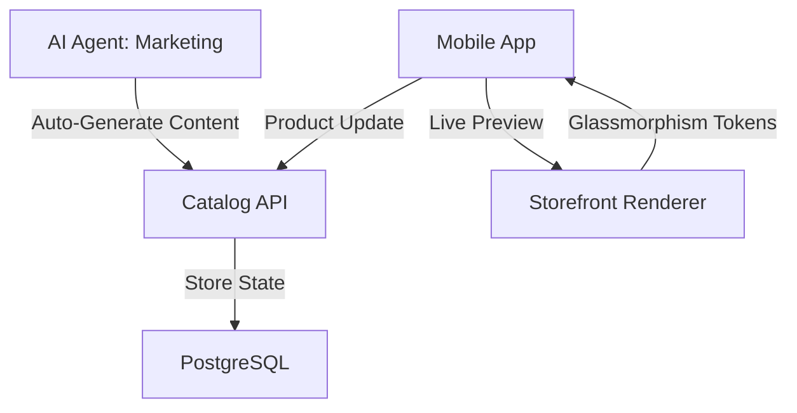

# [Frontend] Mobile-First Storefront & Catalog Editor

## Title
Mobile-First Storefront & Catalog Editor: Empowering Non-Technical Founders

## Problem Statement
Small business owners like Maya (the baker) and Fatima (the food cart operator) rely on their smartphones to run their businesses. Current e-commerce platforms (Shopify, Wix) often require a desktop for complex catalog management and storefront design. Maya needs to quickly upload cake photos and update availability, while Fatima needs to toggle "sold out" on her menu items instantly from her phone during a busy lunch rush. The lack of a truly mobile-optimized, radical-simplicity editor creates a barrier to entry and slows down daily operations.

## Research Report
- **Competitive Analysis:**
    - **Shopify:** Excellent for scaling, but "mobile-first" is limited to management; setup and design are painful on small screens.
    - **Wix:** Template-heavy; editing a site on mobile feels like using a shrunken desktop app.
    - **OHC Opportunity:** By focusing on 375px-first design and AI-assisted layout, OHC can reduce "time to live" for a full catalog from hours to minutes.
- **User Needs:**
    - Maya: "I want to snap a photo of my new strawberry shortcake and have it on my site with a price in 30 seconds."
    - Fatima: "When the shawarma is gone, I need to turn it off on the website immediately so people stop ordering it."

## Design Doc
### UI/UX Flow (375px First)
1. **Catalog Overview:** A card-based list of products/services with "Quick Toggle" for availability.
2. **AI-Assisted Uploader:**
   - User snaps/selects photo.
   - AI suggests Title, Description, and Category.
   - User confirms price and saves.
3. **Storefront Preview:** A "What You See Is What They Get" (WYSIWTG) live preview with glassmorphism overlays for editing.

### Architecture Diagram

## Implementation Prompt
Implement a mobile-first Storefront & Catalog Editor in Flutter. The UI must follow the OHC Premium design system (Glassmorphism, 20px blur).
- **CUJ:** Maya snaps a photo of a cake -> AI suggests a description -> Maya sets price $45 -> Cake is live on her storefront.
- **Key Features:** Card-based catalog management, AI-assisted content generation for products, and a real-time mobile preview.
- **Acceptance Criteria:** 100% usability on 375px width, < 5 second product publish time, integration with the Marketing AI Agent.

## Priority
P0

## Estimated Scope
Medium
