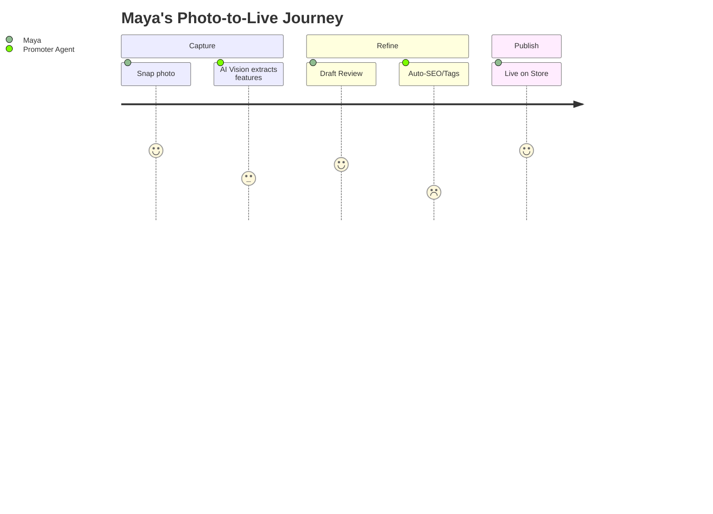

# [Frontend] Mobile-First Storefront & Catalog Editor

## Problem Statement
Non-technical small business owners like Maya (baker) and Priya (boutique owner) struggle with complex product management interfaces in platforms like Shopify. They need a way to manage their "Catalog" entirely from a phone, with AI doing the heavy lifting of writing descriptions, organizing categories, and optimizing images. Current OHC implementation lacks any product/catalog management UI.

## Research Report
- **Shopify:** Mobile app is secondary; complex variant management is painful on small screens. Many features (like Shopify Magic) are not yet optimized for mobile ([Source](https://help.shopify.com/en/manual/shopify-admin/productivity-tools/shopify-magic)).
- **Wix:** AI website builder is strong, but catalog management remains a traditional form-heavy experience requiring manual entry ([Source](https://www.wix.com/ai)).
- **Durable:** Generates a site but lacks deep inventory/variant management for retail ([Source](https://durable.co/)).
- **OHC Opportunity:** A "Catalog Feed" experience where the user just snaps a photo, and the Marketing (Promoter) department auto-generates the product page, tags, and SEO metadata.

### User Journey Comparison

## Design Doc
- **Entity Types:** `Product`, `Category`, `Variant`, `Inventory`.
- **UI Flow (375px):**
  1. **Quick-Add:** Floating action button (FAB) triggers camera.
  2. **AI Processing:** Image uploaded → Vision AI extracts features → Promoter agent drafts name/description/price.
  3. **Review Card:** Glassmorphic card showing the draft. User taps "Publish" or "Edit".
  4. **Catalog Grid:** Visual grid with "Sold Out" toggles accessible via thumb-reach.

## Implementation Prompt
**Outcome:** Implement a mobile-first Catalog Editor.
**CUJ:** Maya takes a photo of a new "Vegan Chocolate Cake". The AI automatically populates the product details. Maya approves, and it immediately appears on her live storefront.
**Acceptance Criteria:**
- 375px optimized layout with touch targets ≥ 44px.
- Integration with Marketing department for auto-description.
- Optimistic UI updates for "Sold Out" toggles.

## Priority
P0

## Estimated Scope
Medium

