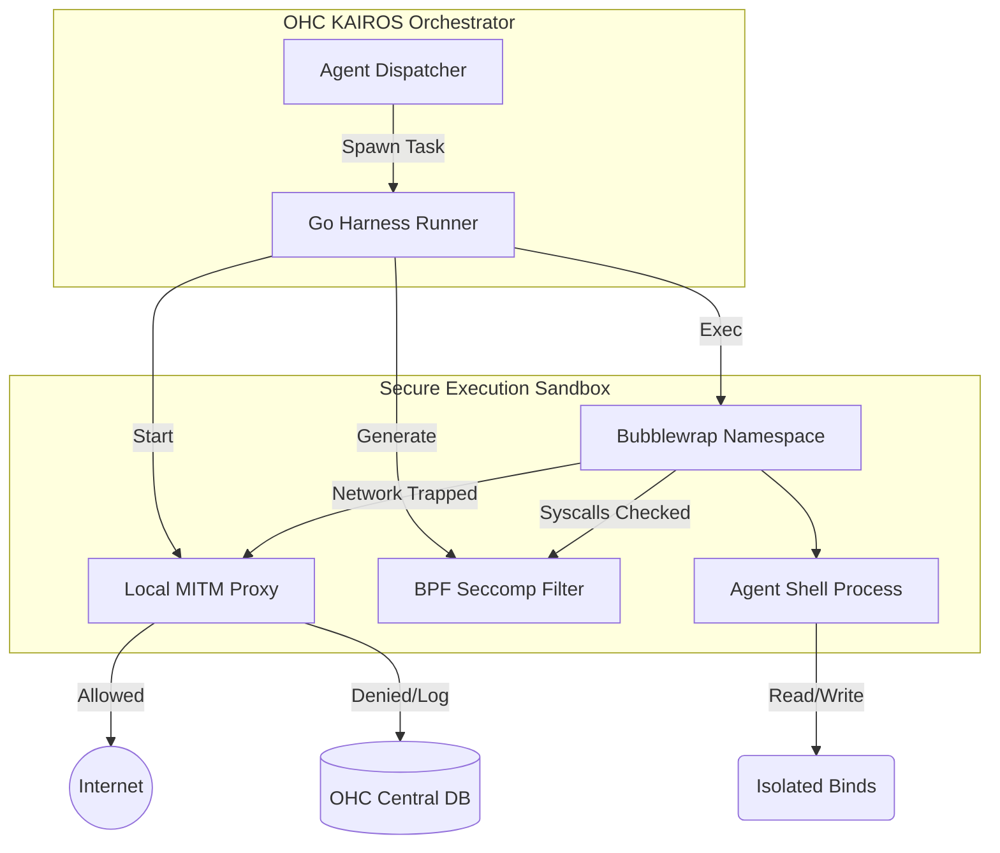

# 🔬 OHC Market Research: Deep Audit of Agent Harness Isolation

**Target:** Leaked Claude Code (v2.1.88)
**Analyst:** Principal Product Researcher & Oracle (L7)

## 1. Executive Summary
This report analyzes the Agent Harness isolation strategies within the leaked Claude Code repository (v2.1.88) and compares them against One Human Corp's (OHC) current hybrid architecture (OHC-HA).
The objective is to identify critical gaps in OHC's execution sandboxing and define an actionable implementation mission.

## 2. Claude Code: Harness Isolation Deep Dive
Claude Code’s `@anthropic-ai/sandbox-runtime` uses OS-level primitives to achieve robust isolation.

### 2.1 Bubblewrap (`bwrap`) Filesystem Sandboxing
- **Mechanism:** On Linux, Claude Code wraps all agent bash commands using `bwrap`.
- **Security:** It enforces explicit `--bind` and `--ro-bind` (read-only) paths based on dynamic `FsReadRestrictionConfig` and `FsWriteRestrictionConfig` policies.
- **Protection:** It prevents the agent from modifying system files or traversing beyond its designated workspace.

### 2.2 Network Interception (HTTP/SOCKS Proxy)
- **Mechanism:** The harness spawns local proxy servers (socat) and forces the sandbox's network traffic (`--unshare-net`) through them.
- **Filtering:** The proxy evaluates outbound traffic against `allowedHosts` and `deniedHosts`. If an unknown host is accessed, it triggers a `SandboxAskCallback` to pause execution and prompt the human user.

### 2.3 System Call Blocking (`seccomp-bpf`)
- **Mechanism:** Uses dynamically generated `seccomp` filters to block specific syscalls.
- **Unix Sockets:** Crucially, it blocks Unix Domain Socket creation to prevent agents from establishing IPC channels to the host or bypassing network proxies.

## 3. OHC vs. Market Reality (Gap Analysis)

| Feature | OHC Hybrid Architecture (Current) | Claude Code Harness | Gap / Opportunity |
| :--- | :--- | :--- | :--- |
| **FS Isolation** | Process isolation only (Go standard exec). | Strict `bwrap` namespace isolation. | 🚨 **Critical**: OHC agents risk overwriting host states. |
| **Network Proxy** | Unrestricted container/host network access. | Strict proxy with runtime human-in-the-loop asks. | 🚨 **Critical**: OHC cannot intercept unauthorized data exfiltration. |
| **Syscall Limits** | None / Default Docker profiles. | Dynamic `seccomp-bpf` Unix socket blocking. | 🟡 **High**: Defense-in-depth against escapes. |

## 4. Architectural Integration Plan
OHC must implement a native Go wrapper (`harness_runner`) that interfaces with these primitive security tools to provide an iron-clad execution layer.

## 5. Implementation Mission Directive

### Implementation Prompt
"Implement a standalone Rust-based Hybrid Agent Harness runner in `src/backend/harness/runner.rs`.
The runner must:
1. Wrap user-provided commands using `bwrap` to enforce read-only system mounts and restricted workspace mounts based on Go struct configuration.
2. Intercept and log network traffic by establishing a local `socat` based HTTP/SOCKS proxy wrapper and passing the appropriate `HTTP_PROXY` env vars.
3. Block unix domain sockets by compiling and attaching a `seccomp-bpf` filter prior to the child process execution.
Ensure 100% unit test coverage using mock execution targets."

### Priority
`P0`

### Estimated Scope
Large
